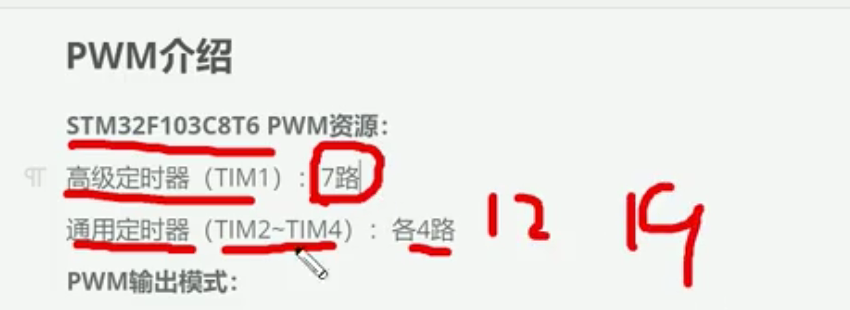
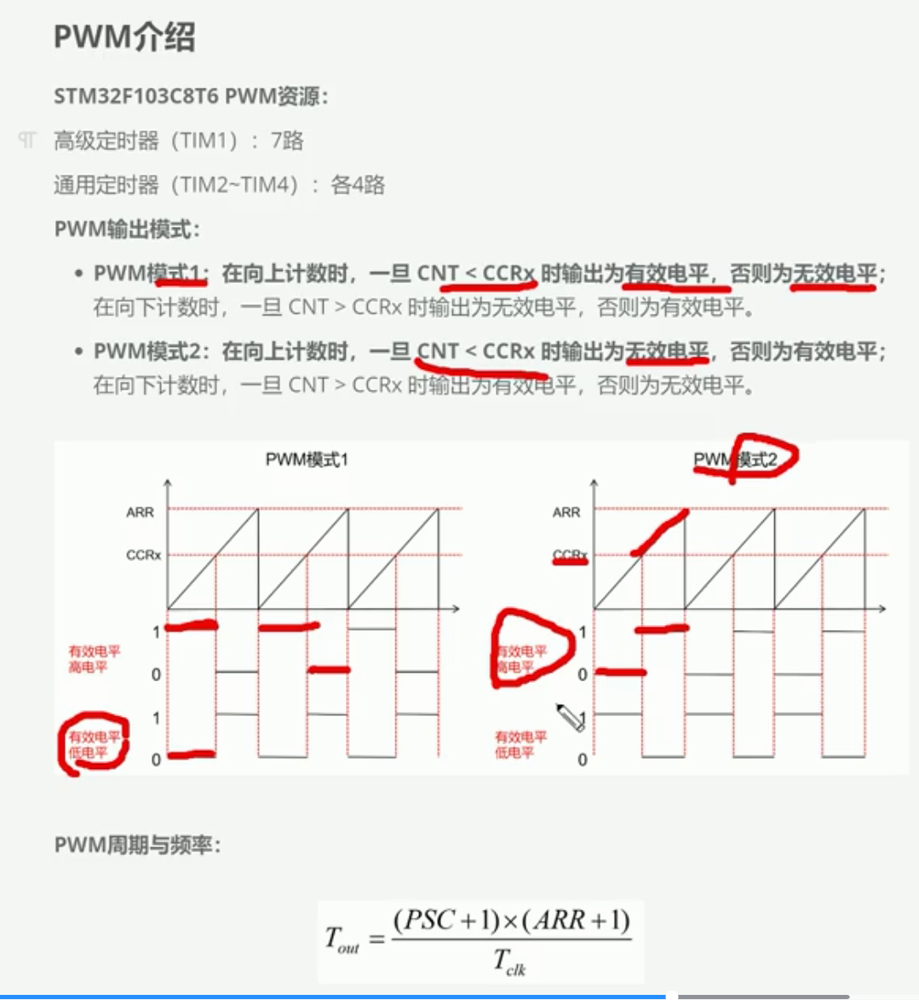
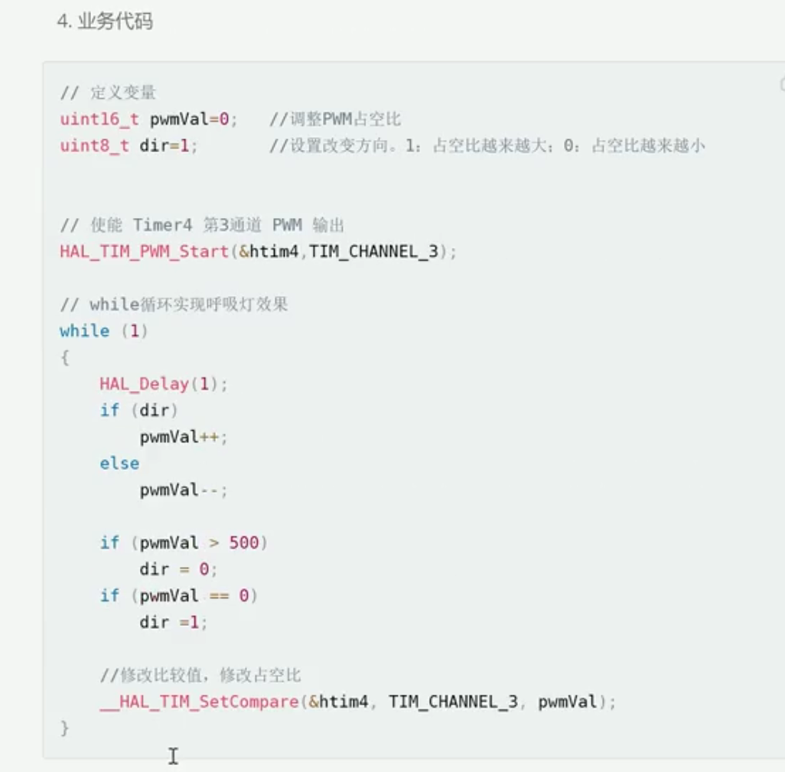
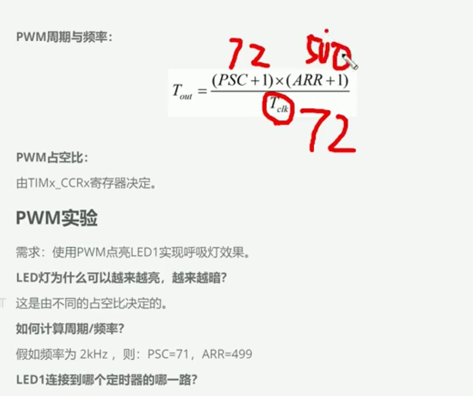
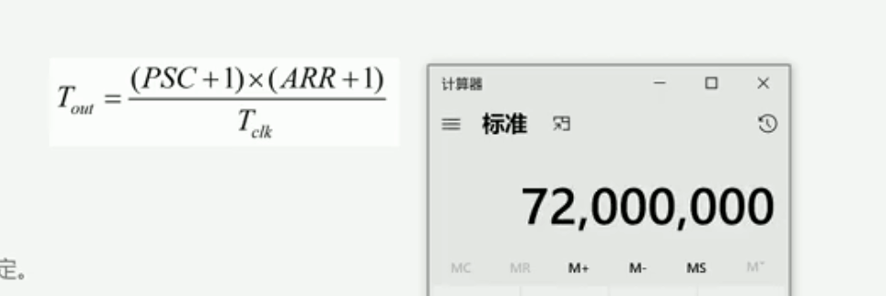
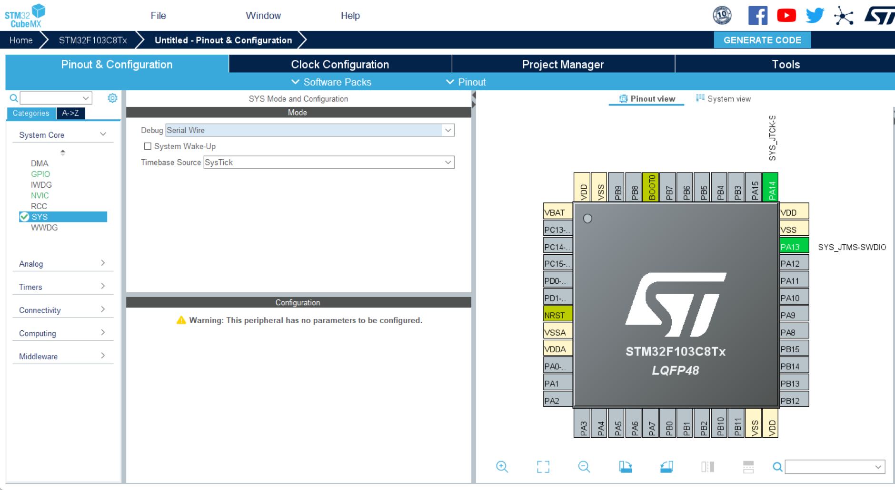
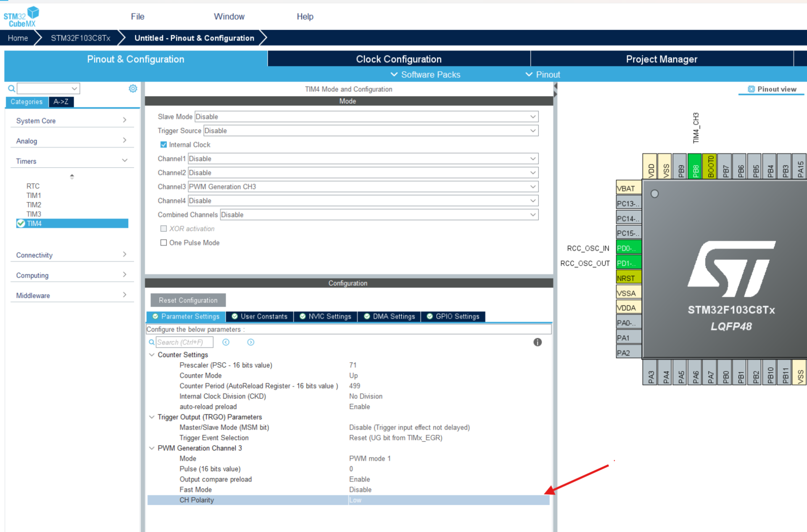

 ccrx 是寄存器, 有效电平需要设置,

占空比: (有效高电平时间/总的时间)

修改低电平的时间可以决定led灯的亮度 ,所谓的低电平的持续时间就是修改占空比,也就是修改ccrx寄存器决定也就是修改pwmVal决定

对于Tclk=72M是72000000, Tout是溢出时间(周期), 

&nbsp;

### LED1 连接到哪个定时器的哪一路?

原理图:   
产品手册:

第四个TIME的第三个通道的PWM

&nbsp;

&nbsp;

### 实战:

STM32CubeMX -- Access To -- STM32F103C8T6  

设置外部时钟源rcc  
  
设置TIMER:

根据手册,设置timer4, 第3个通道

CH Polarity: 设置为有效低电平 , Pulse: 占空比0(可以使用代码方式设置), Mode: PWM mode 1 设置模式1

