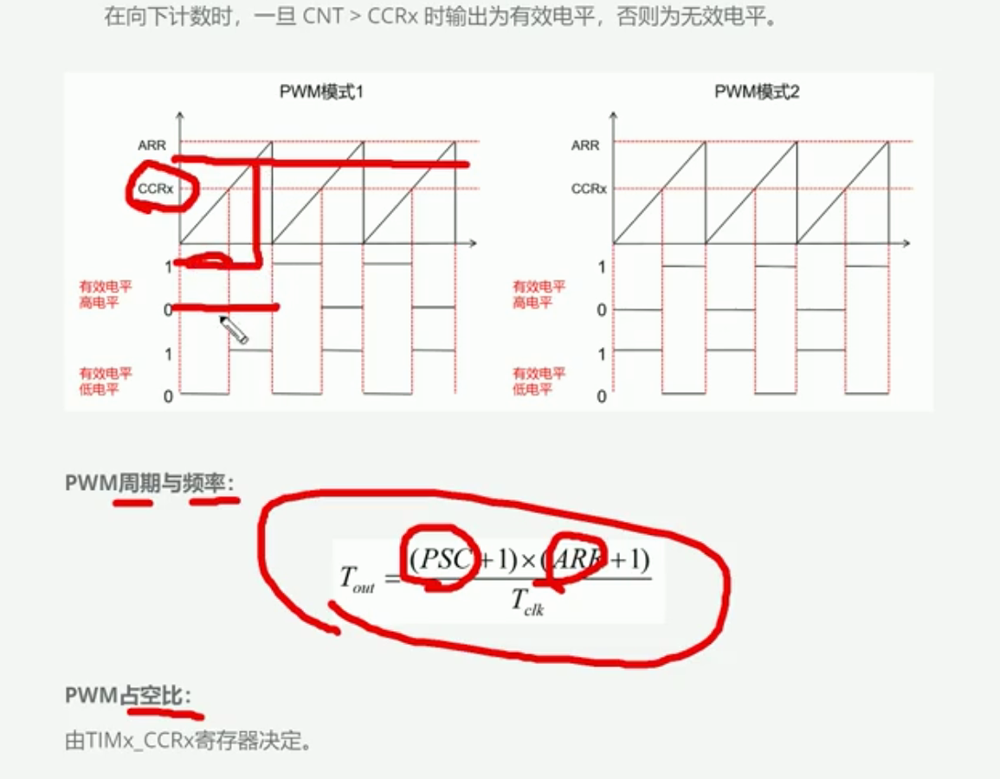
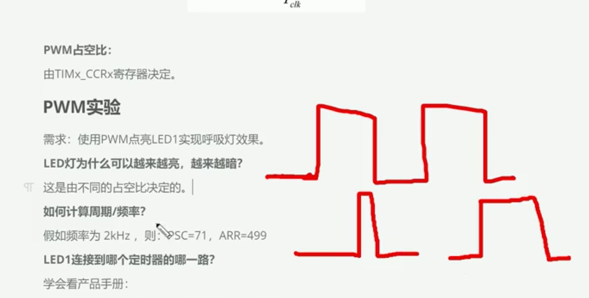
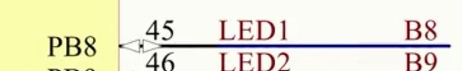
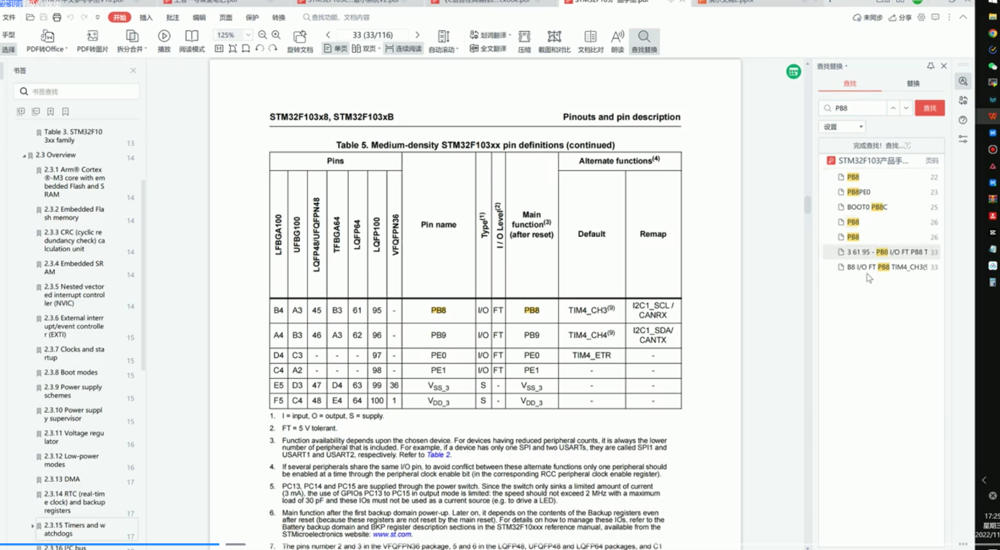
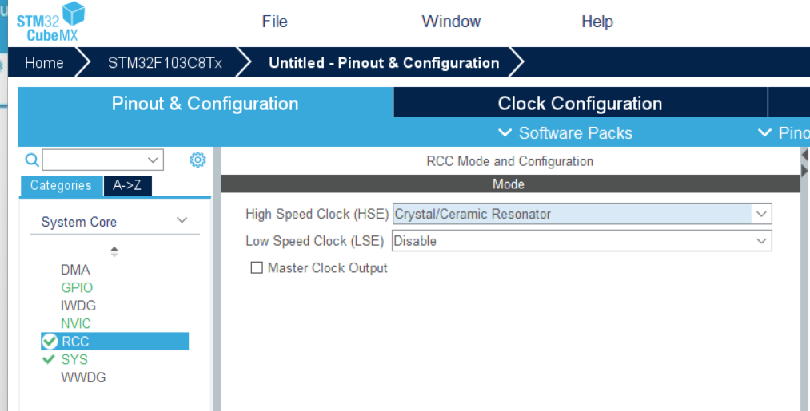
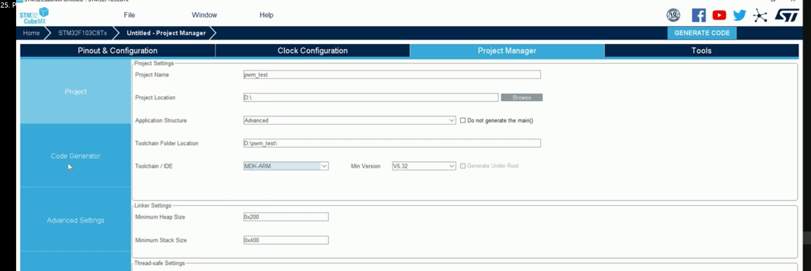
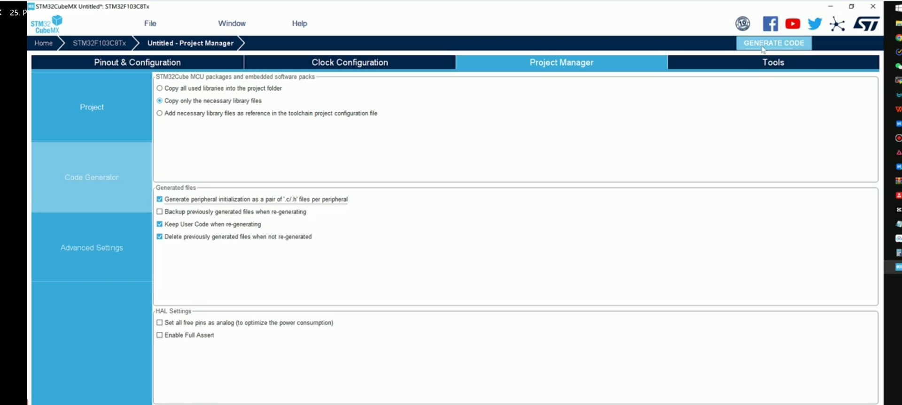

 ccrx 是寄存器, 有效电平需要设置,

占空比: (有效高电平时间/总的时间)

修改低电平的时间可以决定led灯的亮度 ,所谓的低电平的持续时间就是修改占空比,也就是修改ccrx寄存器决定也就是修改pwmVal决定

对于Tclk=72M是72000000, Tout是溢出时间(周期), 

&nbsp;

### LED1 连接到哪个定时器的哪一路?

原理图:   
产品手册:

第四个TIME的第三个通道的PWM

&nbsp;

&nbsp;

### 实战:

STM32CubeMX -- Access To -- STM32F103C8T6  


设置外部时钟源rcc  
  
设置TIMER:

根据手册,设置timer4, 第3个通道


CH Polarity: 设置为有效低电平 , Pulse: 占空比0(可以使用代码方式设置), Mode: PWM mode 1 设置模式1





你的笔记和呼吸灯代码其实已经对应上了，只是 CubeMX 把“定时器配置”放在 `tim.c`，把“呼吸变化逻辑”放在 `main.c`，所以看起来像断开的两部分。

整体关系是：

```
RCC提供72 MHz时钟
        ↓
TIM4分频，生成2 kHz PWM
        ↓
CCR3决定低电平占空比
        ↓
PB8输出PWM
        ↓
人眼感受到LED亮度
        ↓
程序不断改变CCR3
        ↓
形成呼吸效果
```

### 1\. 笔记中的 TIM4_CH3 对应 PB8

你的笔记写的是：

```
LED1 → TIM4 → Channel 3
```

CubeMX生成的代码也明确配置：

```
PB8 ------> TIM4_CH3
```

这部分在 \[tim.c (line 45)\](/D:/STM32/PWM_test/Core/Src/tim.c:45) 中。

所以信号路径是：

```
TIM4的CCR3寄存器 → TIM4_CH3 → PB8 → LED1
```

### 2\. PSC和ARR决定PWM频率

生成代码中的配置是：

```
htim4.Init.Prescaler = 71;  // PSC
htim4.Init.Period = 499;    // ARR
```

TIM4时钟是72 MHz，因此：

```
计数频率
= 72 MHz ÷ (PSC + 1)
= 72 MHz ÷ 72
= 1 MHz
```

计数器从0数到499，一共500次：

```
PWM频率
= 1 MHz ÷ (ARR + 1)
= 1 MHz ÷ 500
= 2000 Hz
```

也就是：

```
PWM周期 = 0.5 ms
```

LED每秒开关2000次，人眼看不到闪烁，只会感觉到平均亮度。

### 3\. CCR3决定LED亮度

你的笔记中写的`CCRx`，在这个项目里具体就是：

```
CCR3
```

因为你使用的是TIM4第3通道。

这行代码：

```
__HAL_TIM_SET_COMPARE(&htim4, TIM_CHANNEL_3, breath_pwm);
```

实际上就是：

```
把breath_pwm写入TIM4的CCR3寄存器
```

由于配置了低电平有效：

```
sConfigOC.OCPolarity = TIM_OCPOLARITY_LOW;
```

因此大致关系是：

| CCR3数值 | 低电平占比 | LED亮度 |
| --- | --- | --- |
| 0   | 0%  | 熄灭  |
| 125 | 25% | 较暗  |
| 250 | 50% | 中等  |
| 499 | 约100% | 最亮  |

所以你笔记里“修改低电平持续时间决定LED亮度”在这块开发板上是正确的。不过更通用的说法应该是：

> 修改有效电平的占空比，决定LED平均亮度。

低电平还是高电平有效，取决于LED的实际接法和PWM极性配置。

### 4\. `sin()`负责让CCR3平滑变化

呼吸逻辑在 \[main.c (line 92)\](/D:/STM32/PWM_test/Core/Src/main.c:92) 中：

```
breath_pwm =
    (sin(i * 3.14159f / 180.0f) + 1.0f)
    / 2.0f
    * PWM_PERIOD;
```

它把正弦值从原来的`-1～1`转换为`0～499`：

| `i`角度 | `sin(i)` | `breath_pwm/CCR3` | LED状态 |
| --- | --- | --- | --- |
| 0°  | 0   | 约249 | 半亮  |
| 90° | 1   | 499 | 最亮  |
| 180° | 0   | 约249 | 半亮  |
| 270° | \-1 | 0   | 熄灭  |
| 359° | 接近0 | 约246 | 回到半亮 |

因此一次循环是：

```
半亮 → 最亮 → 半亮 → 熄灭 → 半亮
```

每次变化后等待2 ms：

```
HAL_Delay(BREATH_STEP_DELAY);
```

360次变化需要：

```
360 × 2 ms = 720 ms
```

所以完整呼吸周期约为0.72秒。这里的`HAL_Delay(2)`控制的是**呼吸速度**，不是PWM频率；PWM的2 kHz频率由PSC和ARR决定。

你可以在笔记里补上这句总结：

> PSC和ARR固定PWM频率；CCR3决定当前亮度；程序周期性改变CCR3，从而形成呼吸灯。

另外，代码中的`breath_dir`目前没有被使用，可以删除；`PWM_PERIOD`实际代表的是ARR值499，改名为`PWM_ARR`会更准确。

&nbsp;

- \------------------------------------------------------------------------------------------------------------------------------------------------------------------------

&nbsp;

你现在是“已经做出来了，但还没真正吃透”。所以这节课不算完全结束，不过也不需要再钻研几天——再做三个小实验，就可以继续下一课。

顺便说一下，是 **PWM**，不是 PWD。

先把公式全部放下，只记住这一幅画面：

> STM32让LED快速开、关。每个周期里，亮的时间越长，人眼感觉越亮。程序不断改变“亮多久”，于是产生呼吸效果。

你代码里的角色非常简单：

```
TIM4、CH3、PB8：找到并控制这颗LED
PSC、ARR：决定LED快速闪烁的频率
CCR3：当前亮度旋钮
循环：不断转动亮度旋钮
HAL_Delay：决定旋钮转动速度
```

目前的正弦函数比较难理解，可以暂时换成最直观的写法：

```
while (1)
{
    // CCR3从0增加到499：逐渐变亮
    for (uint16_t pwm = 0; pwm <= 499; pwm++)
    {
        __HAL_TIM_SET_COMPARE(
            &htim4,
            TIM_CHANNEL_3,
            pwm
        );

        HAL_Delay(2);
    }

    // CCR3从499减少到0：逐渐变暗
    for (int16_t pwm = 499; pwm >= 0; pwm--)
    {
        __HAL_TIM_SET_COMPARE(
            &htim4,
            TIM_CHANNEL_3,
            pwm
        );

        HAL_Delay(2);
    }
}
```

这里可以直接看出：

```
CCR3：0 → 499 → 0
LED：暗 → 亮 → 暗
```

## 做完三个实验就算过关

### 实验一：固定亮度

暂时不做呼吸，分别测试：

```
__HAL_TIM_SET_COMPARE(&htim4, TIM_CHANNEL_3, 0);
```

```
__HAL_TIM_SET_COMPARE(&htim4, TIM_CHANNEL_3, 250);
```

```
__HAL_TIM_SET_COMPARE(&htim4, TIM_CHANNEL_3, 499);
```

你应该看到熄灭、半亮、接近最亮。这样就能确认：**CCR3就是亮度旋钮。**

### 实验二：改变呼吸速度

把：

```
HAL_Delay(2);
```

改成：

```
HAL_Delay(10);
```

呼吸会明显变慢。这样就能确认：**Delay控制呼吸变化的速度。**

### 实验三：关闭PWM启动

暂时注释：

```
HAL_TIM_PWM_Start(&htim4, TIM_CHANNEL_3);
```

呼吸效果就会消失。这样就能确认：**这行负责启动TIM4第3通道的PWM输出。**

完成后，如果你能用自己的话说出下面这句话，这一课就结束了：

> CubeMX配置TIM4_CH3从PB8输出PWM；CCR3控制LED当前亮度；程序让CCR3不断增大和减小，因此形成呼吸灯。

暂时不要求你记住72 MHz、APB倍频和所有寄存器公式。课程可以先往后走，以后学习舵机和定时器时，PWM会再次出现，那时理解会更深。你现在缺的不是继续看理论，而是亲手改变三次数值，观察结果。