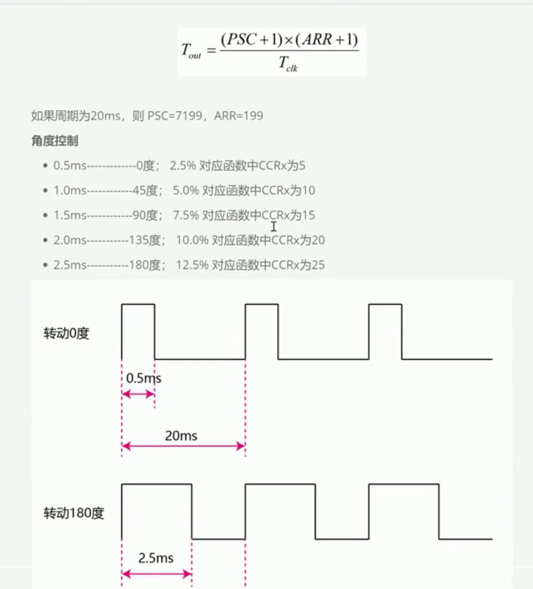
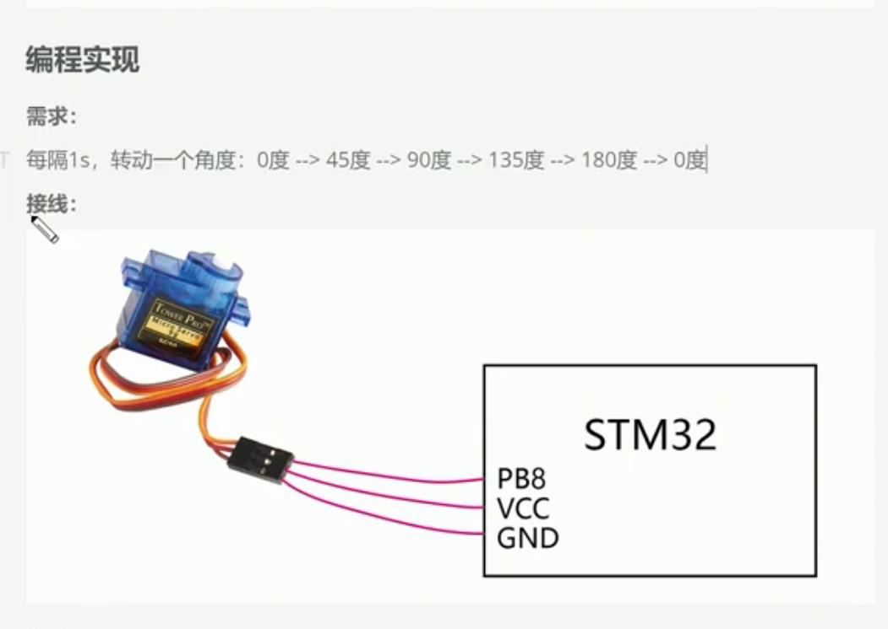
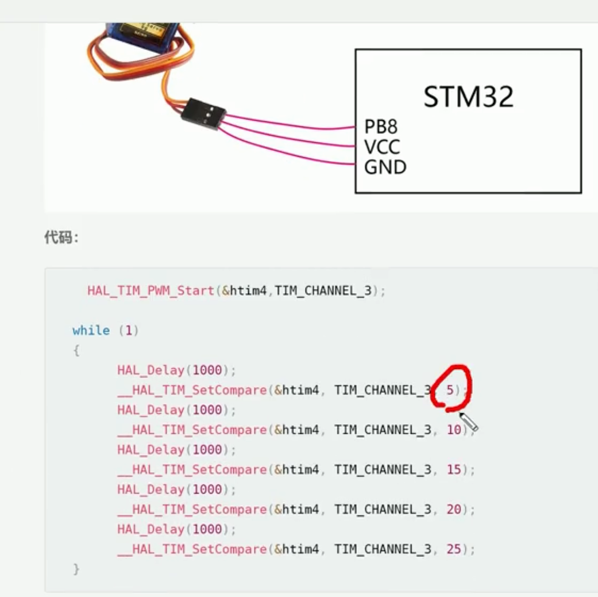
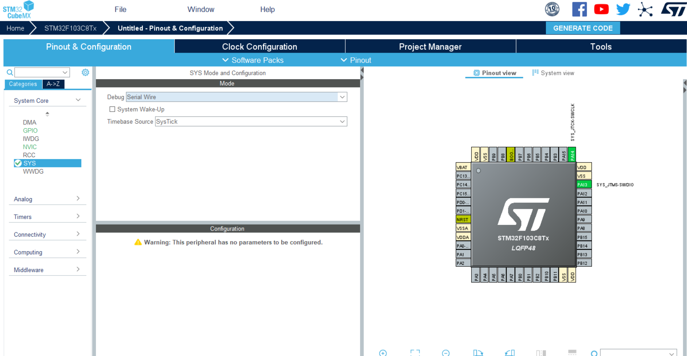
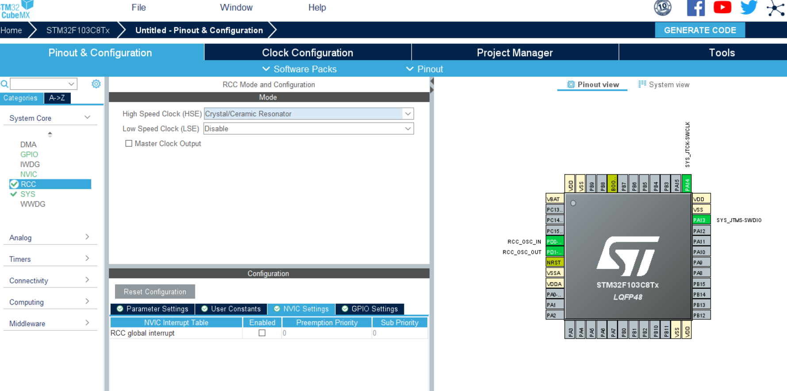
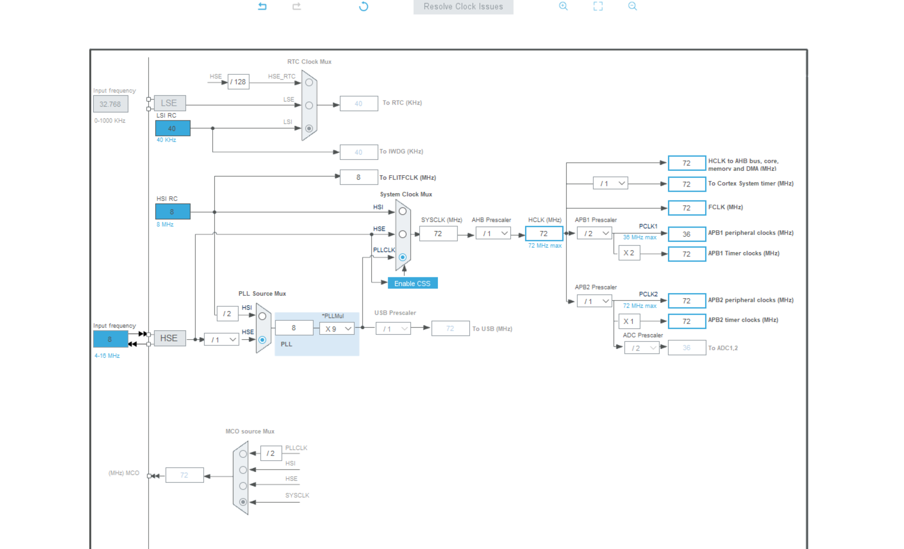
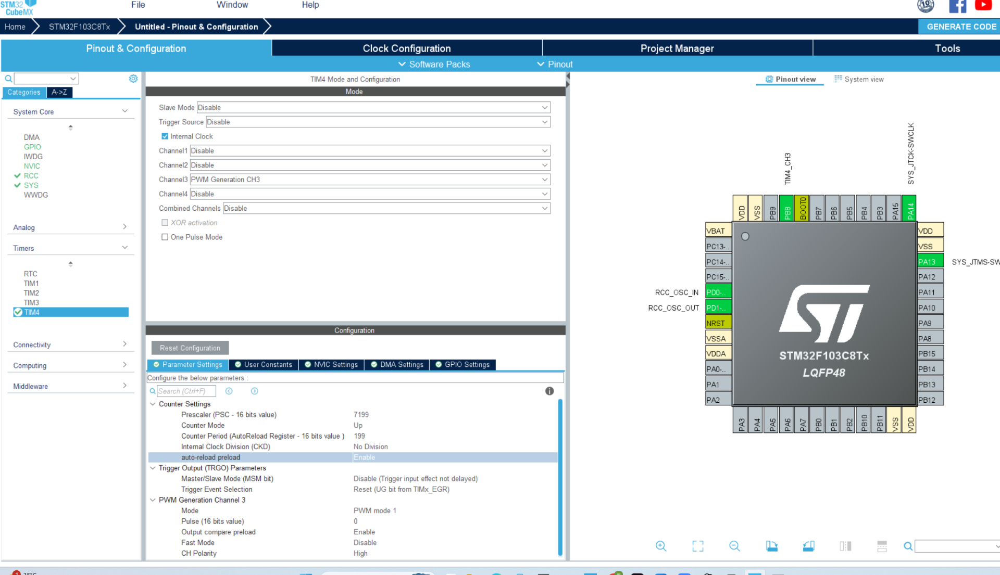
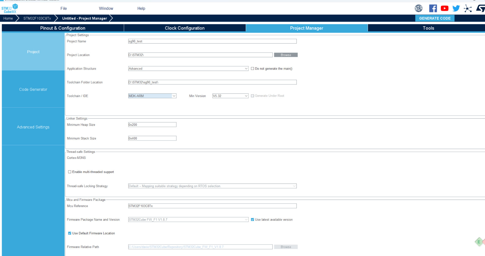
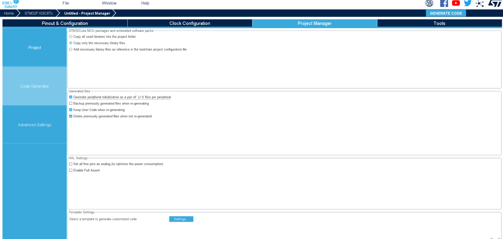
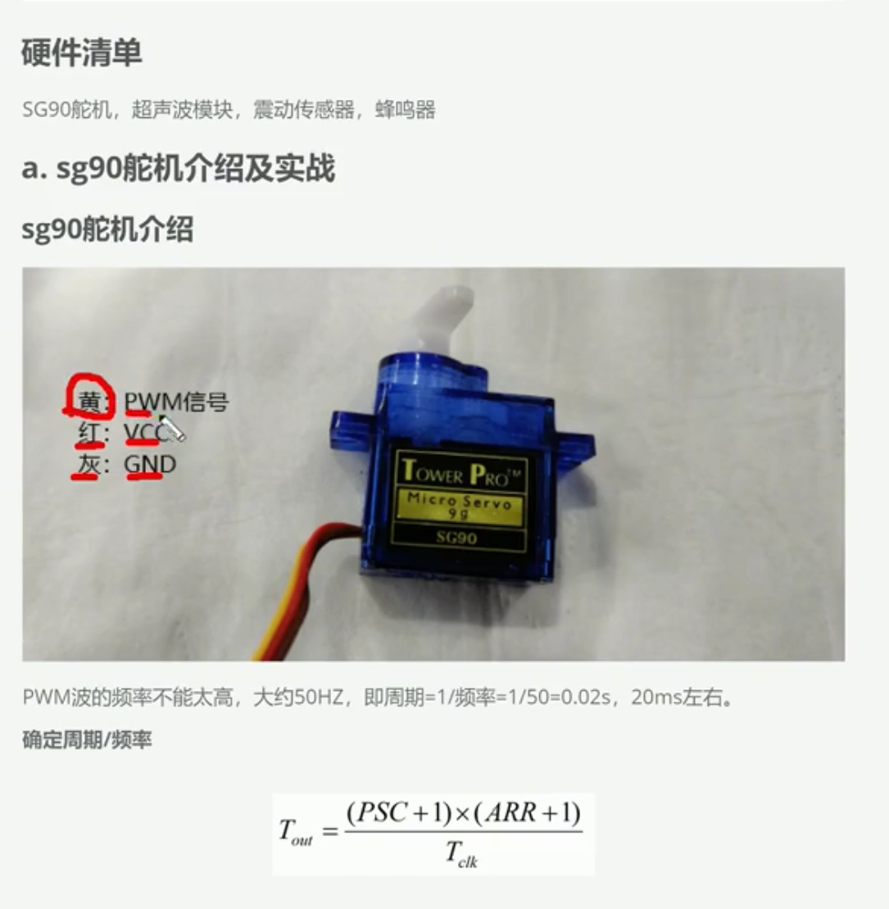

&nbsp;

&nbsp;

不是你理解能力的问题，这份笔记几乎全是截图，恰好把最关键的“为什么 CCR=5 就是0.5 ms”省略了。

整节课其实只讲一件事：

> STM32每隔20 ms给舵机发送一个高电平脉冲，脉冲持续多久，决定舵机转到什么角度。

## 把20 ms想成一把尺子

定时器配置为：

```
PSC = 7199
ARR = 199
定时器时钟 = 72 MHz
```

先经过PSC分频：

```
72 MHz ÷ (7199 + 1)
= 10000 Hz
```

因此定时器每计一个数需要：

```
1 ÷ 10000秒 = 0.1 ms
```

这相当于尺子的每一小格是：

```
1格 = 0.1 ms
```

ARR等于199，计数器实际从0数到199，共200格：

```
200格 × 0.1 ms = 20 ms
```

所以定时器会自动、持续产生一个20 ms周期。

## CCR决定高电平占几格

每格是0.1 ms，因此：

| CCR3 | 高电平格数 | 高电平时间 | 笔记中的角度 |
| --- | --- | --- | --- |
| 5   | 5格  | 0.5 ms | 0°  |
| 10  | 10格 | 1.0 ms | 45° |
| 15  | 15格 | 1.5 ms | 90° |
| 20  | 20格 | 2.0 ms | 135° |
| 25  | 25格 | 2.5 ms | 180° |

因此：

```
__HAL_TIM_SET_COMPARE(
    &htim4,
    TIM_CHANNEL_3,
    15
);
```

表示：

```
CCR3 = 15
高电平时间 = 15 × 0.1 ms = 1.5 ms
舵机大约转到90°
```

这就是整份笔记最核心的联系：

```
PSC决定每格多长
ARR决定整个周期多长
CCR决定高电平占几格
高电平持续时间决定舵机角度
```

## `HAL_Delay(1000)`在做什么？

它不是用来生成舵机脉冲的。

当你执行：

```
__HAL_TIM_SET_COMPARE(
    &htim4,
    TIM_CHANNEL_3,
    15
);

HAL_Delay(1000);
```

实际过程是：

```
CCR3设为15
    ↓
定时器硬件自动持续输出1.5 ms脉冲
    ↓
舵机转到约90°
    ↓
程序等待1秒
    ↓
这一秒内定时器仍然持续输出脉冲
```

因此：

- 定时器硬件负责每20 ms发送一次脉冲；
- `HAL_Delay(1000)`只是让舵机在当前位置停留1秒。

## 和呼吸灯有什么区别？

两者都在改变CCR，但目的不同：

```
呼吸灯：
CCR改变 → 平均亮度改变

舵机：
CCR改变 → 高电平脉宽改变 → 角度改变
```

可以把舵机代码整理成一个函数：

```
void Servo_SetAngle(uint8_t angle)
{
    if (angle > 180) {
        angle = 180;
    }

    uint16_t compare = 5 + angle * 20 / 180;

    __HAL_TIM_SET_COMPARE(
        &htim4,
        TIM_CHANNEL_3,
        compare
    );
}
```

使用：

```
Servo_SetAngle(0);
HAL_Delay(1000);

Servo_SetAngle(90);
HAL_Delay(1000);

Servo_SetAngle(180);
HAL_Delay(1000);
```

这里的0.5～2.5 ms和角度只是课程采用的近似范围，不同SG90可能略有差异，需要实际校准。

还有两个重要注意事项：

- 舵机信号需要高电平有效。如果沿用呼吸灯项目的`TIM_OCPOLARITY_LOW`，要改为`TIM_OCPOLARITY_HIGH`。
- 舵机最好使用独立、足够电流的5 V电源供电，并与STM32共地，不要用GPIO给舵机供电。

你现在只需要真正记住一句话：

> **20 ms是重复发送的周期，0.5～2.5 ms是决定角度的高电平时间，CCR负责改变这个时间。**

&nbsp;

****

****

****

 ** **

****

&nbsp;

&nbsp;

****