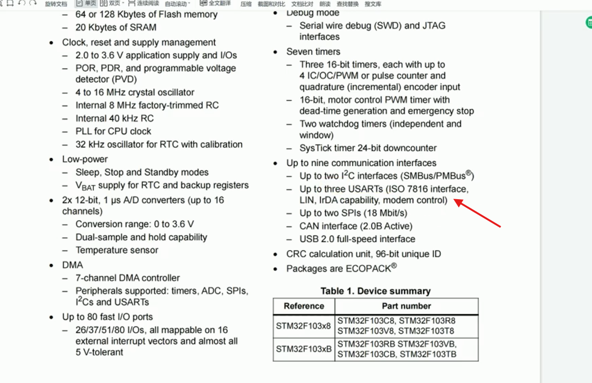
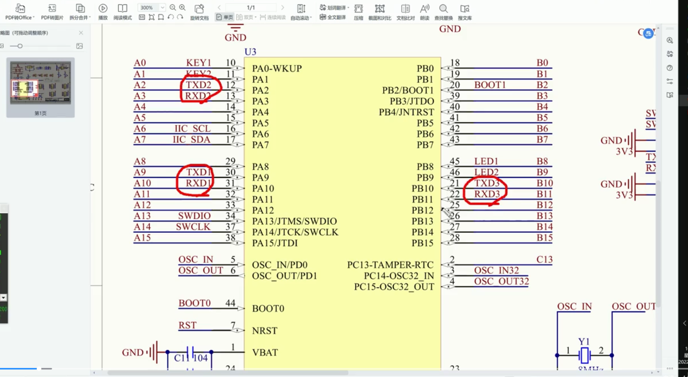
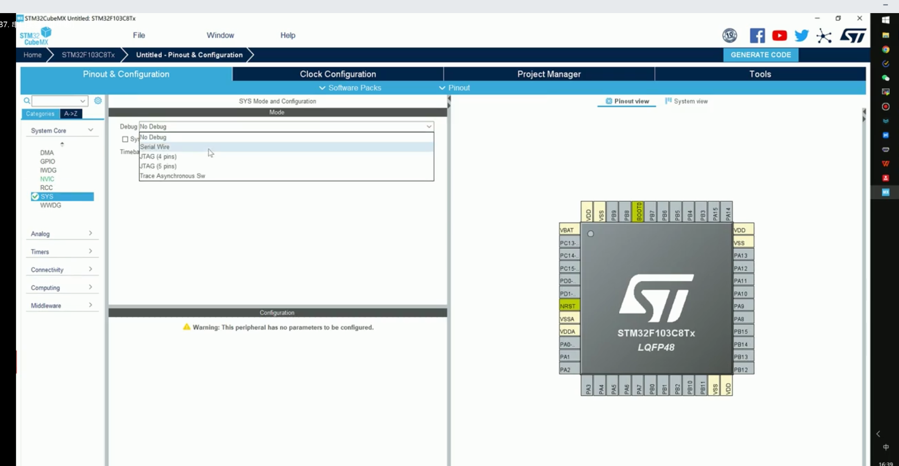
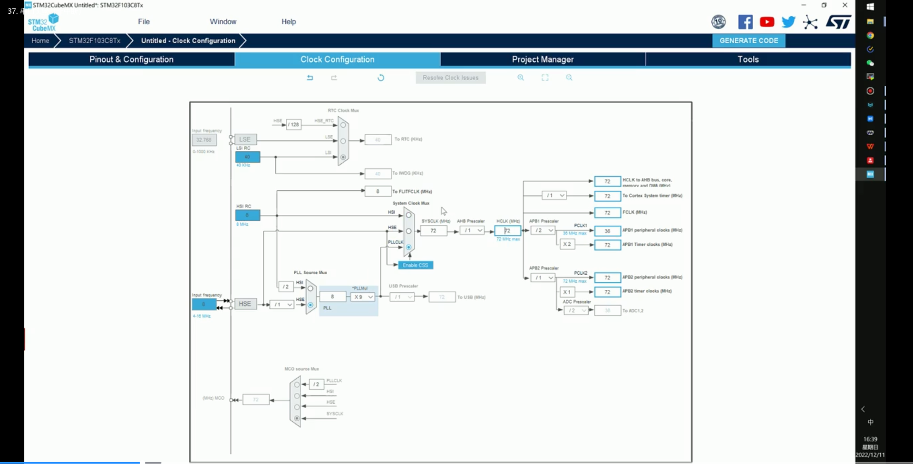
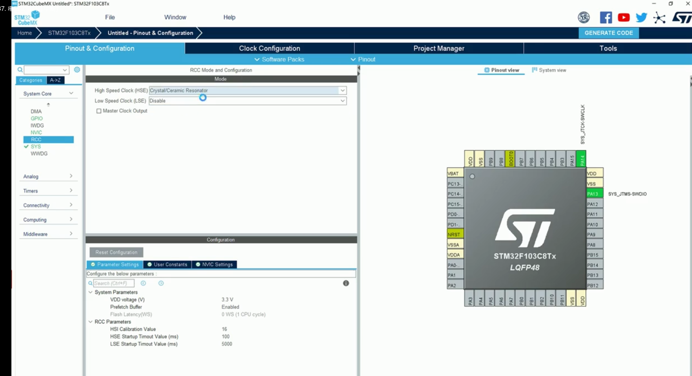
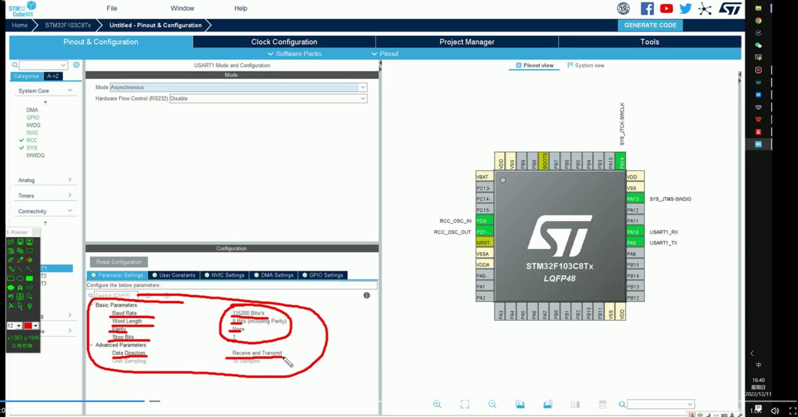
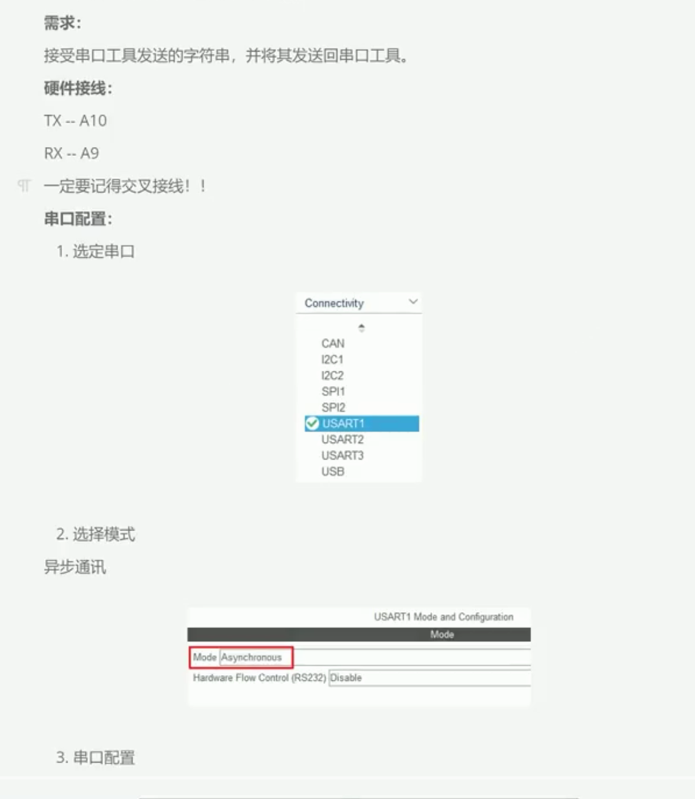
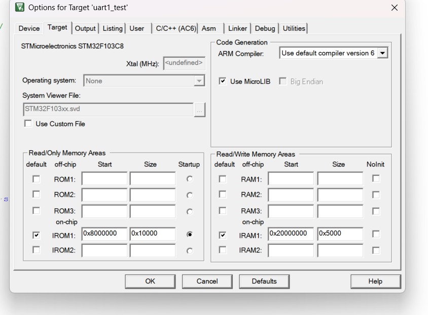

最多3个串口

&nbsp;

&nbsp;







&nbsp;



&nbsp;



```



use MicroLIB ✅️

&nbsp;


```


# STM32 串口 printf 重定向 & 回显 笔记

## 1\. HAL_UART_Transmit 发送字符串

```c
// ❌ 硬编码长度，修改字符串时容易忘改
HAL_UART_Transmit(&huart1, (uint8_t *)"hello world\r\n", 13, 100);

// ✅ 用 strlen 自动计算长度
const char *msg = "hello world\r\n";
HAL_UART_Transmit(&huart1, (uint8_t *)msg, strlen(msg), 100);
```

> 参数：`(串口句柄, 数据指针, 长度, 超时ms)`  
> `&huart1` 是取实体变量的地址（转成指针），`msg` 本身就是指针。

* * *

## 2\. HAL_UART_Receive 接收并回显

### 缓冲接收 + 回显（不用 printf，纯 HAL 方案）

```c
unsigned char ch[64] = {0};   // ⚠️ 声明为 unsigned char，避免接收时强制转换
while (1) {
    HAL_UART_Receive(&huart1, ch, sizeof(ch) - 1, 100);     // 接收
    HAL_UART_Transmit(&huart1, ch, strlen((char *)ch), 100); // 回显
    memset(ch, 0, sizeof(ch));                                // 彻底清零
}
```

### 逐字节回显（简单）

```c
uint8_t rx_byte;
while (1) {
    if (HAL_UART_Receive(&huart1, &rx_byte, 1, HAL_MAX_DELAY) == HAL_OK) {
        HAL_UART_Transmit(&huart1, &rx_byte, 1, 100);
    }
}
```

* * *

## 3\. 最终完整模板（HAL 直驱版，兼容所有编译器）

```c
/* Includes */
#include "main.h"
#include "usart.h"
#include "gpio.h"
#include <string.h>

int main(void)
{
    HAL_Init();
    SystemClock_Config();
    MX_GPIO_Init();
    MX_USART1_UART_Init();

    /* 发送字符串 */
    HAL_UART_Transmit(&huart1, (uint8_t *)"hello world\r\n",
                      strlen("hello world\r\n"), 0xFFFF);

    unsigned char ch[64] = {0};
    while (1)
    {
        /* 接收 + 回显 */
        HAL_UART_Receive(&huart1, ch, sizeof(ch) - 1, 100);
        HAL_UART_Transmit(&huart1, ch, strlen((char *)ch), 100);
        memset(ch, 0, sizeof(ch));
    }
}
```

> **优点**：不依赖 `<stdio.h>`、不依赖 MicroLIB、AC5/AC6/GCC 全部兼容。

* * *

## 4\. printf 重定向方案（按编译器选择）

### Keil AC5 + MicroLIB

```c
#include <stdio.h>

int fputc(int ch, FILE *f)
{
    unsigned char temp[1] = {ch};
    HAL_UART_Transmit(&huart1, temp, 1, 0xFFFF);
    return ch;
}
```

> Keil 必须操作：魔术棒 → Target → 勾选 **Use MicroLIB**

### STM32CubeIDE / GCC（newlib-nano）

```c
#include <stdio.h>

int __io_putchar(int ch)
{
    HAL_UART_Transmit(&huart1, (uint8_t *)&ch, 1, 0xFFFF);
    return ch;
}

// 或者用 _write 更底层
int _write(int file, char *ptr, int len)
{
    HAL_UART_Transmit(&huart1, (uint8_t *)ptr, len, 0xFFFF);
    return len;
}
```

### ARM Compiler 6（AC6）

```c
#include <stdio.h>

/* 禁用 semihosting */
__asm(".global __use_no_semihosting\n\t");
__asm(".global __ARM_use_no_argv\n\t");
FILE __stdout;

void _sys_exit(int ret) { for (;;); }
void _ttywrch(int ch)   { (void)ch; }

int fputc(int ch, FILE *f)
{
    unsigned char temp[1] = {ch};
    HAL_UART_Transmit(&huart1, temp, 1, 0xFFFF);
    return ch;
}
```

> **注意**：AC6 v6.24 的 MicroLIB 版 `stdio.h` 有 bug（`printf` 声明解析错误），建议关闭 MicroLIB 使用上述方案，或升级编译器版本。

| 编译器 | 标准库 | printf 底层 | 重写函数 | MicroLIB |
| --- | --- | --- | --- | --- |
| Keil AC5 | MicroLIB | fputc | `int fputc(int ch, FILE *f)` | 勾选  |
| Keil AC6 | 标准C库 | fputc | `int fputc(int ch, FILE *f)` + 禁用 semihosting | 不勾选 |
| GCC | newlib-nano | \_write | `int __io_putchar(int ch)` 或 `int _write(...)` | \-  |

* * *

## 5\. 常见问题

### AC6 v6.24 编译 `#include <stdio.h>` 报错

```
error: expected identifier or '('
extern _ARMABI int =(const char * __restrict /*format*/, ...) ...
```

**原因**：AC6 v6.24 的 MicroLIB 版 stdio.h 存在解析 bug。

**解决方案**（任选一种）：

1.  **不用 stdio.h**（推荐）— 直接用 `HAL_UART_Transmit` 发送
2.  关闭 MicroLIB + 使用 semihosting 禁用方案
3.  切换为 AC5 编译器
4.  升级 ARM Compiler 6 到 6.19+ 版本

### 缓冲区太小导致截断

- 缓存大小要 > 预期最大输入长度
- 接收长度用 `sizeof(buf) - 1`，跟随缓冲区自动适配

### memset 只清 strlen，导致残留数据

```c
// ❌ 如果 receive 返回 0，strlen=0，memset 等于没清
memset(ch, 0, strlen(ch));

// ✅ 始终用 sizeof 彻底清零
memset(ch, 0, sizeof(ch));
```

### 输出没有换行

- Windows 下换行是 `\r\n`（回车 + 换行）
- 单独 `\n` 只换行不回行首
- 单独 `\r` 只回行首不换行

### HAL_UART_Receive 第三个参数是 unsigned char\[\]

```c
// ✅ 声明为 unsigned char，无需类型转换
unsigned char ch[64] = {0};
HAL_UART_Receive(&huart1, ch, sizeof(ch) - 1, 100);

// ❌ 声明为 char，需要强制转换
char ch[64] = {0};
HAL_UART_Receive(&huart1, (uint8_t *)ch, sizeof(ch) - 1, 100);
```

&nbsp;

&nbsp;

&nbsp;

## 改造后:
以下是针对当前 `main.c` 改造的笔记：

---

## main.c 改造要点

### 1. printf 重定向 — `fputc` 简化

原来的写法创建了临时数组，当前直接传地址：

```c
// 原来
unsigned char temp[1] = {ch};
HAL_UART_Transmit(&huart1, temp, 1, 0xFFFF);

// 现在
HAL_UART_Transmit(&huart1, (uint8_t *)&ch, 1, 0xFFFF);
```

> 效果一致，更简洁。`(uint8_t *)` 是 Keil 的 HAL 参数类型要求。

### 2. 启动输出 — 用 `HAL_UART_Transmit` + `strlen` 替掉 `printf`

```c
// 原来
printf("hello world\r\n");

// 现在
HAL_UART_Transmit(&huart1, (uint8_t *)"hello world\n", strlen("hello world\n"), 0xFFFF);
```

> 对于固定字符串首次输出，直接用 HAL 发送更稳定，不依赖 printf 重定向是否已就绪。

### 3. 缓冲区提升到 main() 作用域

```c
// 原来 — 在 while(1) 内每次循环重新声明
while (1) {
    char ch[64] = {0};
    ...
}

// 现在 — 在 main() 开头声明一次，整个 main 可用
int main(void) {
    char ch[64] = {0};
    ...
    while (1) {
        ...
    }
}
```

> 声明提前，配合 `memset` 清零复用，避免每轮循环重复分配/初始化。

### 4. printf 参数安全修复

```c
// 原来 — 不安全，ch 可能含 % 导致格式化字符串漏洞
printf(ch);

// 现在 — 安全写法，ch 作为纯字符串参数
printf("%s", ch);
```

> 这是 ARMCLANG `-Wformat-security` 警告的直接修复。

### 5. 换行符选择

启动输出用的是 `\n` 而非 `\r\n`：
```c
"hello world\n"
```

> 串口助手中 `\n` 通常足够触发换行，`\r\n` 更严谨但非必须（取决于上位机终端配置）。如需严格的回车+换行，可恢复 `\r\n`。

### 6. 当前编译环境确认

| 项目 | 配置 |
|------|------|
| 编译器 | ARMCLANG V6.24 (AC6) |
| 芯片 | STM32F103C8 |
| MicroLIB | 已启用 (`useUlib=1`) |
| C 标准 | C99 (`uC99=1`) + V6 Lang=3 |

### 整体调用链

```
HAL_Init() → SystemClock_Config() → MX_GPIO_Init() → MX_USART1_UART_Init()
    → HAL_UART_Transmit("hello world\n")    ← 启动输出
    → while(1):
        HAL_UART_Receive(&huart1, ch, ...)   ← 接收
        printf("%s", ch)                     ← fputc→HAL_UART_Transmit 回显
        memset(ch, 0, sizeof(ch))            ← 清零
```