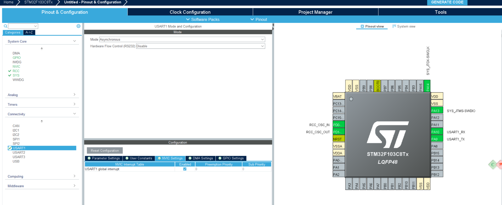
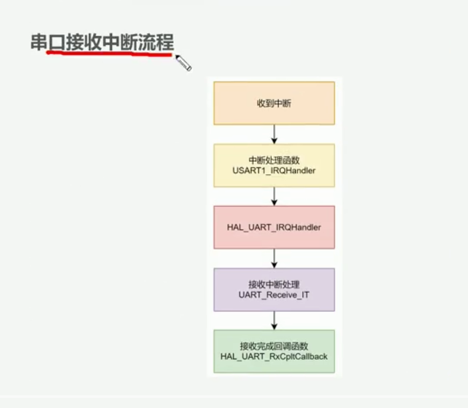
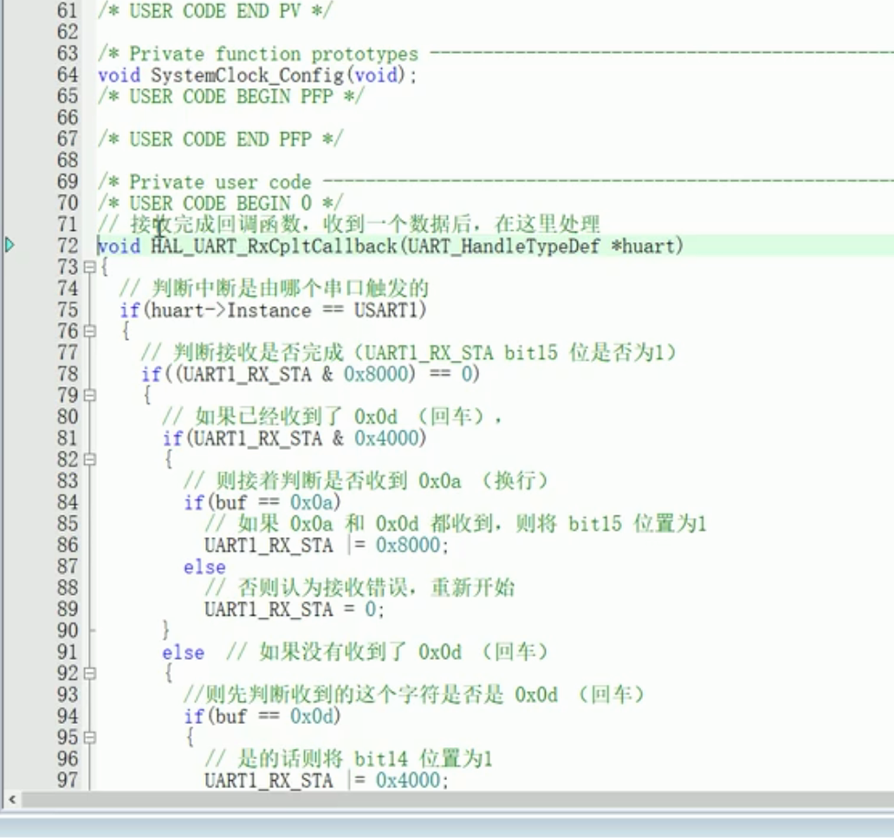

17步骤+




在main.c调用回调处理函数 HAL_UART_RxCpltCallback() 该函数一个字符一个字符的接受,接受一个字符,处理


这段代码对初学者确实不直观，因为它把“接收完成标志”和“接收长度”塞进了同一个变量 `UART_RX_STA`。实际工作中更常见、也更容易维护的写法，是把它们拆成两个变量。

## 1. 中断串口到底怎么工作

程序启动时执行：

```c
HAL_UART_Receive_IT(&huart1, &UART_RX_BUF[0], 1);
```

含义是：

> 请 USART1 接收 1 个字节，把它放进 `UART_RX_BUF[0]`，收到后产生中断。

它不会停在这里等待。

收到一个字节后，执行流程是：

```text
串口收到数据
    ↓
进入 USART1_IRQHandler
    ↓
HAL_UART_IRQHandler(&huart1)
    ↓
HAL 调用 HAL_UART_RxCpltCallback
    ↓
用户在回调中处理数据
    ↓
再次调用 HAL_UART_Receive_IT，等待下一个字节
```

所以，中断接收的关键是：**每接收完一次，通常都要重新开启下一次接收。**

---

## 2. 代码里有两种完全不同的 `&`

### 第一种：取地址

```c
&huart1
&UART_RX_BUF[0]
```

这里的 `&` 是“获取变量的内存地址”。

例如：

```c
uint8_t data;
HAL_UART_Receive_IT(&huart1, &data, 1);
```

表示：

- `&huart1`：UART1 管理对象的地址
- `&data`：接收到的数据应该存放的位置
- `1`：接收一个字节

数组中：

```c
&UART_RX_BUF[0]
```

表示第 0 个元素的地址，基本等价于：

```c
UART_RX_BUF
```

---

### 第二种：按位与

当 `&` 两边都有数字时：

```c
UART_RX_STA & 0x8000
```

这是“按位与”，用来检查某些二进制位。

`0x8000` 的二进制是：

```text
1000 0000 0000 0000
```

只有最高位是 1。

因此：

```c
if (UART_RX_STA & 0x8000)
```

意思是：

> 检查 `UART_RX_STA` 的最高位是不是 1。

结果不为 0，条件就成立。

它相当于检查“接收完成标志”。

---

## 3. `UART_RX_STA` 是怎么存两个信息的

这个变量是 16 位：

```text
bit15  bit14 ... bit0
 完成标志    接收长度
```

例如：

```text
UART_RX_STA = 0x8003
```

二进制大致是：

```text
1000 0000 0000 0011
│                   │
接收完成            接收了3个字节
```

检查是否完成：

```c
UART_RX_STA & 0x8000
```

提取接收长度：

```c
uint16_t len = UART_RX_STA & 0x3FFF;
```

`0x3FFF` 是：

```text
0011 1111 1111 1111
```

它会把高两位去掉，只保留低位的长度。

设置完成标志：

```c
UART_RX_STA |= 0x8000;
```

`|=` 表示按位或并赋值，相当于：

```c
UART_RX_STA = UART_RX_STA | 0x8000;
```

它只把最高位置 1，其他位保持不变。

---

## 4. 发送 `31 32 33 0A` 时发生了什么

| 收到数据 | 存放位置 | `UART_RX_STA` | 含义 |
|---|---:|---:|---|
| `31` | `BUF[0]` | `0x0001` | 已接收1字节 |
| `32` | `BUF[1]` | `0x0002` | 已接收2字节 |
| `33` | `BUF[2]` | `0x0003` | 已接收3字节 |
| `0A` | `BUF[3]` | `0x8003` | 换行，接收完成 |

主循环检测：

```c
if (UART_RX_STA & 0x8000)
```

此时条件成立。

然后提取长度：

```c
uint16_t len = UART_RX_STA & 0x3FFF;
```

得到：

```c
len = 3;
```

最后发送前三个字节：

```c
HAL_UART_Transmit(&huart1, UART_RX_BUF, len, 0xFFFF);
```

因此回显：

```text
123
```

---

## 5. 更适合学习和实际维护的写法

建议不要先使用 `UART_RX_STA` 这种位打包方式，而是拆成几个含义明确的变量：

```c
#include <stdbool.h>

#define UART_RX_BUF_LEN 64

static uint8_t rx_byte;
static uint8_t rx_buffer[UART_RX_BUF_LEN];

static volatile uint16_t rx_length = 0;
static volatile bool rx_complete = false;
```

启动第一次接收：

```c
HAL_UART_Receive_IT(&huart1, &rx_byte, 1);
```

中断回调：

```c
void HAL_UART_RxCpltCallback(UART_HandleTypeDef *huart)
{
    if (huart->Instance != USART1)
    {
        return;
    }

    if (rx_byte == '\n')
    {
        /* 收到换行，一行数据接收完成 */
        rx_complete = true;
    }
    else if (rx_byte == '\r')
    {
        /* 忽略回车符 */
    }
    else if (rx_length < UART_RX_BUF_LEN)
    {
        /* 保存普通数据 */
        rx_buffer[rx_length] = rx_byte;
        rx_length++;
    }
    else
    {
        /* 缓冲区已满 */
        rx_complete = true;
    }

    /* 一行尚未结束，继续接收下一个字节 */
    if (!rx_complete)
    {
        HAL_UART_Receive_IT(&huart1, &rx_byte, 1);
    }
}
```

主循环处理：

```c
while (1)
{
    if (rx_complete)
    {
        HAL_UART_Transmit(&huart1,
                          rx_buffer,
                          rx_length,
                          HAL_MAX_DELAY);

        rx_length = 0;
        rx_complete = false;

        /* 开始接收下一行 */
        HAL_UART_Receive_IT(&huart1, &rx_byte, 1);
    }
}
```

这和原代码原理相同，但变量含义更清晰：

- `rx_byte`：本次收到的一个字节
- `rx_buffer`：保存整行数据
- `rx_length`：已经接收多少字节
- `rx_complete`：一行是否接收完成

其中 `rx_length` 和 `rx_complete` 加 `volatile`，因为它们会在中断和主循环之间共享。

## 6. 实际工作中的常见原则

串口中断函数通常只做很短的事情：

- 取走收到的数据
- 放进缓冲区
- 更新长度或标志
- 开启下一次接收

复杂操作尽量放在主循环或任务中，例如：

- 解析通信协议
- 计算校验和
- 控制设备
- 写 Flash
- 打印大量日志

数据量较小、按命令行接收时，逐字节中断很适合。数据量较大或长度不固定时，实际项目通常会使用：

```c
HAL_UARTEx_ReceiveToIdle_IT()
```

或者：

```c
HAL_UARTEx_ReceiveToIdle_DMA()
```

不过学习阶段，先把上面的“单字节中断 + 完成标志”掌握好最合适。


会，而且在嵌入式开发中很常见，因为硬件寄存器本质上就是“一排开关”。不过实际项目一般会用有名字的宏，不会到处写 `0x8000` 这种难读的数字。

可以把按位操作先理解成：

```text
&   检查开关
|   打开开关
&~  关闭开关
^   翻转开关
```

例如一个 8 位状态寄存器：

```text
bit7 bit6 bit5 bit4 bit3 bit2 bit1 bit0
                ↑
            数据接收完成
```

如果 bit4 表示“接收完成”，掩码就是：

```c
#define RX_COMPLETE_FLAG  0x10
```

检查它：

```c
if (status & RX_COMPLETE_FLAG)
{
    /* bit4 是 1，接收完成 */
}
```

你可以直接把它读成：

> status 里面有没有 RX_COMPLETE_FLAG？

而不必每次都自己计算二进制。

常见的四种操作是：

```c
/* 检查某一位 */
if (status & RX_COMPLETE_FLAG)

/* 设置某一位 */
status |= RX_COMPLETE_FLAG;

/* 清除某一位 */
status &= ~RX_COMPLETE_FLAG;

/* 翻转某一位 */
status ^= RX_COMPLETE_FLAG;
```

## 为什么嵌入式里很多

STM32 的一个硬件寄存器可能同时保存很多状态，例如 UART 状态寄存器：

```text
bit7：发送寄存器空
bit6：发送完成
bit5：收到新数据
bit3：溢出错误
bit2：噪声错误
```

读取同一个寄存器，就能知道很多硬件状态。

底层代码可能是：

```c
if (USART1->SR & USART_SR_RXNE)
{
    /* 收到了数据 */
}
```

但使用 HAL 时，通常写成更容易理解的形式：

```c
if (__HAL_UART_GET_FLAG(&huart1, UART_FLAG_RXNE))
{
    /* 收到了数据 */
}
```

这个 HAL 宏内部依然使用按位与，只是帮你隐藏了细节。

## 实际工作不建议随便写“魔法数字”

这种代码不直观：

```c
if (status & 0x20)
```

更好的写法是：

```c
#define UART_DATA_READY_FLAG  (1U << 5)

if (status & UART_DATA_READY_FLAG)
```

`1U << 5` 表示把数字 `1` 左移5位：

```text
0000 0001
    ↓ 左移5位
0010 0000
```

代码一眼就能看出是在检查第5位。

## 你现在代码里的位操作不是必须的

当前代码：

```c
uint16_t UART_RX_STA;
```

同时保存：

- 最高位：接收是否完成
- 低位：接收长度

这样写节省变量，但理解和维护都更困难。

实际项目完全可以拆开：

```c
volatile bool rx_complete = false;
volatile uint16_t rx_length = 0;
```

判断完成：

```c
if (rx_complete)
```

设置完成：

```c
rx_complete = true;
```

获得长度：

```c
uint16_t len = rx_length;
```

这种写法更适合业务代码，也方便调试。按位操作主要应该出现在：

- 操作硬件寄存器
- 解析通信协议
- 保存多个状态标志
- 权限和功能开关
- 对存储空间要求很高的场景

所以不用担心：按位操作确实要会，但不需要把所有状态都强行写成位操作。看到：

```c
value & MASK
```

先把它翻译成一句话：

> 检查 `value` 中由 `MASK` 指定的那些位。

这样会比直接盯着二进制容易得多。


-------------------------------------------------------------------------


这个函数的作用是：**USART1 每接收完一次指定数量的数据后，由 HAL 自动调用它。**

因为你每次要求接收 `1` 个字节：

```c
HAL_UART_Receive_IT(&huart1, &UART_RX_BUF[0], 1);
```

所以当前程序中，串口每收到一个字节，就会触发一次：

```c
HAL_UART_RxCpltCallback()
```

## 触发过程

程序启动时：

```c
HAL_UART_Receive_IT(&huart1, &UART_RX_BUF[0], 1);
```

表示：

> 开启 USART1 中断接收，接收1个字节，保存到 `UART_RX_BUF[0]`。

当电脑发送一个字节后：

```text
串口助手发送数据
        ↓
STM32 PA10 收到数据
        ↓
硬件产生 USART1 中断
        ↓
进入 USART1_IRQHandler()
        ↓
HAL_UART_IRQHandler(&huart1)
        ↓
HAL发现1个字节接收完成
        ↓
调用 HAL_UART_RxCpltCallback(&huart1)
```

所以它不是由你直接调用的，而是 HAL 在串口中断中自动调用的。

## 一行一行理解

### 1. 判断是不是 USART1

```c
if (huart->Instance == USART1)
```

同一个回调函数可以处理多个串口，例如 USART1、USART2。

`huart` 表示这次是哪个串口产生的回调。

这段判断的意思是：

> 只有 USART1 收到数据时，才执行下面的代码。

`huart->Instance` 等价于：

```c
(*huart).Instance
```

因为 `huart` 是一个指针。

---

### 2. 获取当前数据位置

```c
uint16_t idx = UART_RX_STA & 0x3FFF;
```

`UART_RX_STA` 低位保存当前接收长度，也就是下一次存放位置。

刚启动时：

```c
UART_RX_STA = 0;
idx = 0;
```

所以第一个字节存放在：

```c
UART_RX_BUF[0]
```

需要注意：进入回调之前，HAL 已经把收到的字节放进缓冲区了。

---

### 3. 判断当前字节是不是换行符

```c
if (UART_RX_BUF[idx] == '\n')
```

`\n` 就是换行符，对应十六进制：

```text
0A
```

如果收到的是 `0A`：

```c
UART_RX_STA |= 0x8000;
return;
```

把最高位置 1，表示一行数据接收完成，然后退出回调。

这里没有再次调用 `HAL_UART_Receive_IT()`，所以会暂时停止接收。

之后主循环发现完成标志：

```c
if (UART_RX_STA & 0x8000)
```

便处理并回显数据，然后重新启动下一轮接收。

---

### 4. 如果不是换行，索引加一

```c
idx++;
```

例如刚才接收的是第0个字节：

```text
原来 idx = 0
加一后 idx = 1
```

下一个字节就应该保存到：

```c
UART_RX_BUF[1]
```

---

### 5. 检查缓冲区是否满了

```c
if (idx >= UART_RX_BUF_LEN - 1)
```

缓冲区长度是64：

```c
#define UART_RX_BUF_LEN 64
```

数组下标只能是：

```text
0～63
```

如果缓冲区快满了，程序设置完成标志并退出：

```c
UART_RX_STA |= 0x8000;
return;
```

这样可以避免继续接收导致数组越界、破坏其他内存。

---

### 6. 保存新的索引

```c
UART_RX_STA = idx;
```

例如刚收到第一个字节：

```text
idx = 1
UART_RX_STA = 1
```

意思是已经接收了1个普通数据字节，下一个字节存入下标1。

---

### 7. 开启下一字节接收

```c
HAL_UART_Receive_IT(&huart1, &UART_RX_BUF[idx], 1);
```

表示：

> 再接收1个字节，把它保存到 `UART_RX_BUF[idx]`。

这里：

```c
&UART_RX_BUF[idx]
```

的 `&` 是“取地址”，不是按位与。

## 发送 `31 32 33 0A` 的完整过程

### 收到 `31`

硬件先执行：

```text
UART_RX_BUF[0] = 0x31
```

然后触发回调：

```text
idx = 0
不是换行
idx变成1
UART_RX_STA = 1
下一次接收到 UART_RX_BUF[1]
```

### 收到 `32`

```text
UART_RX_BUF[1] = 0x32
idx变成2
UART_RX_STA = 2
下一次接收到 UART_RX_BUF[2]
```

### 收到 `33`

```text
UART_RX_BUF[2] = 0x33
idx变成3
UART_RX_STA = 3
下一次接收到 UART_RX_BUF[3]
```

### 收到 `0A`

```text
UART_RX_BUF[3] = 0x0A
```

回调发现：

```c
UART_RX_BUF[3] == '\n'
```

于是：

```c
UART_RX_STA |= 0x8000;
```

最终：

```text
UART_RX_STA = 0x8003
```

含义是：

```text
最高位：接收完成
低位：有效数据长度为3
```

主循环便发送：

```text
UART_RX_BUF[0] = '1'
UART_RX_BUF[1] = '2'
UART_RX_BUF[2] = '3'
```

## 什么情况下不会触发

以下情况不会进入这个回调：

- 没有调用 `HAL_UART_Receive_IT()`
- 串口没有收到数据
- 接收中断没有开启
- `USART1_IRQHandler()` 没有调用 `HAL_UART_IRQHandler()`
- 接收过程中发生错误，可能进入 `HAL_UART_ErrorCallback()`
- 上一次接收完成后没有重新调用 `HAL_UART_Receive_IT()`

最关键的一句话是：

> `HAL_UART_Receive_IT(..., 1)` 只负责接收一个字节；一个字节收到后触发回调，必须在回调或主循环中再次调用它，才能继续接收下一个字节。