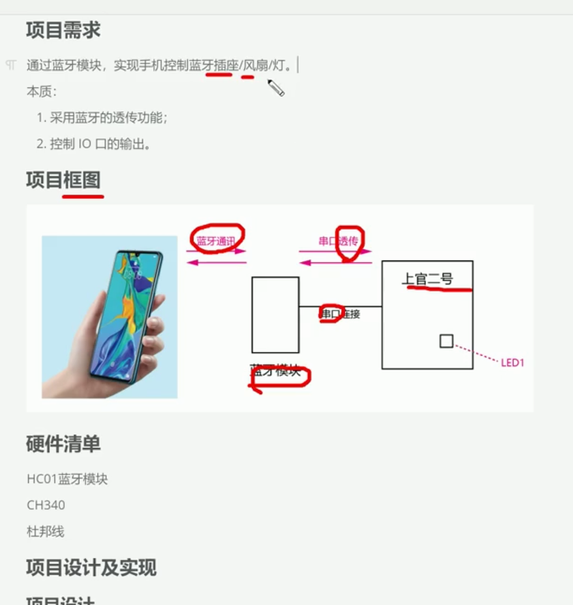
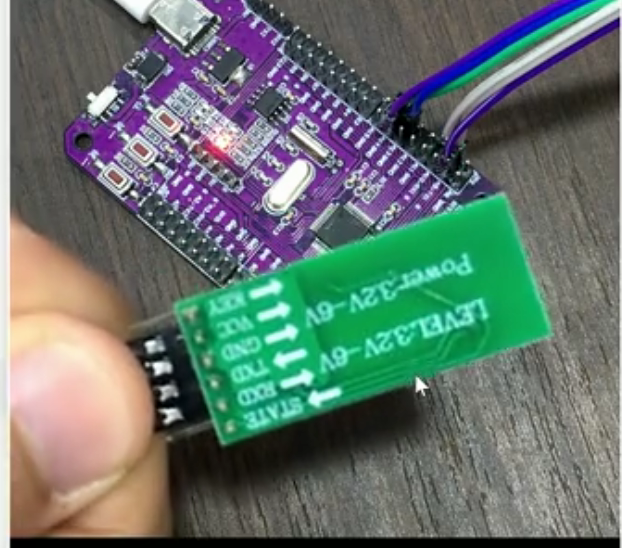
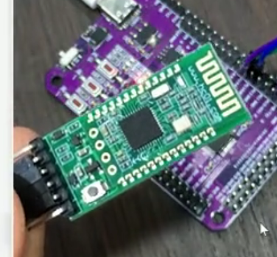
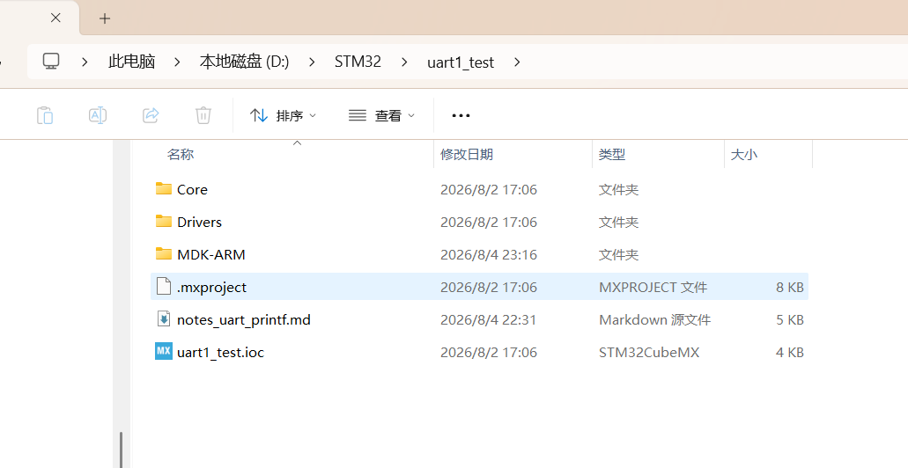
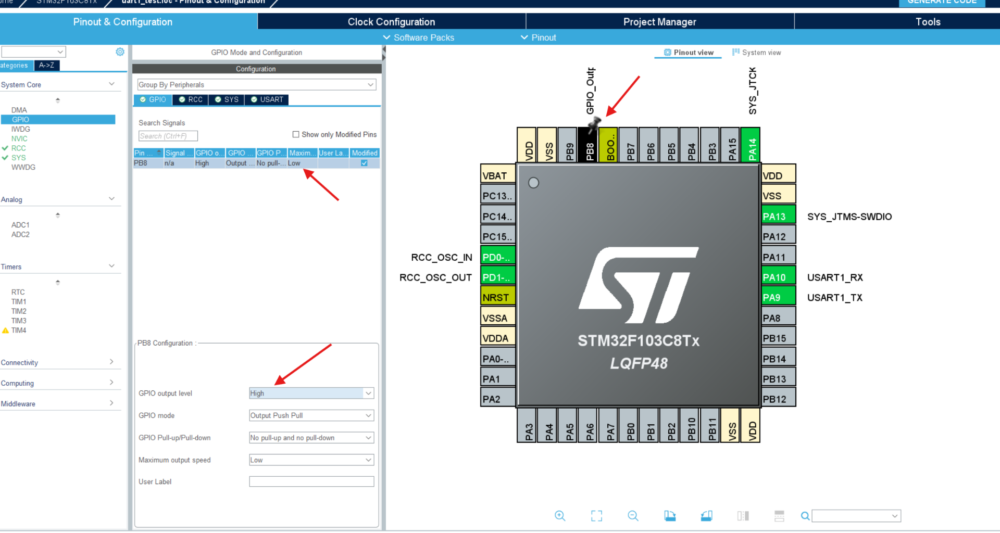
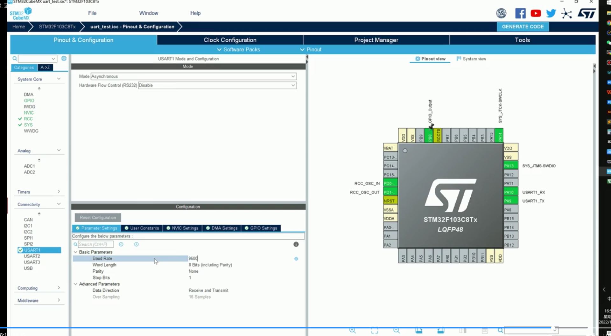
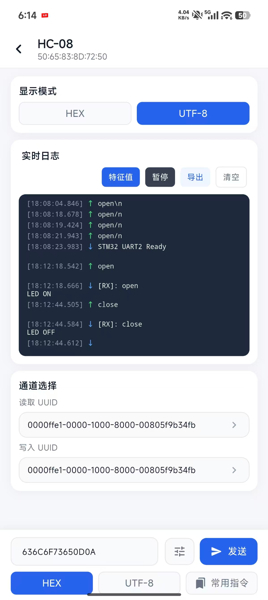

基于uart1_test 进行修改,增加P8 GPIO口


这里在经过使用串口助手(pc版)发送open/n close/n完成后,再次使用蓝牙模块发送

HC-08 波特率9600, 在UART2_test模块基础上修改

严格来说，这不是 UTF-8 编码不支持换行，而是该 App 不会把输入框里的 \n 转换成换行字节。以后遇到串口命令没反应，可以先查看实际发送的十六进制字节，这是很实用的排查方法。


open: 6F 70 65 6E 0A(hex)
close: 63 6C 6F 73 65 0D 0A (hex)

原因已经很明确：写入 UUID 选错了。

截图中：

```text
读取 UUID：FFE1  ← 正确
写入 UUID：2A02  ← 错误
```

HC-08 默认使用：

```text
服务 UUID：FFE0
读/写/通知特征 UUID：FFE1
```

而 `2A02` 是蓝牙标准里的“Peripheral Privacy Flag”，不是串口透传通道，所以模块拒绝写入，应用直接显示“发送失败”。[HC-08 官方手册](https://www.hc01.com/downloads/HC-08A%20version%20english%20datasheet.pdf)也说明 `FFE1` 支持 `read / notify / write_without_response`；`2A02` 的定义可见[蓝牙 SIG 官方编号表](https://www.bluetooth.com/wp-content/uploads/Files/Specification/HTML/Assigned_Numbers/out/en/index-en.html)。

修正步骤：

1. 点击“写入 UUID”这一栏。
2. 选择：

```text
0000ffe1-0000-1000-8000-00805f9b34fb
```

3. 如果能选择写入方式，选择：

```text
Write Without Response
写入无响应
```

4. “读取 UUID”继续保持 `FFE1`。
5. 再发送 `open`。

另外，你的 STM32 程序需要收到换行才处理命令。UUID修正后，如果显示“发送成功”但 GPIO 没动作，点击发送框旁边的设置按钮，开启：

```text
结尾添加 LF
```

或：

```text
结尾添加 CRLF
```

最终应该发送的实际数据是：

```text
open\n
close\n
```

但要在应用设置中添加真实换行，不能在输入框直接输入普通字符 `/n`。

