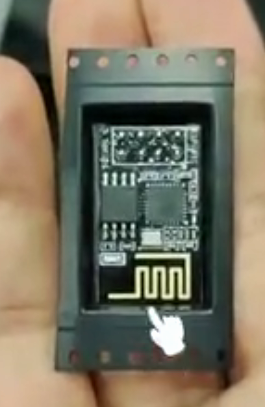
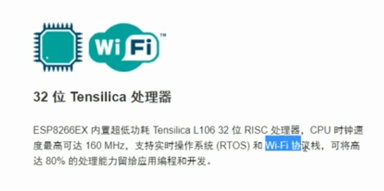
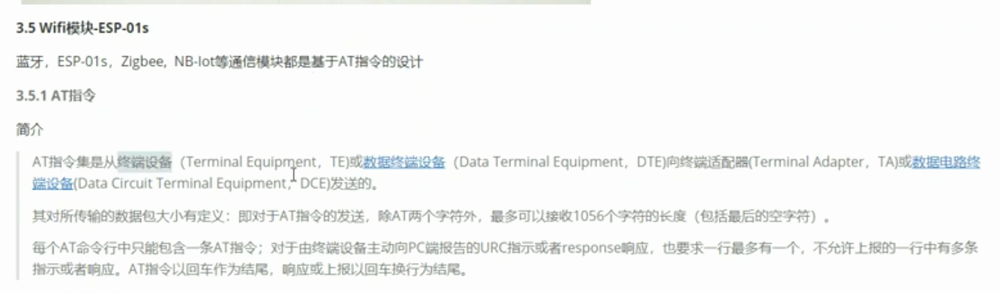
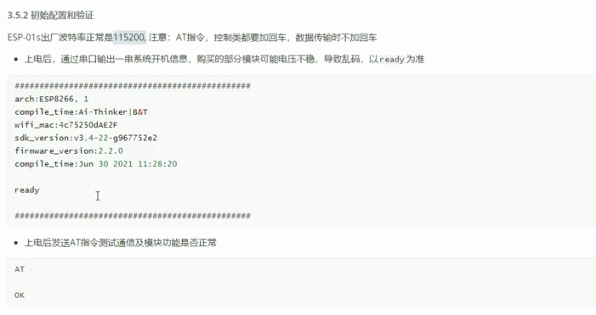
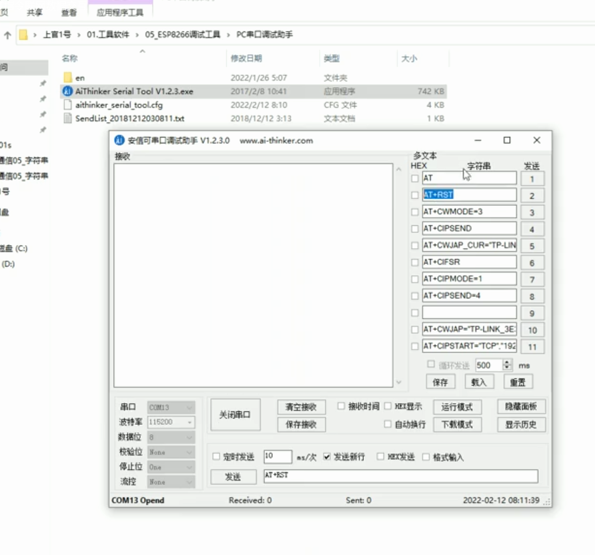
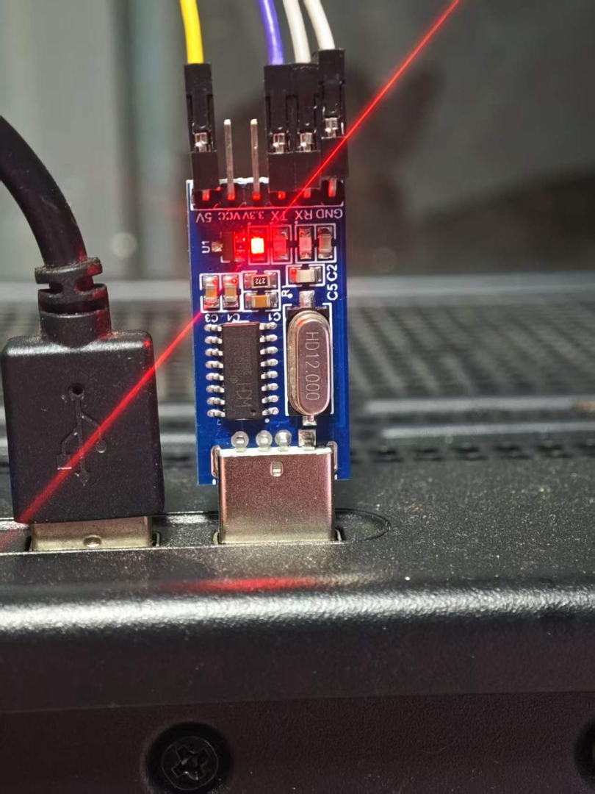
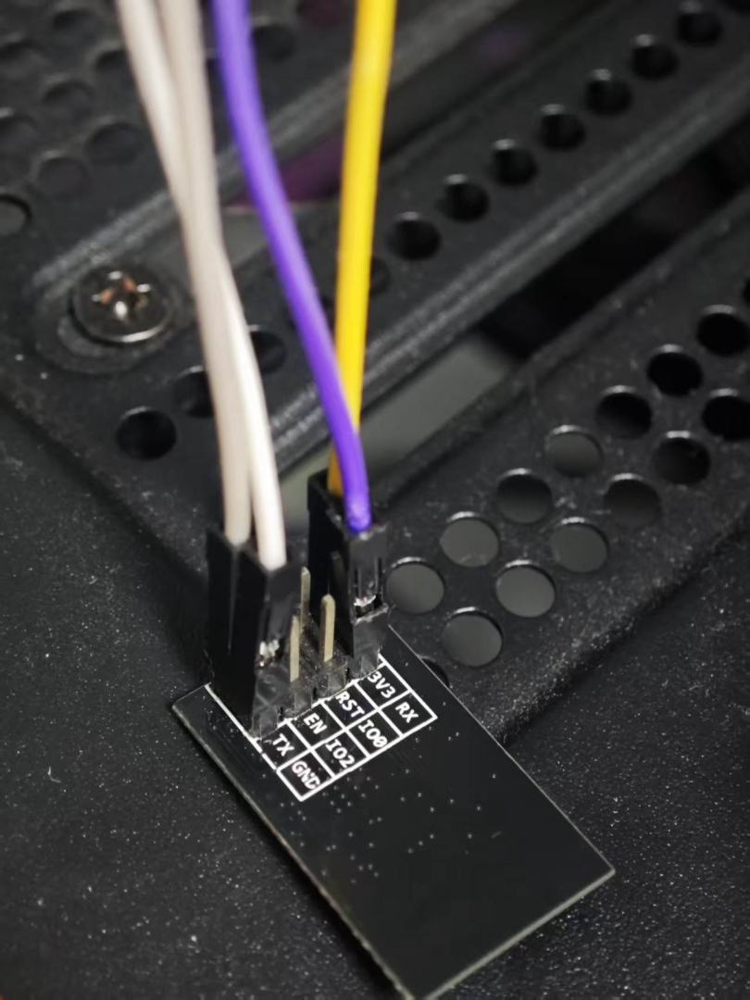
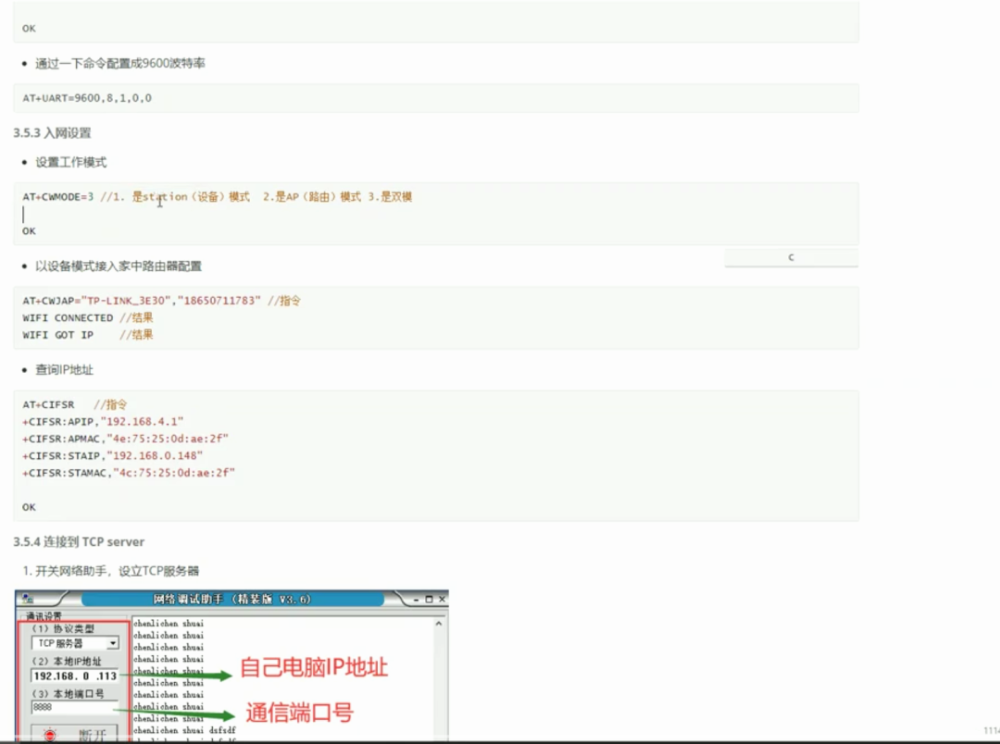

学习rtos recors 用到多线程,方便处理数据
### wifi模块

- 目标: 通过wifi模块,实现单片机的上网
- 
- 
- 
- 
- 官网说的115200是“对应官方ESP-AT固件的出厂配置”，不代表你手上模块当前保存的波特率一定是115200。

而且你第一张截图的历史命令中已经出现了：

```text
AT+UART=9600,8,1,0,0
```

在部分旧版ESP8266/NONOS-AT固件中，这条命令可能会把9600保存进Flash。如果当时恰好带了正确的`\r\n`并收到`OK`，很可能就是那次改的。也可能是卖家在出厂测试时已经设置为9600。

现在在9600下依次发送：

```text
AT+GMR
AT+UART_CUR?
AT+UART_DEF?
```

预期分别得到：

```text
AT version:...
SDK version:...
```

```text
+UART_CUR:9600,8,1,0,0
OK
```

```text
+UART_DEF:9600,8,1,0,0
OK
```

其中：

- `UART_CUR`：当前配置，不一定断电保存；
- `UART_DEF`：保存在Flash中的默认配置，断电后仍有效。

这是乐鑫官方对两条命令的定义。[ESP8266 ESP-AT命令文档](https://docs.espressif.com/projects/esp-at/en/release-v2.3.0.0_esp8266/AT_Command_Set/Basic_AT_Commands.html)

如果这些命令返回`ERROR`，说明可能是旧版AT固件，再尝试：

```text
AT+UART?
```

最简单的验证方式是：

1. 在9600下确认`AT`返回`OK`；
2. 彻底断电10秒；
3. 重新上电；
4. 仍然用9600发送`AT`。

断电后仍能返回`OK`，就说明9600已经是Flash中保存的配置，而不是串口助手偶然碰巧接收正确。

9600可以继续使用，没有问题，只是传输速度较慢。若想恢复115200，可在当前正常工作的9600下发送：

```text
AT+UART_DEF=115200,8,1,0,0
```

收到`OK`后关闭串口，改成115200再打开。如果是旧固件，则可能使用：

```text
AT+UART=115200,8,1,0,0
```

不建议直接执行`AT+RESTORE`，因为它除了恢复波特率，还会清除已保存的Wi-Fi及其他AT配置。

- 
- 
- 


