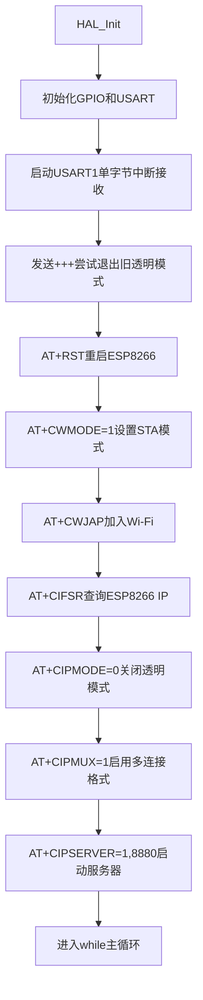
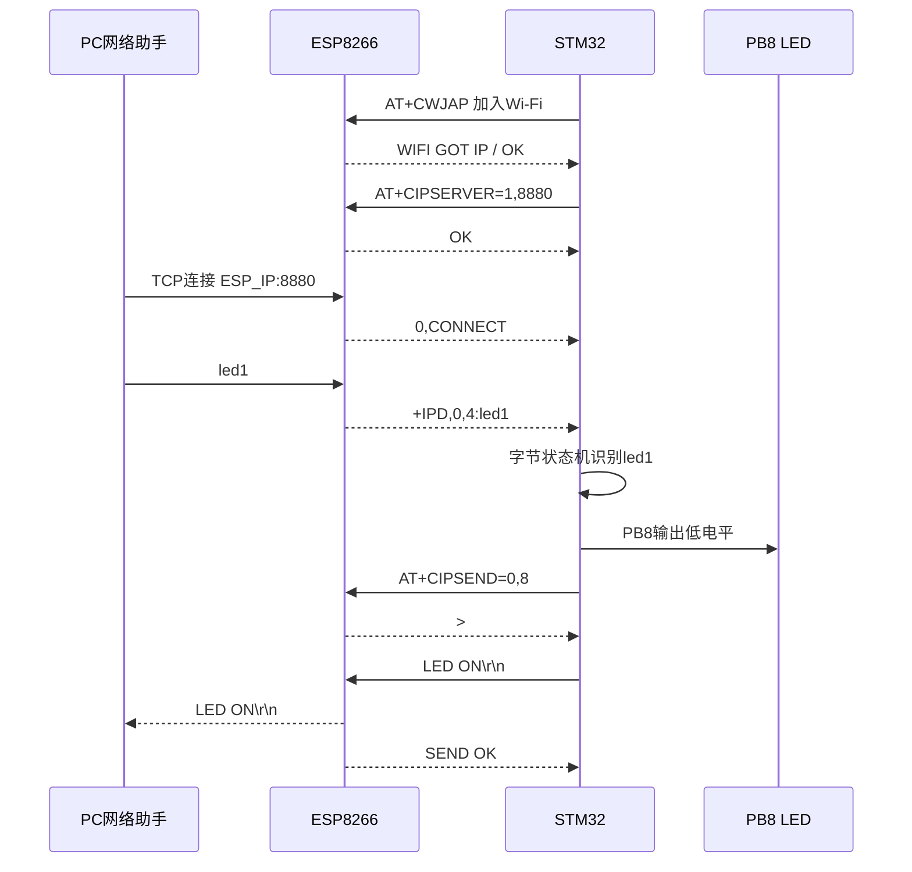

## esp8266当做服务器,然后让pc机连接esp8266
# ESP8266 TCP Server 学习笔记

> 面向前端开发者的 STM32 + ESP8266 入门笔记，内容基于当前 `uart2_test_revert` 工程。

## 1. 先用一句话理解这个项目

PC 作为 TCP Client，主动连接 ESP8266 的 TCP Server；PC 发送 `led1` 或 `led0`，ESP8266 通过串口把网络数据交给 STM32，STM32 最终控制 PB8 上的 LED，并把执行结果回复给 PC。

完整的数据链路是：

```text
网络调试助手
    │ TCP Client，发送 led1 / led0
    ▼
Wi-Fi 网络
    │
    ▼
ESP8266
    │ TCP Server + AT 固件
    │ USART1
    ▼
STM32F103C8
    │ 解析命令并控制 GPIO
    ▼
PB8 LED
```

ESP8266 负责“联网和 TCP”，STM32 负责“业务逻辑和硬件控制”。

---

## 2. 项目中的硬件分工

| 模块 | 作用 | 当前配置 |
|---|---|---|
| STM32F103C8 | 主控制器，执行程序和控制 LED | 主循环 + 串口中断 |
| ESP8266 | Wi-Fi 与 TCP 通信 | Wi-Fi STA + TCP Server |
| USART1 | STM32 与 ESP8266 通信 | 9600，PA9 TX，PA10 RX |
| USART2 | STM32 向 PC 输出调试日志 | 115200，PA2 TX，PA3 RX |
| PB8 | 控制 LED | 低电平亮，高电平灭 |

串口接线需要交叉：

```text
STM32 PA9  USART1_TX  ───> ESP8266 RX
STM32 PA10 USART1_RX  <─── ESP8266 TX
STM32 GND             ───  ESP8266 GND
```

注意：ESP8266 是 3.3V 器件，IO 不应直接接 5V；供电还需要能够承受 Wi-Fi 发射时的瞬时电流。供电不稳经常表现为随机重启、入网失败或 TCP 连接后掉线。

---

## 3. 前端概念与嵌入式概念对照

前端转嵌入式时，可以先建立下面这组对应关系：

| 前端常见概念 | 当前项目中的对应概念 |
|---|---|
| 浏览器事件循环 | STM32 的 `while (1)` 主循环 |
| DOM/网络事件回调 | 串口接收完成中断回调 |
| `onmessage(data)` | `HAL_UART_RxCpltCallback()` |
| 消息队列 | USART2 环形缓冲区 |
| 流式解析器 | `+IPD` 解析和 `led1/led0` 状态机 |
| HTTP/WebSocket 连接 | 更底层的 TCP 连接 |
| 后端监听端口 | ESP8266 执行 `AT+CIPSERVER=1,8880` |
| 前端请求服务器 | PC 的 TCP Client 主动连接 ESP8266 |
| API 协议 | 自定义的 `led1/led0` 命令协议 |

但有一个重要区别：浏览器替你处理了大量底层细节；裸机 STM32 中，这些缓冲、状态、超时和字节解析通常需要自己管理。

---

## 4. Wi-Fi 角色和 TCP 角色不是一回事

这是学习这个项目时最容易混淆的地方。

### 4.1 Wi-Fi 层

- STA：像手机一样，连接已有 Wi-Fi。
- SoftAP：像路由器一样，自己创建 Wi-Fi 热点。

当前代码执行：

```text
AT+CWMODE=1
AT+CWJAP="mi","12345678"
```

所以当前 ESP8266 是 Wi-Fi STA，会连接名为 `mi` 的现有 Wi-Fi。

### 4.2 TCP 层

- TCP Server：监听一个端口，等待连接。
- TCP Client：知道 Server 的 IP 和端口，主动连接。

当前 ESP8266 执行：

```text
AT+CIPSERVER=1,8880
```

因此当前 ESP8266 同时是：

```text
Wi-Fi STA + TCP Server
```

PC 和 ESP8266 都要连接 `mi`，然后 PC 网络调试助手以 TCP Client 身份连接：

```text
ESP8266的局域网IP:8880
```

教程中“ESP8266 有自己的 Wi-Fi”通常指另一种组合：

```text
Wi-Fi SoftAP + TCP Server
```

这种模式下 PC 先连接 ESP8266 创建的热点，再连接通常为 `192.168.4.1` 的 ESP8266。它不需要外部路由器，但不是当前代码使用的联网方式。

---

## 5. 当前项目与旧项目的区别

### 旧项目

```text
ESP8266：TCP Client
PC网络助手：TCP Server
```

ESP8266 使用类似下面的命令主动连接 PC：

```text
AT+CIPSTART="TCP","PC_IP",8880
```

### 当前项目

```text
ESP8266：TCP Server
PC网络助手：TCP Client
```

ESP8266 在本地监听 8880：

```text
AT+CIPMUX=1
AT+CIPSERVER=1,8880
```

两种方案改变的是“谁主动建立连接”，不是 `led1/led0` 的含义。

TCP 连接建立之后是全双工的：

```text
PC  <──────── 双向收发 ────────>  ESP8266
```

Client 可以发送和接收，Server 同样可以发送和接收。Server 并不等于“只能接收”，Client 也不等于“只能发送”。

---

## 6. TCP 应该怎样理解

### 6.1 TCP Server 的职责

Server 主要做三件事：

1. 绑定本机端口。
2. 监听端口。
3. 接受 Client 发起的连接。

ESP8266 的 AT 固件替 STM32 完成了这些工作。STM32 只需要发送 AT 命令并处理返回结果。

### 6.2 TCP Client 的职责

Client 必须知道：

- Server 的 IP 地址。
- Server 的端口。

当前 PC 网络调试助手需要填写 ESP8266 的 IP 和 `8880`。

### 6.3 TCP 是可靠的字节流

TCP保证的核心内容包括：

- 数据按顺序到达。
- 丢失的数据会重传。
- 重复的数据会被协议处理。
- 双方能检测连接建立和断开。

但 TCP 不保留应用消息边界。

PC 连续发送：

```text
led1
led0
```

接收方可能分成下面几次收到：

```text
le
d1led
0
```

也可能一次收到：

```text
led1led0
```

这都是正常现象。因此嵌入式程序不能依赖“一次接收刚好是一条命令”。当前代码通过逐字节状态机解决了这个问题。

### 6.4 `led1` 是应用协议，不是 TCP 协议

TCP 只看到 4 个字节：

```text
6C 65 64 31
```

它并不知道这些字节代表“开灯”。

“收到 `led1` 就开灯”是当前项目自己定义的应用层规则，类似前端项目中约定：

```json
{"action":"led","value":1}
```

未来可以把协议升级为：

```text
LED:1\n
LED:0\n
```

或者 JSON、TLV、二进制帧。TCP 层不需要因此改变。

---

## 7. ESP8266 的 AT 命令是什么

ESP8266 内部运行了 AT 固件，可以把它理解为一个“通过串口调用的网络 SDK”。

STM32 发送命令：

```text
AT+CIPSERVER=1,8880\r\n
```

ESP8266 返回：

```text
OK\r\n
```

这类似前端调用一个异步 API：

```js
await esp.startServer({ port: 8880 })
```

区别是这里没有 JavaScript 对象和 Promise，只有串口上的文本字节、状态标志和超时等待。

---

## 8. 当前代码的启动流程

主程序启动后大致按下面的顺序执行：



关键点：ESP8266 的 TCP Server 模式需要连接编号，因此使用 `CIPMUX=1`。这时不能沿用旧项目的透明传输方案，需要解析 `+IPD` 并使用带连接编号的 `CIPSEND`。

---

## 9. 为什么启动时发送 `+++`

旧代码曾使用透明传输模式。在透明模式下，STM32 发送的普通串口内容会被 ESP8266 当成 TCP 数据，而不是 AT 命令。

`+++` 是退出透明传输的转义序列，并且前后需要保护时间：

```text
等待约1秒 → 发送+++ → 等待约1秒
```

退出后再发送：

```text
AT+RST
```

这样即使 ESP8266 保留在旧运行状态，STM32 也有机会恢复对它的 AT 控制。

---

## 10. 串口接收中断：嵌入式中的事件回调

当前代码通过下面的调用启动 USART1 接收：

```c
HAL_UART_Receive_IT(&huart1, &ESP_RX_BYTE, 1U);
```

含义是：

> USART1 收到 1 个字节后产生中断，并调用接收完成回调。

回调函数是：

```c
void HAL_UART_RxCpltCallback(UART_HandleTypeDef *huart)
```

可以把它类比为：

```js
serial.on("data", byte => {
  // 处理一个字节
});
```

但 STM32 的中断回调有更严格的要求：

- 尽量短。
- 不做长时间阻塞。
- 不在里面执行复杂业务。
- 收到一个字节后，必须重新启动下一次接收。

因此当前回调主要负责：

1. 判断当前字节属于 AT 返回还是 TCP Payload。
2. 更新解析状态。
3. 把需要显示的数据放进缓冲区。
4. 设置标志，通知主循环处理业务。
5. 再次调用 `HAL_UART_Receive_IT()`。

---

## 11. `+IPD`：ESP8266 如何把 TCP 数据交给 STM32

PC 连接成功时，ESP8266通常输出：

```text
0,CONNECT
```

这里的 `0` 是 TCP 连接编号。

当编号 0 的 PC 连接发送 `led1` 时，ESP8266通过 USART1 输出：

```text
+IPD,0,4:led1
```

字段解释：

| 字段 | 含义 |
|---|---|
| `+IPD` | ESP8266 收到了网络数据 |
| `0` | 数据来自连接 0 |
| `4` | Payload 长度为 4 字节 |
| `led1` | 真正的 TCP Payload |

代码中的 `ESP_ParseIPDHeader()` 负责解析头部，得到：

```text
ESP_IPD_LINK_ID = 0
ESP_IPD_REMAINING = 4
```

随后接收的 4 个字节才会送入 LED 命令解析器。这样可以避免把 `+IPD`、连接号、长度等 AT 固件信息误当成用户命令。

---

## 12. `led1/led0` 状态机

`LED_ParseByte()` 不要求一次拿到完整字符串，而是维护一个匹配进度：

```text
状态0 --收到l--> 状态1
状态1 --收到e--> 状态2
状态2 --收到d--> 状态3
状态3 --收到1--> 产生开灯命令
状态3 --收到0--> 产生关灯命令
```

假设 TCP 把 `led1` 拆成两次：

```text
第一次：le
第二次：d1
```

状态机会在第一次结束时停在“已经匹配 le”，第二次继续匹配，所以仍然能正确识别。

这与前端流式读取响应体时使用增量解析器的思路相同。

当前匹配还兼容大小写：

```text
led1
LED1
Led1
```

都会被统一按小写处理。

---

## 13. 为什么中断只设置 Pending，主循环再控制 LED

收到完整命令时，中断没有直接完成全部业务，而是设置：

```c
LED_COMMAND_PENDING
LED_COMMAND_LINK_ID
```

主循环中的 `LED_ProcessPending()` 再完成：

1. 读取并清除 Pending。
2. 控制 PB8。
3. 通过 ESP8266 回复 PC。

这种结构可以理解为：

```text
中断 = 快速生产事件
主循环 = 消费事件并执行耗时业务
```

类似前端中事件处理器先把任务放入队列，再由事件循环调度执行。

---

## 14. `volatile` 的作用

许多变量被声明为：

```c
volatile uint8_t ESP_SEND_OK_Flag;
```

`volatile` 告诉编译器：

> 这个变量可能在当前代码流程之外发生变化，每次使用时都要真正读取内存，不能只相信寄存器中的旧值。

在当前项目中：

- 中断回调写入标志。
- 主循环或等待函数读取标志。

如果没有 `volatile`，编译器优化可能导致主循环看不到中断刚刚写入的新值。

但要注意：`volatile` 不等于线程安全，也不保证一组操作的原子性。

所以读取并清除 Pending 时使用了短暂的临界区：

```c
__disable_irq();
command = LED_COMMAND_PENDING;
LED_COMMAND_PENDING = 0U;
__enable_irq();
```

它防止“刚读完但还没有清零时，中断又写入新命令”造成状态混乱。

---

## 15. 环形缓冲区：为什么不在中断里直接打印

USART1 接收中断可能连续触发。如果在中断里使用阻塞方式向 USART2 打印大量内容，会延长中断执行时间，导致后续 ESP8266 字节丢失。

当前代码使用：

```text
UART2_FORWARD_BUF
UART2_FORWARD_HEAD
UART2_FORWARD_TAIL
```

形成环形缓冲区：

```text
USART1中断：把数据快速写入缓冲区
                  ↓
主循环：从缓冲区取出数据并发送到USART2
```

`HEAD` 表示下一次写入的位置，`TAIL` 表示下一次读取的位置。

如果 `HEAD` 的下一格追上 `TAIL`，表示缓冲区已满，代码设置：

```text
UART2_FORWARD_OVERRUN = 1
```

主循环随后打印溢出提示。

这和前端/Node.js 中生产者速度超过消费者时出现的背压问题很相似。

---

## 16. STM32 如何给 TCP Client 回复数据

Server 模式启用了连接编号，所以发送时不能直接把 `LED ON` 写进 USART1。

假设命令来自连接 0，回复长度是 8 字节，完整流程为：

```text
STM32 -> ESP8266: AT+CIPSEND=0,8\r\n
ESP8266 -> STM32: >
STM32 -> ESP8266: LED ON\r\n
ESP8266 -> STM32: SEND OK
```

代码中的 `ESP_SendToClient()` 完成这套流程：

1. 生成 `AT+CIPSEND=<link_id>,<length>`。
2. 等待 `>` 提示符。
3. 发送指定长度的 Payload。
4. 等待 `SEND OK`。
5. 任一步骤超时或收到错误就返回失败。

这里的长度必须是实际字节数。长度填错可能导致 ESP8266 继续等待数据，或者把后续 AT 命令误当成 Payload。

---

## 17. 当前程序的主循环

初始化结束后，程序永远运行：

```c
while (1)
{
    LED_ProcessPending();
    UART2_ForwardPending();
    // 处理缓冲区溢出和心跳
    HAL_Delay(1U);
}
```

裸机程序通常没有“执行完退出”的概念。复位后从 `main()` 开始，完成初始化，再永久运行主循环。

可以把它理解为一个永不结束的事件循环：

```js
while (true) {
  processLedCommands();
  flushDebugQueue();
  await delay(1);
}
```

区别是 C 代码没有 JavaScript Runtime 帮助调度，时间、并发和硬件状态都需要开发者明确管理。

---

## 18. PB8 为什么低电平亮

当前板子的 LED 是低电平有效：

```c
HAL_GPIO_WritePin(GPIOB, GPIO_PIN_8, GPIO_PIN_RESET); // 亮
HAL_GPIO_WritePin(GPIOB, GPIO_PIN_8, GPIO_PIN_SET);   // 灭
```

这通常意味着 LED 的连接方式类似：

```text
3.3V ─ 电阻 ─ LED ─ PB8
```

PB8 输出低电平时形成电流回路，LED 点亮；PB8 输出高电平时两端电压接近，LED 熄灭。

所以不能简单认为“写 1 一定是开，写 0 一定是关”。必须结合原理图和有效电平判断。

---

## 19. 从上电到开灯的完整时序



---

## 20. 实际测试步骤

### 20.1 烧录和串口观察

1. 编译并烧录 STM32 程序。
2. 打开连接 CH340 的串口助手。
3. USART2 参数设置为 `115200, 8-N-1`。
4. 复位 STM32。

正常情况下会看到类似日志：

```text
=== ESP8266 TCP Server ===
Joining WiFi...
WiFi connected
ESP8266 station IP follows:
[ESP8266]: +CIFSR:STAIP,"192.168.x.x"
Starting TCP server on port 8880...
TCP server ready: connect PC to ESP_IP:8880
```

### 20.2 PC 建立 TCP 连接

1. 确保 PC 与 ESP8266 连接同一个 Wi-Fi。
2. 网络调试助手选择 `TCP Client`。
3. 服务器地址填写 `AT+CIFSR` 显示的 ESP8266 IP。
4. 端口填写 `8880`。
5. 点击连接。

连接成功后 USART2 通常会显示：

```text
[ESP8266]: 0,CONNECT
```

### 20.3 测试 LED

发送：

```text
led1
```

预期结果：

- PB8 LED 点亮。
- PC 收到 `LED ON`。
- USART2 输出 LED ON 日志。

发送：

```text
led0
```

预期结果：

- PB8 LED 熄灭。
- PC 收到 `LED OFF`。
- USART2 输出 LED OFF 日志。

---

## 21. 常见问题排查

| 现象 | 优先检查 |
|---|---|
| 一直 Wi-Fi join failed | SSID、密码、2.4GHz Wi-Fi、ESP8266供电、USART1波特率 |
| 看不到任何 ESP8266 返回 | PA9/PA10 是否交叉、是否共地、ESP波特率是否为9600 |
| PC 连接不上 | PC与ESP是否同网段、IP是否取自 `STAIP`、端口是否为8880 |
| 网络助手开了 Server 后无法使用 | 当前ESP也是Server，网络助手应选择TCP Client |
| 收到 `0,CLOSED` | PC断开、Wi-Fi不稳定或网络助手主动关闭连接 |
| 收到命令但LED不亮 | 检查PB8、LED有效电平和开发板原理图 |
| LED变化但PC没有回复 | 查看是否出现 `>`、`SEND OK` 或 `CIPSEND` 错误 |
| 出现 forwarding buffer overrun | 输入数据过快，USART2转发速度跟不上USART1接收速度 |
| ESP8266随机重启 | 优先检查3.3V供电能力和电源去耦 |

---

## 22. 阅读当前 `main.c` 的推荐顺序

不要从第一行机械地往下读，建议按功能阅读：

1. 先看顶部的 AT 命令常量，了解初始化目标。
2. 看 `main()`，掌握启动顺序和主循环。
3. 看 `HAL_UART_RxCpltCallback()`，理解字节从哪里进入程序。
4. 看 `ESP_ParseIPDHeader()`，理解 AT 头部与 TCP Payload 的边界。
5. 看 `LED_ParseByte()`，理解流式状态机。
6. 看 `LED_ProcessPending()`，理解中断和主循环如何协作。
7. 看 `ESP_SendToClient()`，理解服务器如何向指定连接回复。
8. 最后看环形缓冲区，理解实时接收和慢速输出之间的解耦。

这样相当于先阅读前端应用的数据流，再深入 Runtime 和底层实现。

---

## 23. C 语言阅读提示

### 固定宽度整数

```c
uint8_t   // 8位无符号整数，通常用于字节
uint16_t  // 16位无符号整数
uint32_t  // 32位无符号整数
```

嵌入式开发关心变量宽度，因为寄存器、协议字段和内存大小都是明确的。

### `static`

函数前的 `static`：

```c
static void LED_ProcessPending(void);
```

表示这个函数只在当前 `.c` 文件内部可见，类似模块私有函数。

函数内部变量前的 `static` 表示它在多次调用之间保留值。

### `const`

```c
static const char ESP_RESET_COMMAND[] = "AT+RST\r\n";
```

表示程序不应修改这段数据，类似只读配置。

### 指针和地址

```c
&ESP_RX_BYTE
```

`&` 表示取得变量的内存地址。HAL需要知道接收到的数据应该写到哪块内存。

```c
uint8_t *data
```

表示 `data` 保存的是一个字节数组的起始地址，而不是数组内容本身。

### `sizeof` 和 `strlen`

- `sizeof(array)`：编译时数组占用的总字节数，字符串数组包含结尾的 `\0`。
- `strlen(string)`：运行时计算可见字符串长度，不包含 `\0`。

发送固定字符串时经常使用：

```c
sizeof(REPLY) - 1U
```

减 1 是为了不把结尾的 `\0` 发送到 TCP 网络。

---

## 24. 当前实现的边界

当前代码适合学习和单个 PC 控制，但还不是完整产品协议：

- ESP8266 AT 层允许多个连接号，业务层主要按单个 PC 的使用场景设计。
- Pending 只保存一条尚未处理的 LED 命令，不是完整命令队列。
- `led1/led0` 没有鉴权，局域网内能连接端口的设备都可以控制 LED。
- Wi-Fi 名称和密码直接写在固件中。
- 没有断线自动重建服务器的完整状态机。
- 没有命令校验、版本号、设备状态查询或错误码协议。
- USART1 当前只有 9600 波特率，不适合高吞吐数据业务。

这些不是当前实验的错误，而是下一阶段可以逐步扩展的工程能力。

---

## 25. 推荐练习路线

### 第一阶段：理解现有数据流

1. 用网络助手发送大小写不同的 `led1/LED1`。
2. 一次发送 `xxled1yy`，观察状态机仍能匹配。
3. 连续发送 `led1led0`，观察最终状态。
4. 主动断开 PC，观察 `0,CLOSED`。

### 第二阶段：扩展命令协议

可以增加：

```text
status      查询LED状态
blink:500   每500ms闪烁
version     查询固件版本
```

重点不是多写几个 `if`，而是设计明确的：

- 帧结束条件。
- 最大命令长度。
- 参数格式。
- 错误回复。
- 超时处理。

### 第三阶段：从标志位升级到事件队列

把单个 `LED_COMMAND_PENDING` 升级为命令队列，使多个快速到达的命令不会互相覆盖。

### 第四阶段：非阻塞状态机

当前 `ESP_SendToClient()` 会等待 `>` 和 `SEND OK`。可以进一步改成完全非阻塞状态机，让主循环同时处理更多任务。

### 第五阶段：Wi-Fi SoftAP

让 ESP8266 创建自己的热点，理解：

```text
Wi-Fi角色变化 ≠ TCP角色必须变化
```

ESP仍然可以保持 TCP Server，只是 PC 不再通过外部路由器找到它。

### 第六阶段：RTOS

掌握裸机主循环、中断、队列和状态机以后，再学习 FreeRTOS：

- 任务。
- 消息队列。
- 信号量。
- 软件定时器。
- 中断与任务间通信。

这样能理解 RTOS 解决了什么问题，而不只是会调用 API。

---

## 26. 最终知识模型

学习这个项目时，可以始终记住下面五层：

```text
第5层：业务规则      led1表示开灯，led0表示关灯
第4层：应用协议      命令格式、回复格式、长度和边界
第3层：TCP           可靠、按序、全双工的字节流
第2层：Wi-Fi         让PC和ESP8266进入可互通的网络
第1层：UART/GPIO     STM32与ESP通信，并控制实际硬件
```

遇到问题时先判断问题在哪一层：

- Wi-Fi都没有连接成功：不要先检查 `led1` 状态机。
- TCP连接不上：先检查IP、端口和Client/Server角色。
- TCP已连接但没有 `+IPD`：检查数据是否真正发送以及AT接收流程。
- 已经看到 `+IPD,0,4:led1` 但LED不变：检查Payload解析和GPIO。
- LED已变化但PC没收到回复：检查 `CIPSEND`、`>` 和 `SEND OK`。

这就是从前端转向嵌入式时非常重要的“分层排查”能力。

---

## 27. 一句话总结

这个项目不是单纯“用 Wi-Fi 控制 LED”，它同时展示了嵌入式开发中的核心方法：分层理解协议、用中断接收实时数据、用缓冲区解耦速度、用状态机解析字节流、用主循环处理业务，并通过超时和状态标志管理外部模块。


本质上，`led1` 这几个字节没有区别，区别只在于“谁主动建立 TCP 连接”。

| 方案 | ESP8266 的 Wi-Fi 身份 | ESP8266 的 TCP 身份 | 谁主动连接 |
|---|---|---|---|
| 修改前 | STA，连接 `mi` | TCP Client | ESP8266 连接 PC |
| 当前代码 | STA，连接 `mi` | TCP Server | PC 连接 ESP8266 |
| 教程常见方案 | SoftAP，自己发 Wi-Fi | TCP Server | PC 先连接 ESP Wi-Fi，再连接 ESP |

连接建立以后：

- 修改前：PC 的 Server 在已接受的连接中发送 `led1`。
- 当前：PC 的 Client 在主动建立的连接中发送 `led1`。
- STM32 最终收到的有效数据仍然是 `l e d 1`，LED 控制效果相同。

“ESP8266 有自己的 Wi-Fi”指 ESP8266 工作在 SoftAP 模式，会创建类似下面的无线网络：

```text
Wi-Fi 名称：ESP8266_AP
密码：12345678
ESP8266 IP：通常为 192.168.4.1
TCP 端口：例如 8880
```

PC 的连接过程就是：

```text
PC 连接 ESP8266_AP
        ↓
TCP Client 连接 192.168.4.1:8880
        ↓
发送 led1
```

这种方式不需要路由器或手机热点，PC 可以直接连接 ESP8266。

当前代码则是：

```text
ESP8266 ──连接──> Wi-Fi“mi”
PC      ──连接──> Wi-Fi“mi”
PC TCP Client ──连接──> ESP8266局域网IP:8880
```

所以，当前代码属于“ESP8266 是 TCP Server”，但它并没有自己创建 Wi-Fi。Wi-Fi 的 AP/STA 身份和 TCP 的 Server/Client 身份是两套独立概念。按你的要求，这里没有继续修改代码。


可以把这两个项目理解成：同一条 TCP 通信链路，只是“打电话的人”互换了。

### 1. TCP Server 和 Client 是什么

用打电话类比：

- TCP Server：公开电话号码，守着电话等待别人打进来。
- TCP Client：知道对方号码，主动拨号。
- TCP 连接成功后：双方都能说话、都能听，不再区分谁只能发、谁只能收。

这里的“电话号码”就是：

```text
IP地址 + TCP端口
```

例如：

```text
192.168.1.20:8880
```

其中：

- IP 地址用于找到设备。
- 端口 `8880` 用于找到设备里的这个 TCP 服务。

### 2. 之前的项目

之前的角色是：

```text
ESP8266：TCP Client
PC网络助手：TCP Server
```

过程是：

```text
PC网络助手监听 8880 端口
          ↓
ESP8266执行 AT+CIPSTART
          ↓
ESP8266主动连接 PC_IP:8880
          ↓
连接成功
          ↓
PC发送 led1
          ↓
ESP8266接收 → STM32控制LED
```

对应的关键指令是：

```text
AT+CIPSTART="TCP","PC的IP",8880
```

它的含义是：

> ESP8266 主动连接指定 PC 的 8880 端口。

因此，PC 必须先打开 TCP Server 并监听端口。

### 3. 当前项目

当前角色交换了：

```text
ESP8266：TCP Server
PC网络助手：TCP Client
```

过程是：

```text
ESP8266监听 8880 端口
          ↓
PC主动连接 ESP8266_IP:8880
          ↓
ESP8266报告 0,CONNECT
          ↓
PC发送 led1
          ↓
ESP8266输出 +IPD,0,4:led1
          ↓
STM32解析 led1 → 控制LED
```

ESP8266启动服务器使用：

```text
AT+CIPMUX=1
AT+CIPSERVER=1,8880
```

它的含义是：

> ESP8266 在自己的 8880 端口等待 TCP Client 连接。

所以网络助手必须选择 TCP Client，然后填写 ESP8266 的 IP 和端口 `8880`。

### 4. `+IPD,0,4:led1` 怎么理解

当前服务器模式下，ESP8266收到 PC 数据后，会通过串口告诉 STM32：

```text
+IPD,0,4:led1
```

各部分含义：

| 内容 | 含义 |
|---|---|
| `+IPD` | 收到了网络数据 |
| `0` | 数据来自编号为 0 的 TCP 连接 |
| `4` | 后面有 4 个数据字节 |
| `led1` | 实际的 TCP 数据 |

注意，`led1` 实际是 4 个字符，所以长度为 4。

STM32需要把前面的 ESP8266 信息去掉，只将 `led1` 交给 LED 命令解析程序。

### 5. TCP 和 `led1` 是两层东西

可以分成三层理解：

```text
Wi-Fi：让两台设备在网络上能够互相找到
  ↓
TCP：建立一条可靠、双向的字节通道
  ↓
led1/led0：你自己定义的控制协议
```

所以：

- TCP 不知道 LED 是什么。
- TCP 只负责可靠、按顺序地传送字节。
- `led1` 表示开灯，是这个项目自己规定的。
- 也可以改成 `ON`、`OFF` 或其他命令，TCP本身不用改变。

### 6. TCP是“字节流”

TCP不会保证一次发送对应一次接收。例如 PC 连续发送：

```text
led1
led0
```

STM32可能分多次收到：

```text
le
d1
led
0
```

也可能一次收到：

```text
led1led0
```

这些都属于正常现象。

因此当前代码不是假设“一次就收到完整的 `led1`”，而是逐字节匹配：

```text
l → e → d → 1
```

即使命令被拆开传输，也能识别。

### 7. 最核心的理解

之前：

```text
ESP8266主动找PC
PC等待ESP8266
```

现在：

```text
PC主动找ESP8266
ESP8266等待PC
```

连接建立之后，两种方案都变成：

```text
PC  ⇄  TCP连接  ⇄  ESP8266  ⇄  串口  ⇄  STM32  ⇄  LED
```

所以 LED 功能没有本质变化，变化的只是 TCP 连接由谁发起、哪台设备需要提供固定的 IP 和监听端口。


不是“UART1 回调触发 UART2 中断”，而是分成两步：

```text
ESP8266数据
   ↓
USART1接收中断
   ↓
HAL_UART_RxCpltCallback()
   ├─ 解析 led1
   └─ 把数据放进 UART2 环形缓冲区
          ↓
主循环 while(1)
   ├─ LED_ProcessPending() 控制LED并打印GPIO日志
   └─ UART2_ForwardPending() 把缓冲区发给CH340
```

当前 USART2 使用的是：

```c
HAL_UART_Transmit(&huart2, ...)
```

这是主循环中的阻塞发送，不是 USART2 中断发送。

当 PC 发送 `led1` 后，理论上 CH340 会看到：

```text
[GPIO] LED ON (PB8=LOW)
```

同时，TCP Payload `led1` 也会被原样转发。不过如果网络助手只发送 `led1`、没有附加换行，它可能与后面的日志粘在一起，例如：

```text
led1[ESP8266]: SEND OK
```

所以看起来可能不像一条独立日志。

可以按现象判断：

- LED亮，并且启动日志能看到，但看不到独立的 `led1`：多数是没有换行或日志粘连；检查串口助手显示区域。
- LED亮，但连 `[GPIO] LED ON` 都没有：可能烧录的不是当前版本，或者 USART2 发送出现异常。
- LED不亮，也没有日志：说明 USART1 没收到/没正确解析 `+IPD,0,4:led1`，需要先检查 TCP 是否连接成功。
- 启动时所有日志都看不到：检查 CH340 是否连接 USART2、波特率是否为 `115200`、PA2/PA3 接线和共地。
- 能看到 `[ESP8266]: 0,CONNECT`：说明 PC 已成功连接 ESP8266 TCP Server。

另外，当前程序不会完整打印：

```text
+IPD,0,4:led1
```

`+IPD` 头部会被程序用于解析并移除，只有真正的 Payload `led1` 被转发到 CH340。这是当前代码的预期行为。