## 25 看门狗实验
### 开启独立看门狗,溢出时间为1秒,使用按键1进行喂狗
### 硬件接线
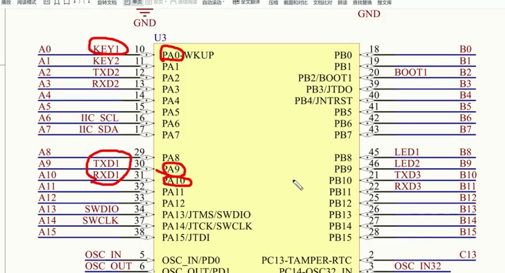 
KEY1 -- PA0
UART1 -- PA9 PA10
### 溢出时间计算
#### 公式: 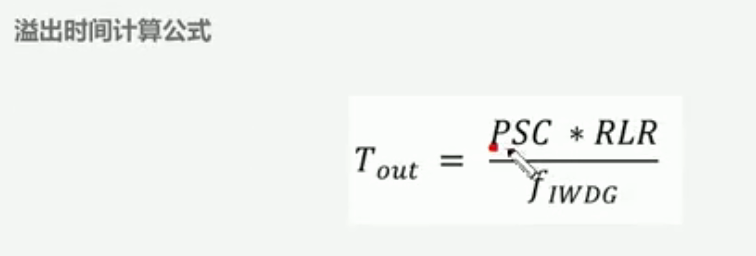
#### PSC: 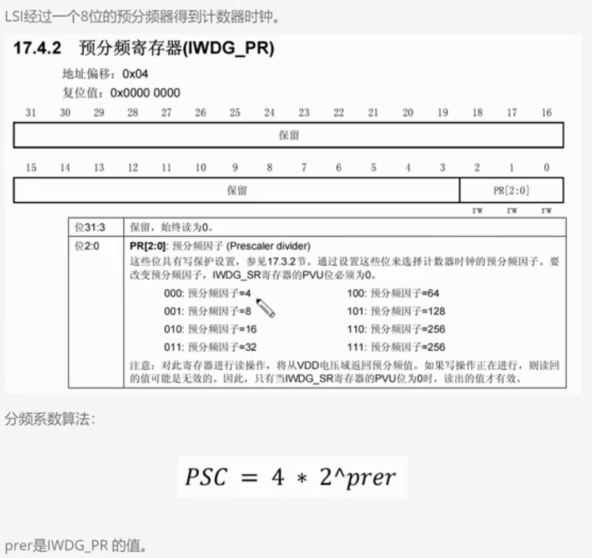
#### f1wdg: 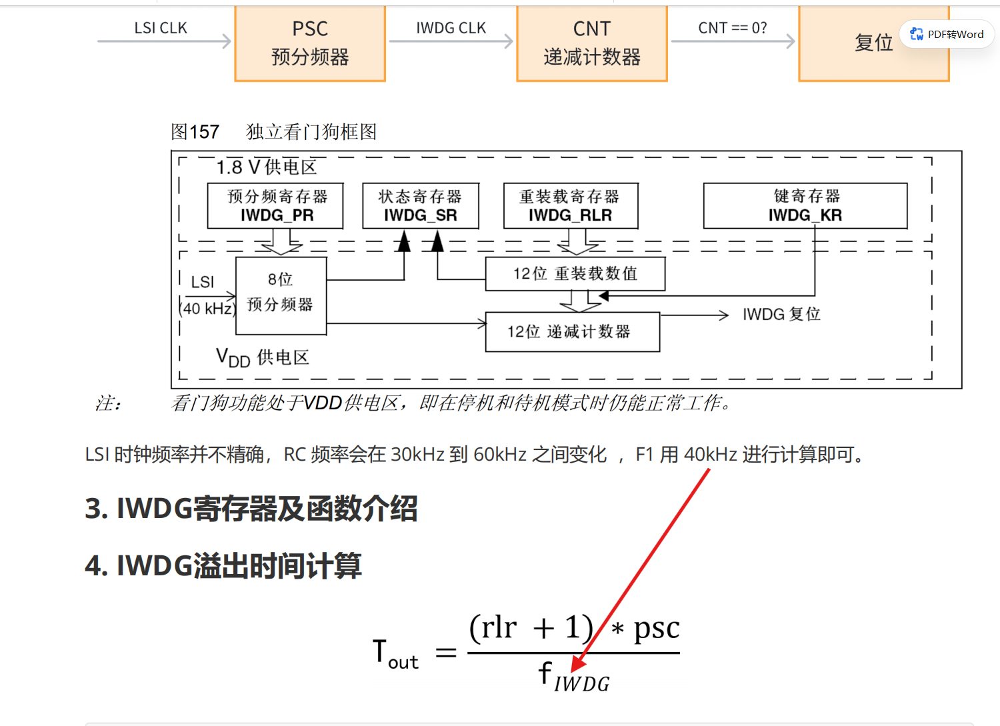
#### 1000毫秒: 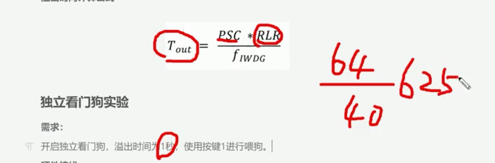
#### 溢出时间设置: PSC=64, RLR=625
### STM32CubeMX配置
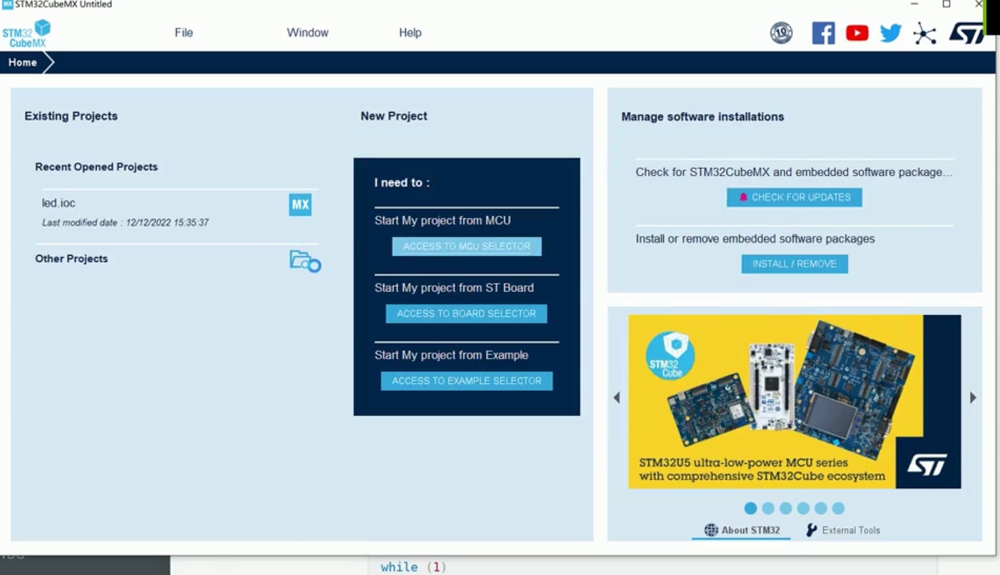
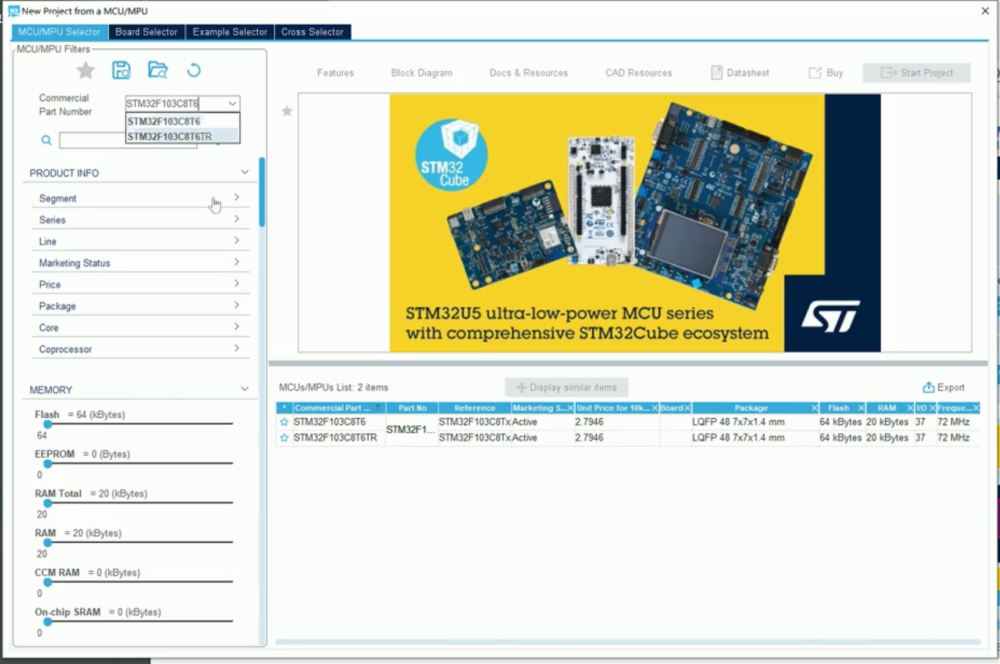
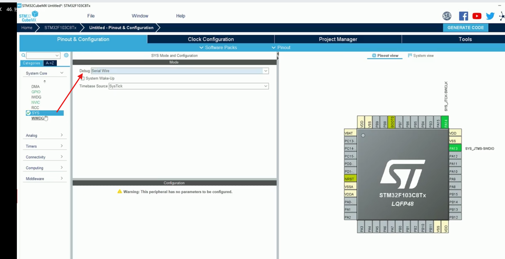
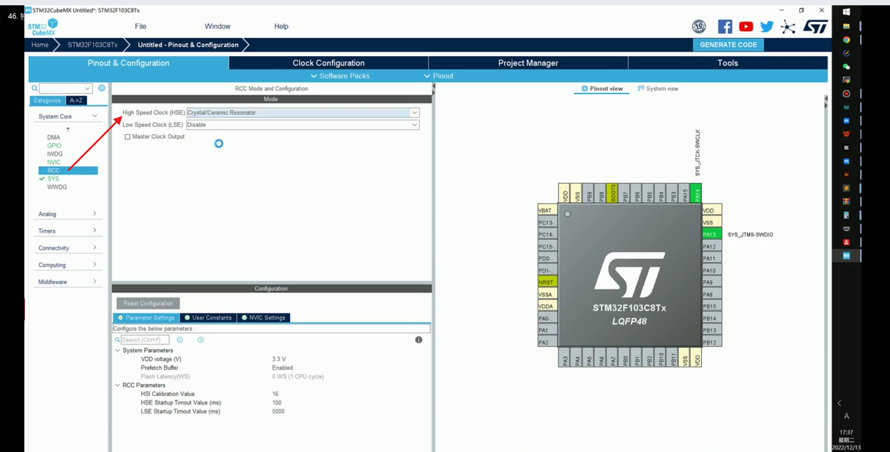
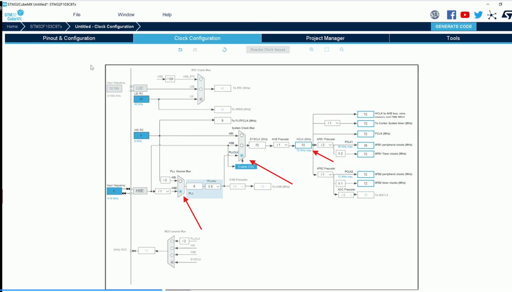
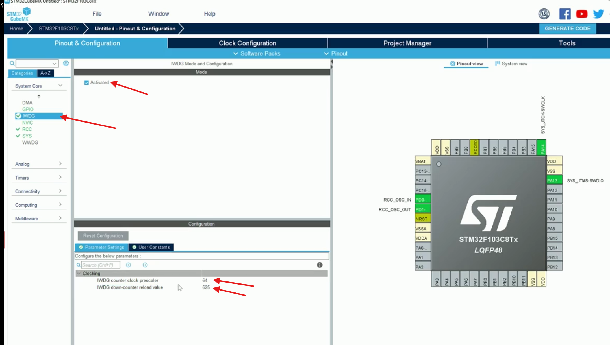
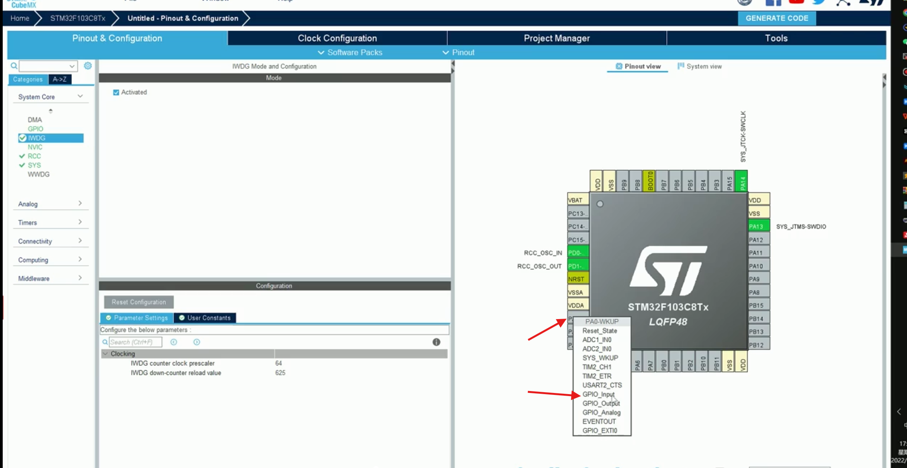
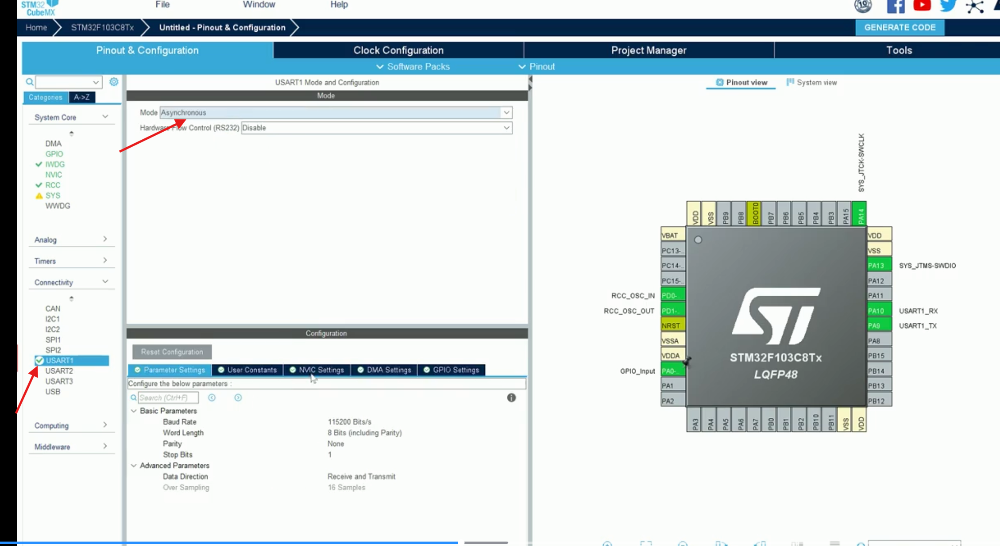
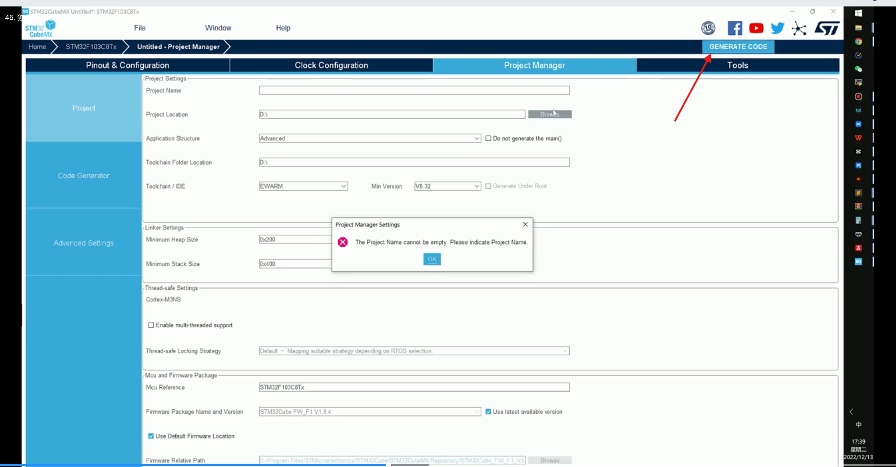
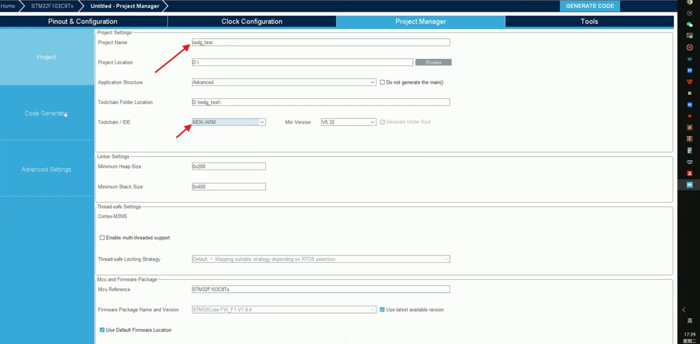
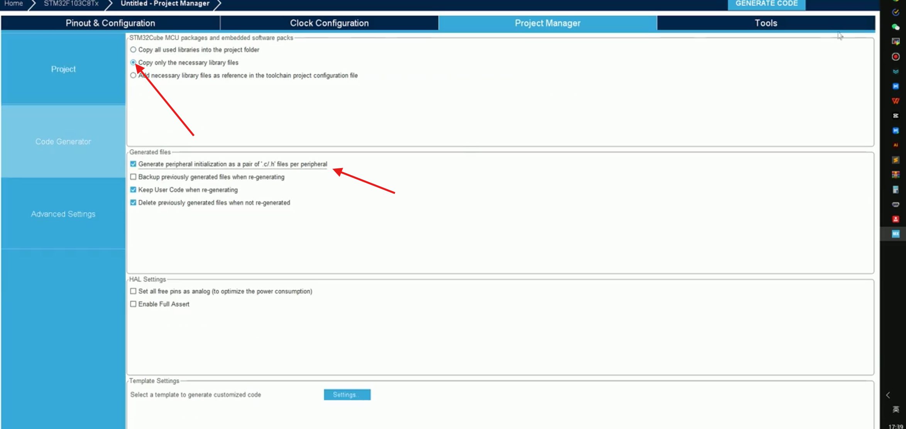
