## 背景: 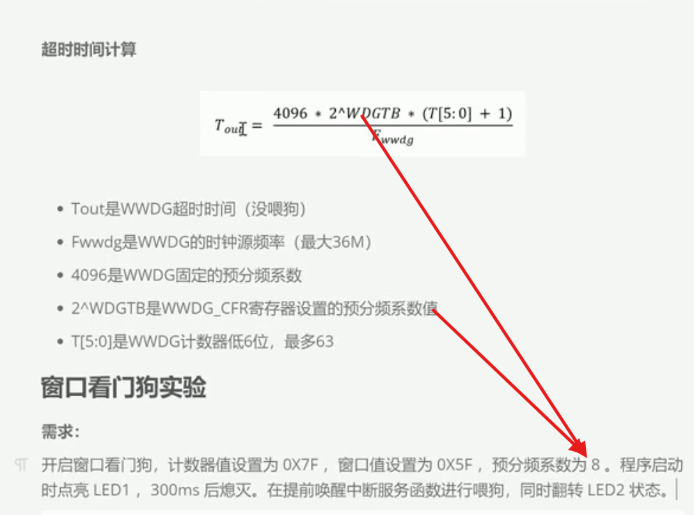
## 计算: 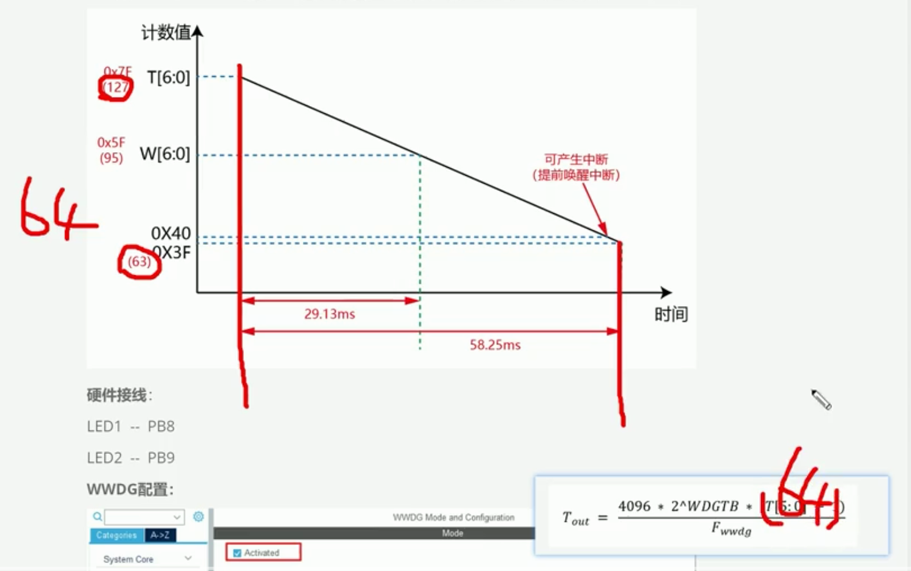
## 需求: 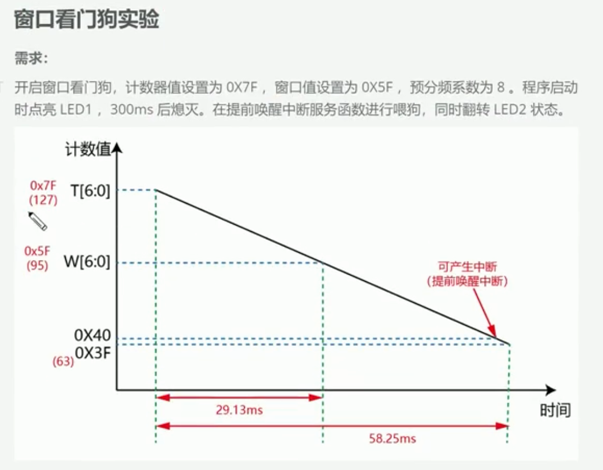
## 解释: 
你理解不了很正常，因为“提前唤醒中断”这个名字容易让人误以为它是把休眠的CPU叫醒。实际上它更准确的意思是：

> 窗口看门狗马上就要导致系统复位了，先触发一次“最后警告中断”，给程序最后一次处理机会。

它对应英文 `Early Wakeup Interrupt，EWI`。这里的“Wakeup”不是重点，重点是 `Early`：在复位前提前通知。

## 先把整个过程简化

窗口看门狗是一个不断递减的计数器：

```text
0x7F → 0x7E → 0x7D → …… → 0x40 → 0x3F
```

其中：

```text
计数到0x40：产生提前唤醒中断EWI
继续减到0x3F：STM32复位
```

因此它只有非常短的“最后机会”：

```text
0x40：警告，再不处理就来不及了
 ↓
0x3F：系统复位
```

在EWI中断中重新把计数器写回 `0x7F`：

```text
0x40
 ↓ 触发中断
在中断中喂狗
 ↓
重新回到0x7F
```

这样就避免了复位。

## 图片中的三个关键数字

图片设置：

```text
初始计数值 T = 0x7F = 127
窗口值     W = 0x5F = 95
复位界限       0x3F = 63
```

可以分成三个区域。

### 不能喂狗的区域

```text
0x7F → 0x60
```

此时计数值大于窗口值 `0x5F`，说明时间还没到，喂得太早。

窗口看门狗的特点就是：

> 喂得太晚会复位，喂得太早也会复位。

### 可以正常喂狗的窗口

```text
0x5F → 0x41
```

当计数值已经小于或等于窗口值，同时仍大于 `0x3F` 时，才处于正常喂狗窗口。

为了避免边界歧义，实际程序通常会选择窗口中间某个稳定时刻喂狗。

### 最后警告和复位

```text
到0x40：产生EWI中断
到0x3F：系统复位
```

在EWI中断里喂狗，属于卡在最后时刻续命。

## 29.13ms和58.25ms怎么来的

STM32F1窗口看门狗计数频率通常为：

```text
WWDG计数频率 = PCLK1 / 4096 / 预分频系数
```

假设：

```text
PCLK1 = 36MHz
预分频系数 = 8
```

那么每减少一次需要：

```text
单次计数时间
= 4096 × 8 / 36,000,000
≈ 0.9102ms
```

从 `0x7F` 减到窗口值 `0x5F`：

```text
127 - 95 = 32次

32 × 0.9102ms ≈ 29.13ms
```

所以大约前29.13ms不能喂狗。

从 `0x7F` 运行到临近复位位置：

```text
127 - 63 = 64次

64 × 0.9102ms ≈ 58.25ms
```

所以看门狗周期大约58.25ms。图片中的时间就是这样计算出来的。

## 这个实验到底要做什么

课程要求：

```text
1. 启动窗口看门狗
2. LED1启动时点亮，300ms后熄灭
3. 每当计数器到0x40，触发EWI中断
4. 在EWI中断函数中喂狗
5. 每次进入中断时翻转LED2
```

运行效果大概是：

```text
程序启动
  ↓
LED1点亮
  ↓
WWDG开始从0x7F递减
  ↓ 大约58ms
进入EWI中断
  ├─ 喂狗，计数器回到0x7F
  └─ 翻转LED2
  ↓
再次递减
  ↓ 大约58ms
再次进入EWI中断
```

因此LED2大约每58ms翻转一次，用于证明：

> 提前唤醒中断确实在周期性发生，而且中断中的喂狗成功阻止了系统复位。

与此同时，主程序可能正在：

```c
HAL_Delay(300);
```

但中断仍然可以打断这个等待：

```text
主程序等待300ms
├─ 第58ms：WWDG中断并喂狗
├─ 第116ms：WWDG中断并喂狗
├─ 第174ms：WWDG中断并喂狗
├─ 第232ms：WWDG中断并喂狗
├─ 第290ms：WWDG中断并喂狗
└─ 300ms结束，主程序熄灭LED1
```

这个实验同时展示了：

- 窗口看门狗计数
- 喂狗窗口
- 提前唤醒中断
- 中断可以打断主程序
- GPIO翻转
- 时钟与超时时间计算

## 中断函数可能长这样

CubeMX/HAL工程中，回调通常类似：

```c
void HAL_WWDG_EarlyWakeupCallback(WWDG_HandleTypeDef *hwwdg)
{
    /* 翻转LED2，观察中断是否发生 */
    HAL_GPIO_TogglePin(GPIOB, GPIO_PIN_9);

    /* 把计数器重新装载为0x7F */
    HAL_WWDG_Refresh(hwwdg);
}
```

底层过程是：

```text
WWDG计数到0x40
→ 设置EWI标志
→ NVIC响应WWDG中断
→ HAL进入中断处理函数
→ 调用HAL_WWDG_EarlyWakeupCallback()
→ 翻转LED2并重新装载计数器
→ 返回主程序
```

## 但实际项目不建议一直在EWI中断中喂狗

这是这节课最容易留下误解的地方。

如果主程序已经卡死：

```c
while (1)
{
    /* 程序异常卡死 */
}
```

但WWDG中断仍然能够正常触发，那么中断函数会继续喂狗：

```text
主程序已经坏了
→ EWI中断还在运行
→ 中断继续喂狗
→ 系统永远不复位
```

这样看门狗就失去作用了。

所以课程在EWI中喂狗，主要是为了演示：

- EWI在什么时刻产生；
- 中断如何被调用；
- 喂狗后计数器如何恢复；
- LED如何观察中断周期。

在真正产品中，更合理的结构通常是：

```text
主程序/系统健康监测任务
→ 确认各项业务正常
→ 在合法窗口内主动喂狗
```

EWI中断则用于“复位前最后处理”，例如：

```c
void HAL_WWDG_EarlyWakeupCallback(WWDG_HandleTypeDef *hwwdg)
{
    /* 记录最后的错误状态 */
    Save_Error_Code();

    /* 将执行器关闭到安全状态 */
    Emergency_Output_Off();

    /* 不再喂狗，等待硬件复位 */
}
```

也就是：

```text
正常情况：主循环在规定窗口内喂狗
异常情况：主循环没有喂狗
         ↓
产生EWI
         ↓
记录故障、关闭危险输出
         ↓
不喂狗
         ↓
STM32复位
```

## 它与独立看门狗的区别

独立看门狗IWDG：

```text
只检查：有没有太久没喂狗
```

窗口看门狗WWDG：

```text
检查：是否在规定时间窗口内喂狗
太早不行，太晚也不行
```

提前唤醒中断EWI：

```text
不是第三种看门狗
而是WWDG复位前的一次最后通知
```

你现在只要记住一句话：

> `0x5F`决定什么时候开始允许喂狗，`0x40`产生最后警告中断，`0x3F`导致复位；课程在警告中断里喂狗是为了展示机制，正式项目通常应在主循环确认系统健康后于合法窗口内喂狗。


## 配置cubemx

### 选择stm32f103c8t6 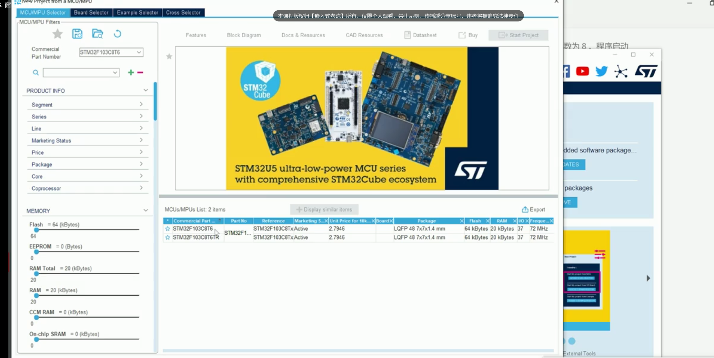
### 配置sys 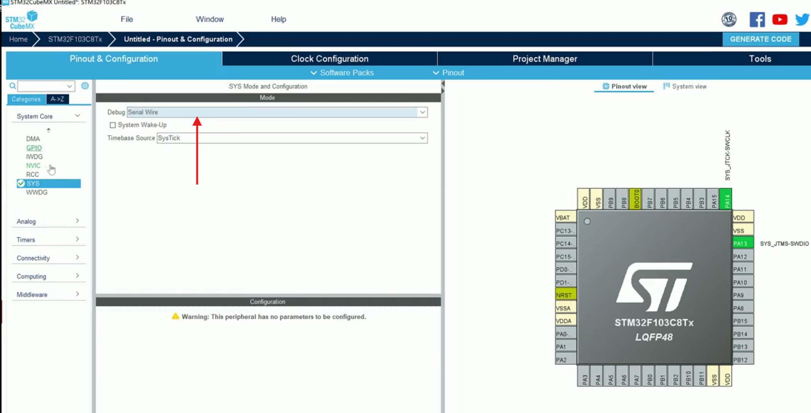
### 配置rcc 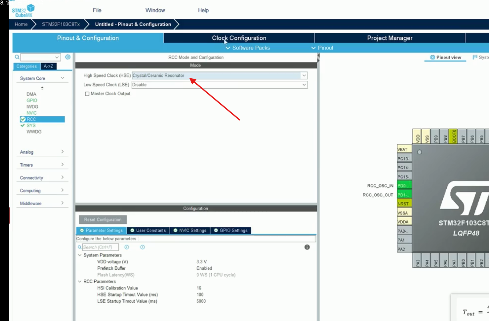 配置clock 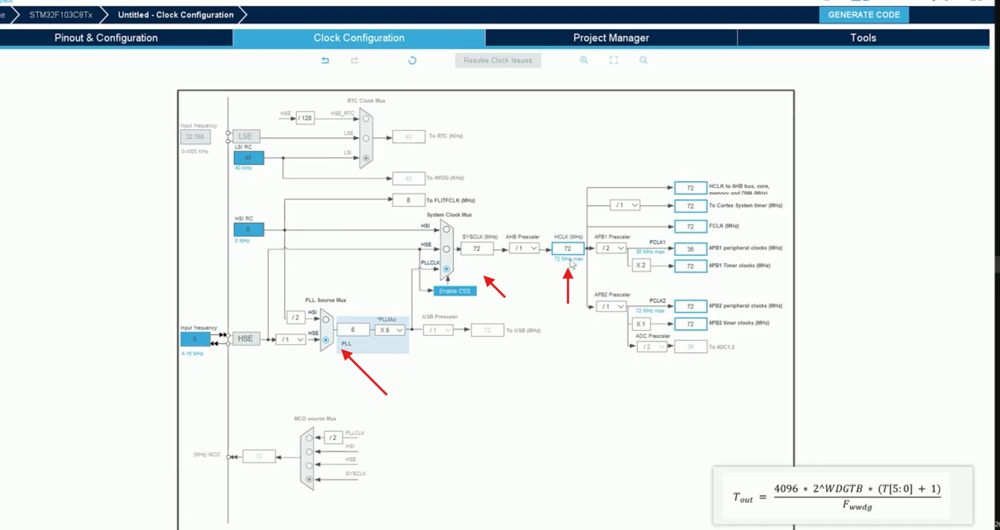 这里Pclk1 36MHz, 也就是Fwwdg最大36MHZ
### 配置GPIO 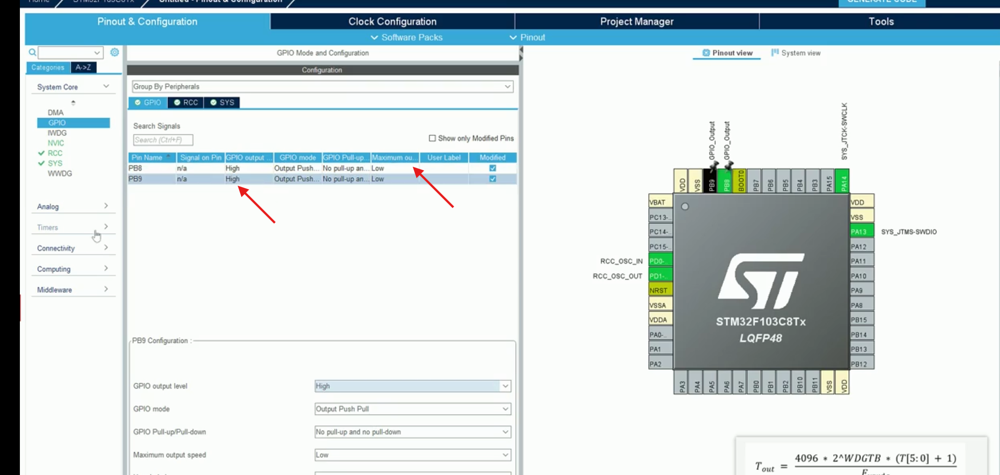
### 配置WWDG 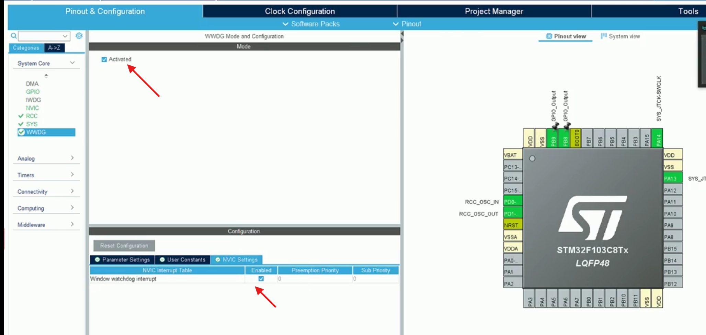 也就是提前唤醒中断 同时配置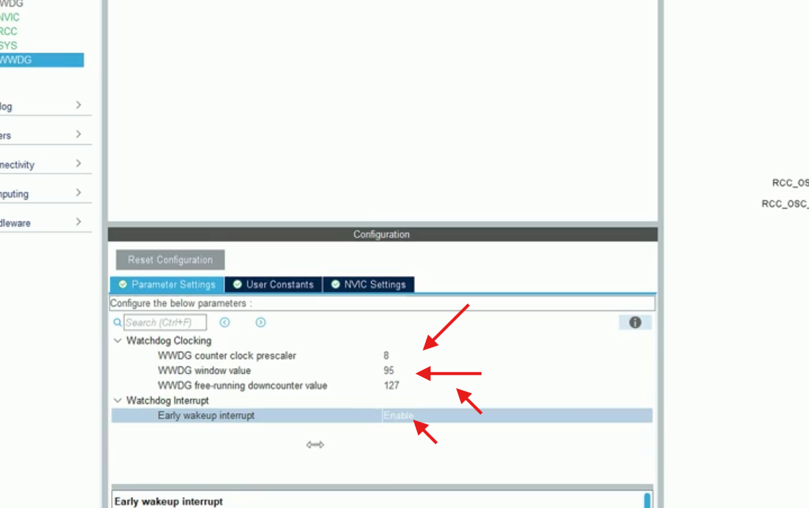
### 生成代码 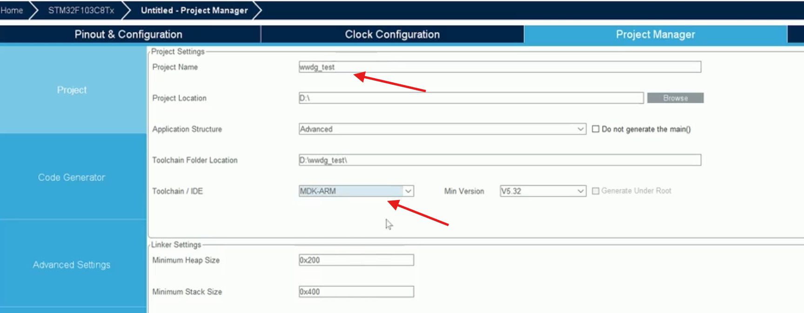 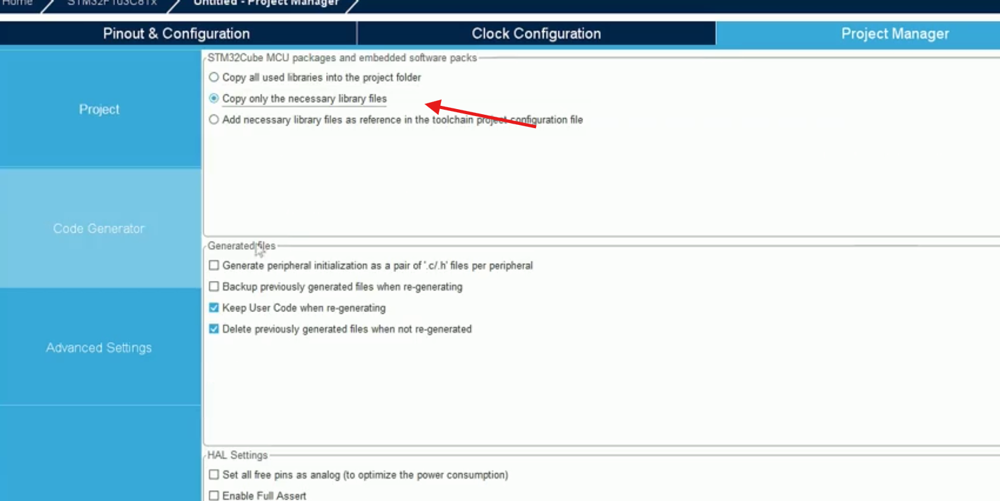

