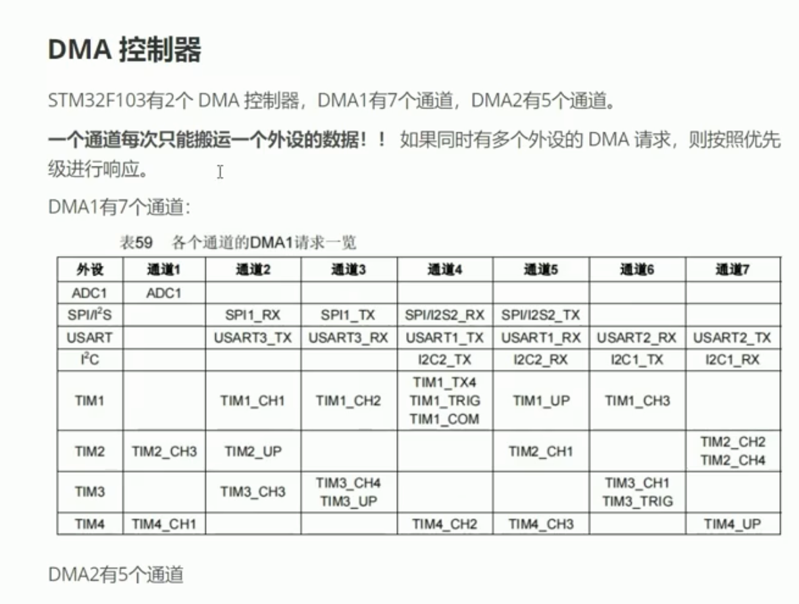
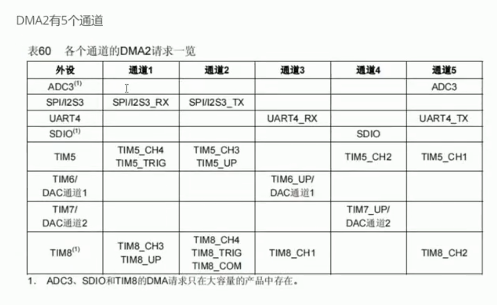
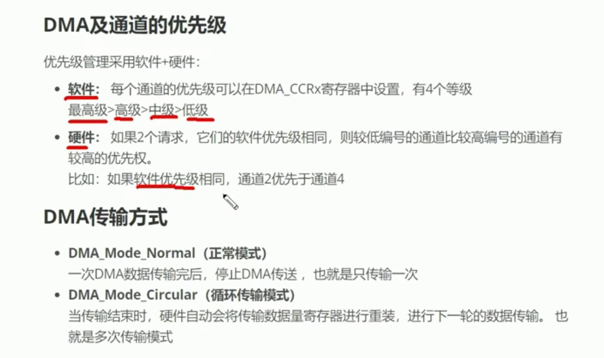
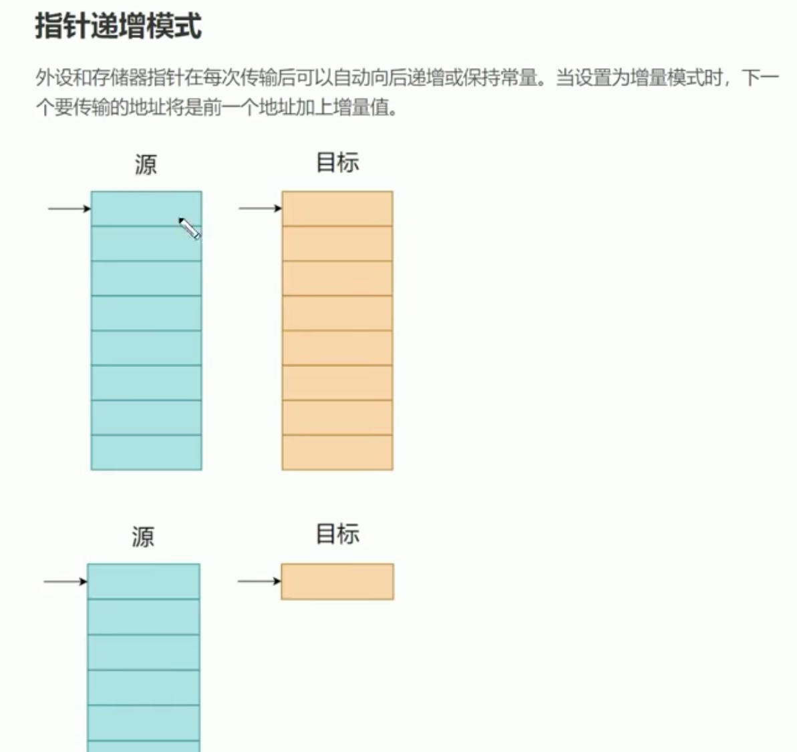

# DMA介绍

## 1. DMA是什么

DMA是`Direct Memory Access`的缩写，中文称为“直接存储器访问”。

它的核心作用是：

> 在外设和内存之间，或者两块内存之间自动搬运数据，减少CPU逐个字节复制数据的工作。

可以把CPU理解成管理者，把DMA理解成专门负责搬货的搬运工。

### 没有DMA时

以USART接收数据为例：

```text
USART收到1个字节
→ CPU读取USART数据寄存器
→ CPU把字节写入内存
→ USART又收到下一个字节
→ CPU再次处理
```

CPU需要参与每一个字节的搬运。

### 使用DMA时

```text
CPU提前告诉DMA：
“把USART收到的数据搬到这个数组，一共搬运100个字节”
    ↓
USART收到数据
    ↓
DMA自动写入内存
    ↓
达到规定数量后通知CPU
```

CPU只负责开始配置以及数据搬运完成后的业务处理，不需要亲自搬运每一个字节。

## 2. DMA解决了什么问题

DMA主要解决以下问题：

- CPU频繁搬运数据，浪费运算时间；
- 高速外设产生大量数据，CPU可能处理不过来；
- 每个字节触发一次中断，中断次数过多；
- CPU忙于复制数据，无法及时处理其他业务；
- 连续采集、通信、显示等场景需要稳定的数据吞吐。

常见应用包括：

- USART批量发送和接收；
- ADC连续采样；
- SPI收发屏幕、Flash或传感器数据；
- I²C批量通信；
- DAC连续输出波形；
- 定时器更新PWM比较值；
- 内存到内存的数据复制。

## 3. DMA不是另一颗CPU

DMA只擅长按照配置搬运数据，并不理解数据含义。

例如DMA收到：

```text
led1
```

DMA只负责把4个字节放入数组：

```text
'l' 'e' 'd' '1'
```

它不知道`led1`表示点亮LED。真正的命令解析仍然需要CPU完成：

```text
DMA负责搬运
→ CPU得到一批数据
→ 程序解析led1
→ CPU控制GPIO
```

因此：

> DMA优化的是“数据怎么搬”，不是“数据怎么理解和处理”。

## 4. DMA的三种搬运方向

### 4.1 外设到内存

```text
Peripheral → Memory
```

例如：

```text
USART接收寄存器 → 接收数组
ADC数据寄存器   → 采样数组
SPI接收寄存器   → 数据缓冲区
```

### 4.2 内存到外设

```text
Memory → Peripheral
```

例如：

```text
发送数组 → USART发送寄存器
图像数组 → SPI发送寄存器 → LCD
波形数组 → DAC数据寄存器
```

### 4.3 内存到内存

```text
Memory → Memory
```

例如：

```text
源数组 → 目标数组
```

内存到内存实验适合理解DMA配置，但真正项目中更常见的是外设与内存之间的搬运。

## 5. DMA工作时有哪些角色

一次DMA搬运至少涉及以下信息：

```text
源地址：数据从哪里来
目标地址：数据要搬到哪里
长度：一共搬多少个数据单位
数据宽度：每次搬8位、16位还是32位
地址是否递增：搬完一个数据后地址要不要移动
模式：搬完停止，还是循环搬运
优先级：多个DMA请求同时出现时谁先处理
```

## 6. 外设地址和内存地址

DMA配置中经常出现：

```text
Peripheral Address：外设地址
Memory Address：内存地址
```

即使进行内存到内存搬运，STM32 HAL或寄存器命名也可能继续沿用“外设端”和“内存端”的说法。此时只需要把它们理解为源端和目标端。

例如USART接收：

```text
外设地址：USART数据寄存器地址
内存地址：接收数组首地址
```

通常由HAL库和CubeMX帮助配置外设寄存器地址，应用程序主要提供接收数组和数据长度。

## 7. 地址递增模式

### 7.1 外设地址通常不递增

USART只有固定的数据寄存器：

```text
USART_DR → USART_DR → USART_DR
```

每次都从同一个寄存器读取或写入，因此外设地址通常设置为不递增：

```text
Peripheral Increment = Disable
```

### 7.2 内存地址通常递增

接收数据需要依次写入数组：

```text
rx_buffer[0]
rx_buffer[1]
rx_buffer[2]
rx_buffer[3]
```

因此内存地址通常设置为递增：

```text
Memory Increment = Enable
```

USART接收`led1`时，DMA的动作可以理解为：

```text
USART_DR → rx_buffer[0] = 'l'
USART_DR → rx_buffer[1] = 'e'
USART_DR → rx_buffer[2] = 'd'
USART_DR → rx_buffer[3] = '1'
```

## 8. 数据宽度

DMA每次可以搬运不同宽度的数据：

```text
Byte      = 8位
Half Word = 16位
Word      = 32位
```

两端数据宽度需要根据外设寄存器和数据类型正确配置。

例如USART通常按字节通信：

```text
Peripheral Data Width = Byte
Memory Data Width     = Byte
```

ADC结果通常为12位，但一般保存在16位变量中：

```text
Peripheral Data Width = Half Word
Memory Data Width     = Half Word
```

数据宽度设置错误可能造成：

- 数据错位；
- 数组越界；
- 只得到部分数据；
- 相邻内存被覆盖。

## 9. DMA的普通模式和循环模式

### 9.1 普通模式Normal

DMA完成指定数量的数据搬运后停止：

```text
开始DMA
→ 搬运N个数据
→ 产生完成事件
→ DMA停止
```

再次使用时，需要软件重新启动DMA。

适合：

- USART发送一段固定数据；
- 接收固定长度的数据包；
- 内存到内存复制；
- 一次性外设操作。

### 9.2 循环模式Circular

DMA搬运到缓冲区末尾后，自动回到开头继续：

```text
buffer[0] → buffer[1] → …… → buffer[N-1]
    ↑                              ↓
    └──────────重新开始────────────┘
```

适合：

- ADC持续采样；
- USART持续接收；
- 音频和波形数据；
- 需要长期运行的数据流。

使用循环模式时，CPU必须及时处理数据，否则DMA可能覆盖尚未处理的旧数据。

## 10. DMA中断

DMA可以产生以下常见事件：

```text
Half Transfer：完成一半
Transfer Complete：全部完成
Transfer Error：搬运发生错误
```

### 半传输中断

假设缓冲区长度为100：

```text
DMA写完前50个
→ 产生半传输事件
→ CPU可以处理前半区

DMA继续写后50个
→ 产生完成事件
→ CPU处理后半区
```

这样DMA搬运和CPU处理可以交替进行，减少等待。

## 11. 中断接收和DMA接收的区别

### 逐字节中断接收

```c
HAL_UART_Receive_IT(&huart1, &rx_byte, 1);
```

过程：

```text
收到1字节
→ CPU进入中断
→ 处理1字节
→ 重新启动下一次接收
```

优点：

- 简单直观；
- 适合低速、小数据量；
- 容易理解字节流。

缺点：

- 每个字节都可能产生中断；
- 高速连续数据时CPU负担较大；
- 回调处理过慢可能丢数据。

### DMA接收

```c
HAL_UART_Receive_DMA(&huart1, rx_buffer, sizeof(rx_buffer));
```

过程：

```text
USART连续收到字节
→ DMA自动写入数组
→ 达到指定长度后通知CPU
```

优点：

- 大幅减少CPU搬运工作；
- 适合高速和连续数据；
- 可以一次处理一批数据。

缺点：

- 不定长数据更难判断什么时候结束；
- 需要管理缓冲区和数据覆盖；
- 调试和状态管理比单字节中断复杂。

## 12. DMA与CPU并不是完全同时随意访问

DMA和CPU都可能访问内存及外设总线，因此需要总线仲裁。

简单理解：

```text
CPU需要访问总线
DMA也需要访问总线
→ 总线控制器决定先服务谁
```

DMA减少了CPU执行搬运指令的工作，但搬运仍会占用总线带宽。大量高速DMA可能对CPU访问内存产生一定影响。

在STM32F103这类没有数据Cache的MCU上，不需要处理数据Cache一致性问题；在带D-Cache的高性能STM32上，还需要考虑DMA与Cache之间的数据一致性。

## 13. DMA通道和外设映射

STM32F103的DMA由多个通道组成。不同外设的DMA请求通常固定映射到指定通道。

例如某个USART的TX和RX可能分别对应不同DMA通道：

```text
USARTx_TX → 某个DMA通道
USARTx_RX → 另一个DMA通道
```

实际通道必须查看：

- 当前芯片参考手册中的DMA请求映射表；
- CubeMX的DMA Settings；
- 自动生成的`dma.c`、`usart.c`和中断文件。

不要只凭其他型号教程中的通道编号配置，因为不同STM32系列和不同USART实例的映射可能不同。

## 14. DMA优先级

多个DMA通道同时提出请求时，会按照优先级和通道规则决定顺序。

常见优先级：

```text
Low
Medium
High
Very High
```

优先级越高，发生竞争时越容易先得到总线使用权。

优先级不是“速度倍增开关”，没有竞争时设置更高并不会让外设本身突破原有速度。

## 15. DMA不会自动解决不定长数据问题

例如ESP8266可能发送：

```text
OK\r\n
```

也可能发送：

```text
+IPD,0,4:led1
```

这些数据长度不固定。如果使用：

```c
HAL_UART_Receive_DMA(&huart1, rx_buffer, 100);
```

DMA通常要收到100字节才产生完成回调。实际数据只有4字节时，CPU不知道这一批数据是否暂时结束。

因此USART不定长接收常结合：

```text
DMA + USART空闲中断IDLE
```

当USART一段时间没有收到新字节时，IDLE事件通知CPU：

> 当前这一批数据暂时接收完了，可以处理缓冲区里的有效字节。

HAL库常用接口：

```c
HAL_UARTEx_ReceiveToIdle_DMA(&huart1,
                             rx_buffer,
                             sizeof(rx_buffer));
```

对应回调常见为：

```c
void HAL_UARTEx_RxEventCallback(UART_HandleTypeDef *huart,
                                uint16_t Size)
{
    /* Normal模式下常表示本次有效长度；Circular模式下要按写入位置计算增量 */
}
```

是否支持该HAL接口，需要结合当前STM32系列和HAL库版本确认。

## 16. DMA与环形缓冲区

DMA循环接收常与环形缓冲区思想结合：

```text
DMA写入位置：不断向前移动
CPU读取位置：处理已经收到的数据
```

CPU只处理“DMA已经写入、但CPU尚未读取”的区间。

需要特别注意：

- 写指针不能覆盖尚未处理的数据；
- 回绕后需要正确计算有效长度；
- 中断和主程序共享位置变量时可能需要`volatile`；
- 修改共享状态时要考虑竞争条件；
- 中断中只记录位置和事件，不做长时间阻塞处理。

## 17. DMA的典型HAL接口

### USART发送

```c
HAL_UART_Transmit_DMA(&huart1, tx_buffer, tx_length);
```

### USART固定长度接收

```c
HAL_UART_Receive_DMA(&huart1, rx_buffer, rx_length);
```

### USART接收到空闲事件

```c
HAL_UARTEx_ReceiveToIdle_DMA(&huart1,
                             rx_buffer,
                             sizeof(rx_buffer));
```

### ADC启动DMA

```c
HAL_ADC_Start_DMA(&hadc1, adc_buffer, adc_count);
```

具体参数类型和回调名称应以当前芯片HAL头文件为准。

## 18. 学习DMA的推荐顺序

### 第一步：内存到内存

目标：

- 理解源地址、目标地址和长度；
- 理解地址递增；
- 理解数据宽度；
- 理解普通模式和完成中断。

### 第二步：USART DMA发送

目标：

- 理解内存到外设；
- 观察DMA发送期间CPU仍可处理其他任务；
- 使用发送完成回调。

### 第三步：USART固定长度DMA接收

目标：

- 理解外设到内存；
- 验证DMA自动写入数组；
- 理解接收完成事件。

### 第四步：ADC循环DMA

目标：

- 理解循环模式；
- 理解连续采样；
- 理解半传输和全传输事件。

### 第五步：USART DMA加空闲中断

目标：

- 接收不定长串口数据；
- 管理有效长度；
- 处理缓冲区回绕；
- 为ESP8266、4G模块和通信协议解析做准备。

## 19. 常见错误

- DMA时钟没有开启；
- DMA通道映射选择错误；
- USART中没有启用DMA请求；
- DMA方向配置相反；
- 外设地址错误；
- 内存地址没有递增；
- 外设和内存数据宽度不匹配；
- 数组生命周期结束，但DMA仍在访问；
- DMA尚未完成就修改发送缓冲区；
- 循环模式覆盖了CPU尚未处理的数据；
- 中断函数中执行长时间阻塞操作；
- 忘记配置DMA中断及NVIC；
- 认为DMA收到的数据会自动带字符串结束符`'\0'`；
- 把接收到的二进制数据直接当作C字符串处理；
- 认为一次DMA回调一定对应一条完整的TCP或应用层消息。

## 20. 与当前ESP8266项目的关系

当前USART1逐字节接收方式是：

```text
ESP8266发送1字节
→ USART1接收中断
→ CPU处理1字节
→ 重新启动下一字节接收
```

升级为DMA加空闲中断后：

```text
ESP8266连续发送一批数据
→ DMA自动写入接收数组
→ USART出现空闲事件
→ CPU得到这一批数据的有效长度
→ 逐字节交给原来的AT/TCP状态机解析
```

需要注意：

> 使用DMA后，原来的字节流解析器仍然有价值。变化的只是“一次给解析器1个字节”变为“一次拿到一批字节，再通过循环逐个交给解析器”。

例如：

```c
for (uint16_t i = 0; i < Size; i++)
{
    ESP_ParseByte(rx_buffer[i]);
}
```

## 21. 最简单的记忆方式

```text
CPU：决定搬什么、搬到哪里、搬多少，以及搬完后怎么处理
DMA：按照配置自动完成实际搬运
外设：产生或消耗数据
内存缓冲区：暂存数据
中断/回调：通知CPU搬到一半、搬完或发生错误
```

一句话总结：

> DMA不会替CPU思考，它只是替CPU搬数据。学习DMA的重点不是记住一个HAL函数，而是理解源地址、目标地址、长度、宽度、递增方式、工作模式以及搬运完成后谁来处理数据。

## 问答补充一：指针递增模式怎么理解

“指针递增”是指：

> DMA每完成一次数据搬运后，内部保存的源地址或目标地址是否自动移动到下一个存储位置。

这里递增的是地址，不是数据内容。

假设有两个数组：

```c
uint8_t source[4] = {10, 20, 30, 40};
uint8_t target[4] = {0};
```

DMA开始时只得到两个首地址：

```text
源地址：&source[0]
目标地址：&target[0]
```

### 源地址和目标地址都递增

```text
source[0] → target[0]
source[1] → target[1]
source[2] → target[2]
source[3] → target[3]
```

结果为：

```c
target = {10, 20, 30, 40};
```

这种配置适合内存到内存的连续数组复制。

### 源地址递增，目标地址不递增

```text
source[0] → target[0]
source[1] → target[0]
source[2] → target[0]
source[3] → target[0]
```

在普通内存复制中，`target[0]`会被不断覆盖，最终只保留最后一次写入的数据。

但USART DMA发送正是这种地址变化思想：

```text
tx_buffer[0] → USART_DR
tx_buffer[1] → USART_DR
tx_buffer[2] → USART_DR
tx_buffer[3] → USART_DR
```

源数组地址不断递增，而USART数据寄存器地址保持固定。

### 源地址不递增，目标地址递增

```text
source[0] → target[0]
source[0] → target[1]
source[0] → target[2]
source[0] → target[3]
```

USART DMA接收也是这种地址变化思想：

```text
USART_DR → rx_buffer[0]
USART_DR → rx_buffer[1]
USART_DR → rx_buffer[2]
USART_DR → rx_buffer[3]
```

USART_DR的地址固定，但寄存器中的内容会随着新字节到达而变化，因此并不是把同一个字节重复写入数组。

### 每次递增多少

地址增加量由DMA数据宽度决定：

```text
Byte（8位）       → 地址每次增加1字节
Half Word（16位）→ 地址每次增加2字节
Word（32位）     → 地址每次增加4字节
```

例如32位数据地址可能按以下方式移动：

```text
0x20000000 → 0x20000004 → 0x20000008
```

所以“指针递增”更准确的含义是：

> 每搬完一个数据单位，地址自动增加一个数据宽度。

最简单的记忆方法：

```text
数组有很多连续元素，内存地址通常递增；
外设数据寄存器是固定窗口，外设地址通常不递增。
```

## 问答补充二：USART接收和发送方向是否相反

是的，USART接收和USART发送的DMA运输方向正好相反，配置时必须明确方向。

### USART接收

```text
USART数据寄存器 → RAM接收数组
Peripheral to Memory
外设 → 内存
```

典型配置：

```text
Direction            = Peripheral to Memory
Peripheral Increment = Disable
Memory Increment     = Enable
Peripheral Data Width = Byte
Memory Data Width     = Byte
```

电脑或ESP8266发送`led1`时：

```text
USART_DR中的'l' → rx_buffer[0]
USART_DR中的'e' → rx_buffer[1]
USART_DR中的'd' → rx_buffer[2]
USART_DR中的'1' → rx_buffer[3]
```

### USART发送

```text
RAM发送数组 → USART数据寄存器
Memory to Peripheral
内存 → 外设
```

典型配置：

```text
Direction            = Memory to Peripheral
Peripheral Increment = Disable
Memory Increment     = Enable
Peripheral Data Width = Byte
Memory Data Width     = Byte
```

发送`LED ON`时：

```text
tx_buffer[0]中的'L' → USART_DR
tx_buffer[1]中的'E' → USART_DR
tx_buffer[2]中的'D' → USART_DR
……
```

### 为什么方向相反，递增配置却相同

接收和发送改变的是数据流动方向：

```text
接收：USART_DR → rx_buffer
发送：tx_buffer → USART_DR
```

但两种情况下的存储结构没有改变：

```text
USART_DR：一个固定的外设寄存器地址，不递增
数组：    多个连续内存元素，需要递增
```

因此：

| USART操作 | DMA方向 | 外设地址 | 内存地址 |
| --- | --- | --- | --- |
| USART接收 | 外设 → 内存 | 不递增 | 递增 |
| USART发送 | 内存 → 外设 | 不递增 | 递增 |

在STM32F103中，读取USART的`DR`表示取得接收数据，写入`DR`表示提交发送数据。寄存器地址固定，但读写方向和硬件行为不同。

## 问答补充三：外部串口传输和DMA搬运有什么区别

“电脑或ESP8266把`led1`发送给STM32”和“DMA把USART数据搬到数组”都让数据发生了移动，但它们属于两个不同层次。

更准确的描述是：

> USART负责把导线上的电平变化恢复成字节；DMA负责把USART数据寄存器中的字节复制到RAM数组。

DMA不是把整个UART搬到数组，而是搬运UART数据寄存器里的数据。

### 第一阶段：设备之间的串口传输

```text
电脑/ESP8266
    ↓ TX引脚发送高低电平
导线
    ↓
STM32 RX引脚
    ↓
USART硬件识别起始位、数据位和停止位
    ↓
USART接收移位寄存器
    ↓
USART数据寄存器DR
```

这一阶段发生在两个设备之间，受以下因素影响：

- TX和RX是否交叉；
- 是否共地；
- 波特率是否一致；
- 数据位、停止位和校验位是否一致；
- 电气电平是否兼容；
- 导线和干扰情况。

例如字符`l`的ASCII值是：

```text
'l' = 0x6C
```

USART发送端把该字节拆成起始位、数据位和停止位，通过TX引脚逐位发送；STM32 USART再通过RX引脚采样并恢复为`0x6C`。

DMA不参与导线上的串行比特接收。

### 第二阶段：STM32内部的DMA搬运

USART已经恢复出完整字节后，会将它放入固定的数据寄存器：

```text
USART_DR = 'l'
```

DMA随后执行：

```text
读取USART_DR
→ 通过STM32内部总线传输
→ 写入rx_buffer[0]
```

后续字节：

```text
USART_DR = 'e' → rx_buffer[1]
USART_DR = 'd' → rx_buffer[2]
USART_DR = '1' → rx_buffer[3]
```

这一阶段发生在STM32芯片内部，不再涉及TX/RX导线，也不负责识别波特率。

### 两个阶段的对比

| 对比项 | 串口接收 | DMA搬运 |
| --- | --- | --- |
| 发生位置 | 两个设备之间 | STM32芯片内部 |
| 起点 | 对方设备的TX | USART数据寄存器 |
| 终点 | STM32 USART数据寄存器 | RAM数组 |
| 数据形式 | 导线上的串行高低电平 | 内部总线上的字节、半字或字 |
| 负责硬件 | USART | DMA控制器 |
| 速度依据 | USART波特率 | 芯片内部总线和DMA配置 |
| 主要工作 | 把串行比特组合成字节 | 把完整数据写入内存 |

因此一次完整的USART DMA接收可以拆成：

```text
通信阶段：外部设备 → STM32 USART_DR
存储阶段：USART_DR → RAM中的rx_buffer
业务阶段：CPU解析rx_buffer中的数据
```

### 不使用DMA时，谁完成第二阶段

无论是否使用DMA，USART都必须先把线路上的比特恢复成字节并放入数据寄存器。区别只在于谁把数据寄存器中的字节取走。

#### CPU轮询

```c
HAL_UART_Receive(&huart1, rx_buffer, 4, 1000);
```

CPU不断检查接收状态，并负责把DR中的字节写入数组。

#### CPU中断

```c
HAL_UART_Receive_IT(&huart1, rx_buffer, 4);
```

USART收到数据后触发中断，CPU进入中断处理流程并完成数据存储。

#### DMA

```c
HAL_UART_Receive_DMA(&huart1, rx_buffer, 4);
```

DMA自动读取DR并写入数组，CPU不再参与每一个字节的复制。

所以可以记为：

```text
USART负责“把数据收进芯片”；
CPU或DMA负责“把数据存进数组”。
```

### 为什么必须及时读取USART_DR

USART的数据寄存器容量有限。如果上一个字节没有及时取走，下一个字节又到达，就可能出现接收溢出：

```text
第一个字节仍在DR中
→ 第二个字节已经接收完成
→ 旧字节没有及时读取
→ 产生ORE接收溢出错误
→ 可能丢失数据
```

DMA的优势是USART每收到一个字节并产生DMA请求后，DMA可以及时读取DR并写入数组，从而降低CPU负担和高速连续接收时丢数据的风险。

### USART DMA发送是接收过程的反方向

```text
RAM中的tx_buffer
    ↓ DMA搬运
USART数据寄存器DR
    ↓ USART硬件把字节拆成串行比特
STM32 TX引脚
    ↓ 导线上的高低电平
电脑/ESP8266 RX引脚
```

因此：

```text
DMA负责：内存字节 → USART内部寄存器
USART负责：完整字节 → TX引脚上的串行电平
```

### 码头类比

可以把整个系统理解成：

```text
USART = 码头
TX/RX导线 = 航线
DMA = 码头和仓库之间的搬运工
RAM数组 = 仓库
CPU = 管理者和货物处理人员
```

船把货物运到码头，不代表货物已经进入仓库。USART把字节接收到数据寄存器后，还需要CPU或DMA将它存入RAM数组，程序才能方便地批量解析和处理。

### 22 DMA 控制器





## 23. 可复现的内存到内存实验

目标是把16字节源数组复制到目标数组，同时让CPU做别的事。

~~~c
static const uint8_t dma_src[16] = {
    0, 1, 2, 3, 4, 5, 6, 7,
    8, 9, 10, 11, 12, 13, 14, 15
};

static uint8_t dma_dst[16];
static volatile uint8_t dma_done;
~~~

配置要点：

~~~text
方向：Memory to Memory
源地址递增：Enable
目标地址递增：Enable
源/目标宽度：Byte
模式：Normal
长度：16
完成中断：Enable
~~~

启动时检查返回值：

~~~c
if (HAL_DMA_Start_IT(&hdma_memtomem_dma1_channel1,
                     (uint32_t)dma_src,
                     (uint32_t)dma_dst,
                     sizeof(dma_src)) != HAL_OK)
{
    Error_Handler();
}
~~~

在对应完成回调中只设置 dma_done = 1，主循环再用 memcmp() 验证两个数组。句柄和通道名以CubeMX为当前芯片生成的代码为准，不要照抄其他型号的DMA通道。

## 24. USART DMA接收的推荐步骤

1. 先用中断方式确认USART接线、波特率和字节解析器正确。
2. 在CubeMX给USART RX添加DMA请求，外设地址不递增、内存地址递增，宽度都选Byte。
3. 为不定长数据优先尝试 HAL_UARTEx_ReceiveToIdle_DMA()，并确认当前F1 HAL版本确实提供该接口。
4. 回调中只记录位置/长度并把这一批字节交给原有解析器，不做阻塞打印。
5. 处理半传输、空闲事件、传输完成、错误以及重新启动。
6. 连续发送超过一个缓冲区的数据，验证回绕和覆盖策略。
7. 分别测试拆包、粘包、二进制0字节和缓冲区满。

在Normal模式中，Size通常可看作本次从缓冲区起点收到的有效字节数；在Circular模式中，它更像DMA当前写入位置。连续回调时应根据“上次位置→本次位置”计算新数据区间，不能每次都从 buffer[0] 重复处理到 buffer[Size-1]。

## 25. 发送完成不一定等于线路完全空闲

DMA把最后一个字节写入USART数据寄存器后，USART硬件仍需按波特率把它移出TX引脚。若下一步要关闭收发器方向、切换半双工或断电，应等待UART的Transmission Complete条件，而不能只看DMA控制器是否搬完。HAL的具体回调链应结合当前系列驱动源码确认。

## 26. 一套排错顺序

~~~text
DMA完全不动
→ 检查DMA时钟、通道映射、USART DMA请求和启动返回值

只收到一个字节/一批后停止
→ 检查Normal模式是否重新启动、错误回调是否恢复

数组内容错位
→ 检查方向、宽度、地址递增和长度单位

数据偶尔丢失
→ 检查缓冲区覆盖、CPU处理速度、串口ORE和临界区

命令解析错误
→ 把DMA层与协议层分开，按有效长度逐字节喂给状态机
~~~

DMA学习的验收标准不是“调用成功”，而是能够解释每一端地址是否递增、每次搬几个字节、何时结束、CPU从哪里知道新数据范围，以及处理不及时会覆盖什么。
