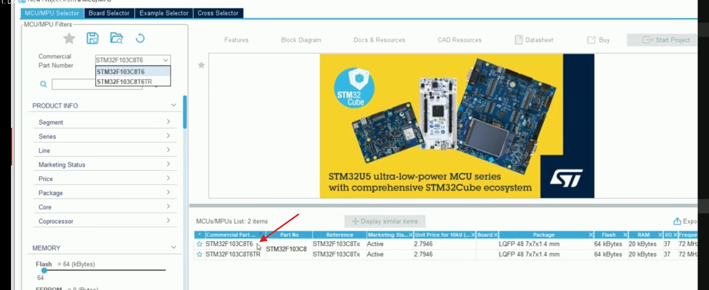
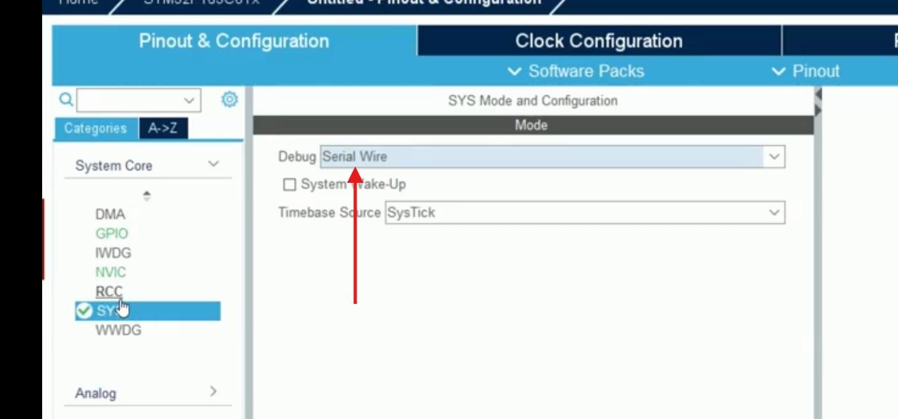
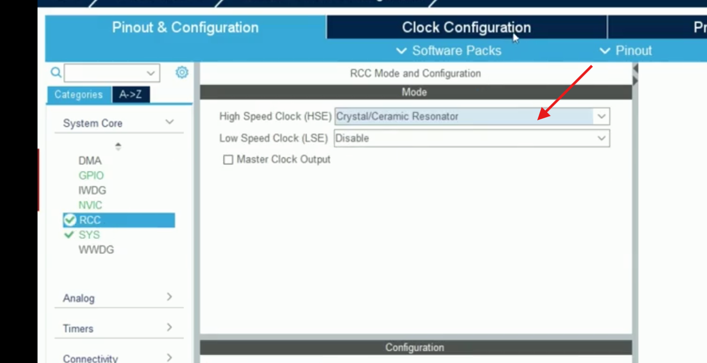
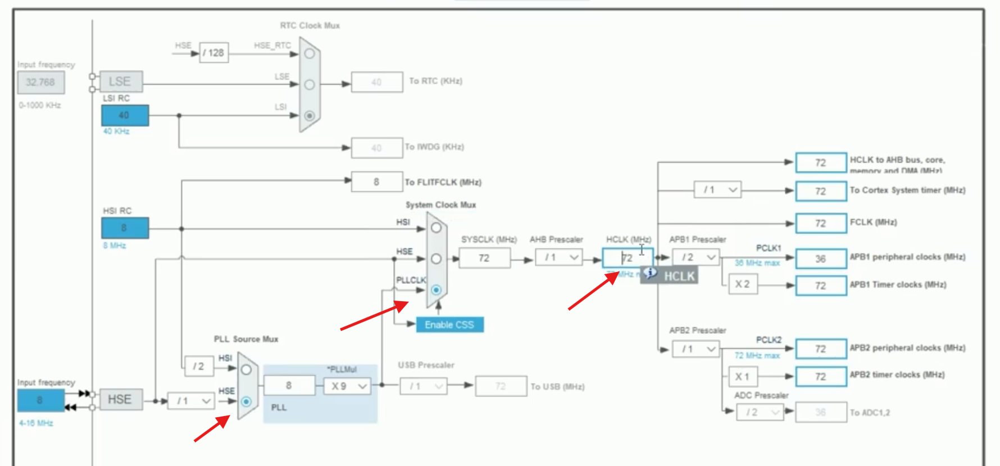
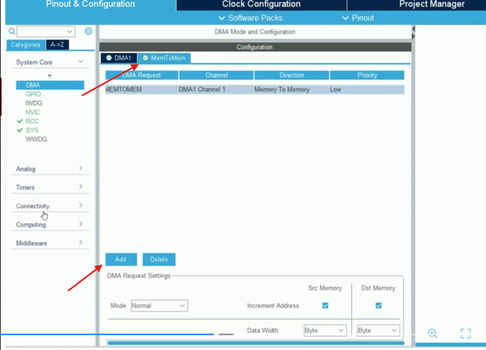
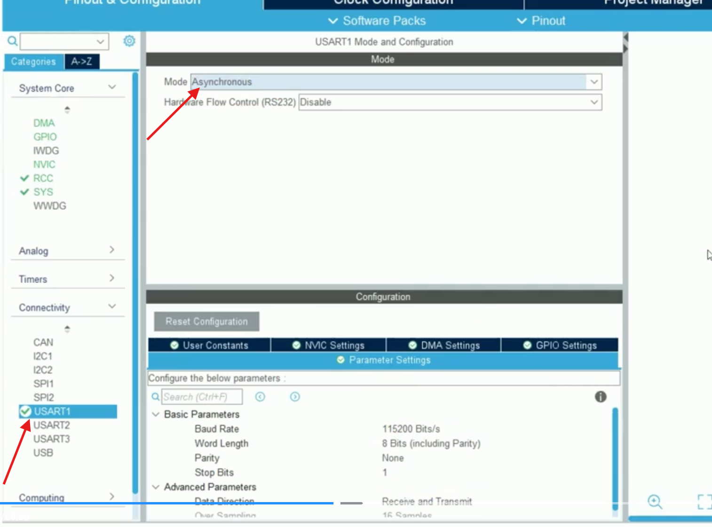
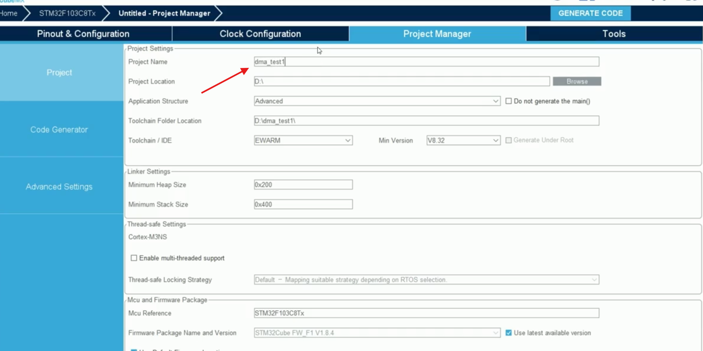

## DMA内存到内存数据搬运 
## 用到的库函数  补充: 
## 代码实现: 

## cubmx 配置:








---

## 一、实验目的

本实验使用 STM32F103 的 DMA1，把一个 `uint32_t` 源数组复制到目标数组。

与 CPU 使用 `for` 循环逐项赋值相比，DMA 可以在初始化好源地址、目标地址和传输数量后自行完成数据搬运。CPU 可以等待传输完成，也可以在 DMA 中断模式下继续执行其他任务。

本实验的数据流如下：

```text
srcBuf（源数组，SRAM）
        │
        │ DMA1_Channel1，Memory to Memory
        ▼
desBuf（目标数组，SRAM）
        │
        │ USART1 + printf
        ▼
串口助手显示复制结果
```

## 二、源数组和目标数组

```c
#define BUF_SIZE 16U

uint32_t srcBuf[BUF_SIZE] = {
    0x00000000, 0x11111111, 0x22222222, 0x33333333,
    0x44444444, 0x55555555, 0x66666666, 0x77777777,
    0x88888888, 0x99999999, 0xAAAAAAAA, 0xBBBBBBBB,
    0xCCCCCCCC, 0xDDDDDDDD, 0xEEEEEEEE, 0xFFFFFFFF
};

uint32_t desBuf[BUF_SIZE];
```

需要特别注意：

- `BUF_SIZE` 表示数组中有 16 个元素。
- 每个 `uint32_t` 占 4 字节。
- 两个数组的总大小都是 `16 × 4 = 64` 字节。
- 全局的 `desBuf` 未显式赋初值，因此程序启动时会被清零。

## 三、DMA 配置的核心含义

推荐的 DMA1 Channel1 配置如下：

```c
hdma_memtomem_dma1_channel1.Instance = DMA1_Channel1;
hdma_memtomem_dma1_channel1.Init.Direction = DMA_MEMORY_TO_MEMORY;
hdma_memtomem_dma1_channel1.Init.PeriphInc = DMA_PINC_ENABLE;
hdma_memtomem_dma1_channel1.Init.MemInc = DMA_MINC_ENABLE;
hdma_memtomem_dma1_channel1.Init.PeriphDataAlignment = DMA_PDATAALIGN_WORD;
hdma_memtomem_dma1_channel1.Init.MemDataAlignment = DMA_MDATAALIGN_WORD;
hdma_memtomem_dma1_channel1.Init.Mode = DMA_NORMAL;
hdma_memtomem_dma1_channel1.Init.Priority = DMA_PRIORITY_LOW;
```

各项含义：

| 配置项 | 作用 |
| --- | --- |
| `DMA_MEMORY_TO_MEMORY` | 源地址和目标地址都位于存储器空间 |
| `DMA_PINC_ENABLE` | 每完成一次传输，源地址自动递增 |
| `DMA_MINC_ENABLE` | 每完成一次传输，目标地址自动递增 |
| `DMA_PDATAALIGN_WORD` | 源端每次读取 32 位，也就是 4 字节 |
| `DMA_MDATAALIGN_WORD` | 目标端每次写入 32 位 |
| `DMA_NORMAL` | 传完指定数量后停止，不自动循环 |
| `DMA_PRIORITY_LOW` | DMA 通道的仲裁优先级；本实验只有一个通道，低优先级即可 |

> 在 STM32 HAL 的命名中，即使是内存到内存模式，源端配置仍使用 `Periph...` 字段，目标端使用 `Mem...` 字段。这里并不意味着真的使用了外设。

### 传输数量和数据宽度的关系

`HAL_DMA_Start()` 最后一个参数表示“传输单元的数量”，不是固定意义上的字节数：

```c
HAL_DMA_Start(&hdma_memtomem_dma1_channel1,
              (uint32_t)srcBuf,
              (uint32_t)desBuf,
              BUF_SIZE);
```

当两端配置为 `WORD` 时：

```text
16 个传输单元 × 4 字节 = 64 字节
```

因此能够复制完整的 16 个 `uint32_t`。

如果错误地配置成 `BYTE`：

```c
DMA_PDATAALIGN_BYTE
DMA_MDATAALIGN_BYTE
```

那么 `BUF_SIZE = 16` 只代表传输 16 字节：

```text
16 字节 ÷ 4 字节/元素 = 4 个 uint32_t
```

这正是串口中只有 `desBuf[0]` 到 `desBuf[3]` 正确、`desBuf[4]` 到 `desBuf[15]` 全部为 0 的原因。

理论上也可以在 `BYTE` 模式下传入：

```c
BUF_SIZE * sizeof(uint32_t)
```

这样会传输 64 个字节，但本实验的数据本来就是 `uint32_t`，所以两端直接配置为 `WORD` 更直观、效率也更合适。

## 四、`printf` 重定向到 USART1

```c
#include <stdio.h>

int fputc(int ch, FILE *f)
{
    uint8_t data = (uint8_t)ch;
    HAL_UART_Transmit(&huart1, &data, 1, HAL_MAX_DELAY);
    return ch;
}
```

这段代码的作用是把标准输出重定向到 USART1：

```text
printf() → fputc() → HAL_UART_Transmit() → USART1 → 串口助手
```

`printf()` 会把字符串拆成一个个字符，每个字符调用一次 `fputc()`。参数 `FILE *f` 表示标准输出流，但本例没有区分不同输出流，所以不使用它。

注意事项：

- 这里使用的是阻塞式串口发送，不是 UART DMA。
- 它适合打印调试信息，但大量输出会占用 CPU 时间。
- 不建议在高频中断服务函数中调用 `printf()`。
- Windows 串口助手通常使用 `\r\n` 换行。

## 五、推荐的 `main.c` 核心代码

下面只保留与本实验直接相关的代码。时钟、GPIO、DMA 和 USART 初始化函数仍由 CubeMX 生成。

```c
#include "main.h"
#include "dma.h"
#include "usart.h"
#include "gpio.h"
#include <stdio.h>
#include <string.h>

#define BUF_SIZE 16U

uint32_t srcBuf[BUF_SIZE] = {
    0x00000000, 0x11111111, 0x22222222, 0x33333333,
    0x44444444, 0x55555555, 0x66666666, 0x77777777,
    0x88888888, 0x99999999, 0xAAAAAAAA, 0xBBBBBBBB,
    0xCCCCCCCC, 0xDDDDDDDD, 0xEEEEEEEE, 0xFFFFFFFF
};

uint32_t desBuf[BUF_SIZE];

int fputc(int ch, FILE *f)
{
    uint8_t data = (uint8_t)ch;
    HAL_UART_Transmit(&huart1, &data, 1, HAL_MAX_DELAY);
    return ch;
}

int main(void)
{
    HAL_Init();
    SystemClock_Config();

    MX_GPIO_Init();
    MX_DMA_Init();
    MX_USART1_UART_Init();

    /* 启动内存到内存 DMA：复制 16 个 32 位数据 */
    if (HAL_DMA_Start(&hdma_memtomem_dma1_channel1,
                      (uint32_t)srcBuf,
                      (uint32_t)desBuf,
                      BUF_SIZE) != HAL_OK)
    {
        Error_Handler();
    }

    /* 轮询等待完整传输，并设置超时，避免程序无限卡死 */
    if (HAL_DMA_PollForTransfer(&hdma_memtomem_dma1_channel1,
                                HAL_DMA_FULL_TRANSFER,
                                HAL_MAX_DELAY) != HAL_OK)
    {
        Error_Handler();
    }

    /* 打印目标数组 */
    for (uint32_t i = 0; i < BUF_SIZE; i++)
    {
        printf("desBuf[%lu] = 0x%08lX\r\n",
               (unsigned long)i,
               (unsigned long)desBuf[i]);
    }

    /* 对整个数组进行最终校验 */
    if (memcmp(srcBuf, desBuf, sizeof(srcBuf)) == 0)
    {
        printf("DMA copy: PASS\r\n");
    }
    else
    {
        printf("DMA copy: FAIL\r\n");
    }

    while (1)
    {
    }
}
```

### 核心执行顺序

1. `HAL_Init()` 初始化 HAL、Flash 接口和 SysTick。
2. `SystemClock_Config()` 配置系统时钟。
3. `MX_DMA_Init()` 打开 DMA1 时钟并配置 Channel1。
4. `MX_USART1_UART_Init()` 初始化串口，供 `printf()` 输出。
5. `HAL_DMA_Start()` 写入源地址、目标地址和传输数量并启动 DMA。
6. `HAL_DMA_PollForTransfer()` 等待搬运完成。
7. 通过串口打印 `desBuf`，再使用 `memcmp()` 校验两个数组是否完全一致。

与直接读取 `DMA_FLAG_TC1` 相比，`HAL_DMA_PollForTransfer()` 会统一处理完成状态和错误状态，并且可以设置超时，调试时更稳妥。

## 六、预期串口输出

修正数据宽度并加入换行后，串口助手应显示：

```text
desBuf[0] = 0x00000000
desBuf[1] = 0x11111111
desBuf[2] = 0x22222222
desBuf[3] = 0x33333333
desBuf[4] = 0x44444444
...
desBuf[14] = 0xEEEEEEEE
desBuf[15] = 0xFFFFFFFF
DMA copy: PASS
```

原代码使用：

```c
printf("Buf[%d] = %X", i, desBuf[i]);
```

因为末尾没有 `\r\n`，所以每次输出会首尾相接，看起来像：

```text
Buf[0] = 0Buf[1] = 11111111Buf[2] = 22222222...
```

这只是显示格式问题，不是串口乱码。

## 七、本次遇到的问题与定位过程

### 问题 1：链接阶段找不到启动符号

错误信息：

```text
Undefined symbol __use_two_region_memory
Undefined symbol __initial_sp
```

这个问题与 `main.c`、DMA 或 USART 代码无关。根因是工程启用了 MicroLIB，但已有的 `startup_stm32f103xb.o` 是按照非 MicroLIB 分支汇编的，启动文件目标文件和链接库配置不一致。

处理方法：

1. 在 Keil 中执行 `Project → Clean Targets`。
2. 再执行 `Project → Rebuild all target files`。
3. 确认日志中重新出现 `assembling startup_stm32f103xb.s...`。
4. 如果仍然报错，可以取消 `Options for Target → Target → Use MicroLIB`，然后再次 Clean 和 Rebuild。

关键点：修改 MicroLIB、编译器或启动文件设置后，应当完整重编译，不能继续使用旧的启动文件 `.o`。

### 问题 2：DMA 只复制前四个元素

现象：

```text
desBuf[0] ~ desBuf[3] 正确
desBuf[4] ~ desBuf[15] 全部为 0
```

根因：DMA 两端配置为 `BYTE`，而传输数量只填写了 16，因此只传输了 16 字节，也就是 4 个 `uint32_t`。

修正：

```c
DMA_PDATAALIGN_WORD
DMA_MDATAALIGN_WORD
```

传输数量继续使用 `BUF_SIZE`，即复制 16 个 32 位数据。

### 问题 3：串口输出全部连在一起

根因：格式字符串中没有换行符。

修正：

```c
printf("desBuf[%lu] = 0x%08lX\r\n",
       (unsigned long)i,
       (unsigned long)desBuf[i]);
```

## 八、轮询模式和中断模式的区别

当前实验属于轮询模式：

```c
HAL_DMA_Start(...);
HAL_DMA_PollForTransfer(...);
```

CPU 会停在等待函数中，直到 DMA 完成。它适合验证 DMA 功能和较短的数据搬运。

如果希望 DMA 工作时 CPU 同时处理其他任务，可以使用：

```c
HAL_DMA_Start_IT(...);
```

并开启对应 DMA 通道的 NVIC 中断，在完成回调中处理后续逻辑。中断模式比轮询模式更能体现 DMA 释放 CPU 的价值，但配置和程序结构也更复杂。

## 九、调试检查清单

遇到 DMA 内存搬运异常时，可以依次检查：

1. DMA1 时钟是否已经开启。
2. 方向是否为 `DMA_MEMORY_TO_MEMORY`。
3. 源地址和目标地址自增是否都已开启。
4. 数据宽度是否与数组元素类型一致。
5. `DataLength` 表示多少个传输单元，而不是想当然地认为是字节数。
6. 是否检查了 `HAL_DMA_Start()` 的返回值。
7. 是否正确等待传输完成，并处理超时或错误。
8. 打印格式是否有 `\r\n`，十六进制宽度是否正确。
9. 修改 MicroLIB 或启动文件设置后，是否执行了 Clean 和 Rebuild。
10. 最后使用 `memcmp()` 校验完整数据，不能只观察前几个元素。
