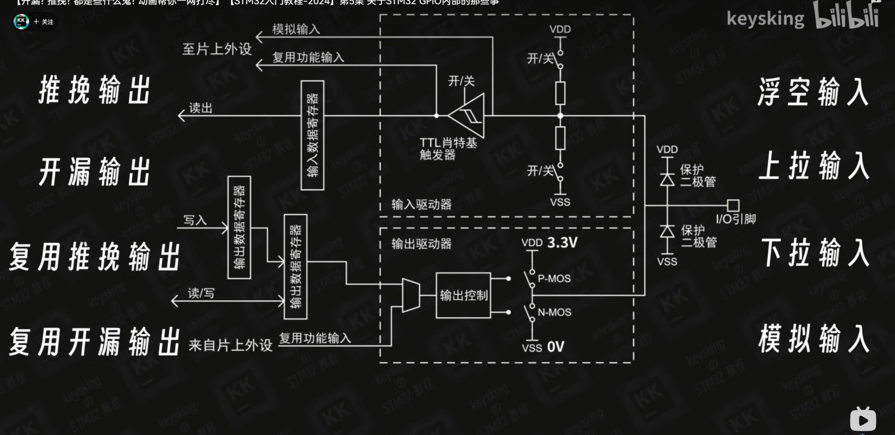

# 2.什么是STM32

【【开漏? 推挽? 都是些什么鬼? 动画帮你一网打尽】【STM32入门教程-2024】第5集 关于STM32 GPIO内部的那些事】 https://www.bilibili.com/video/BV1zG4y1K78S/?share_source=copy_web&vd_source=0092ed1d38306fe233f5952b8cba76da

  
[上官二号课堂笔记（更新SPI部分）.pdf](../_resources/上官二号课堂笔记（更新SPI部分）.pdf)