- 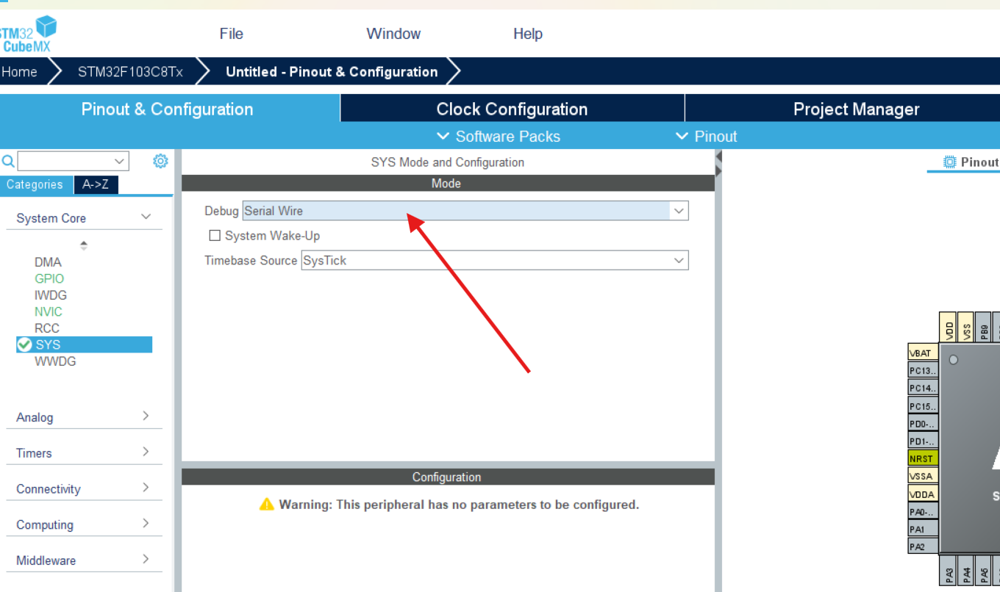
- 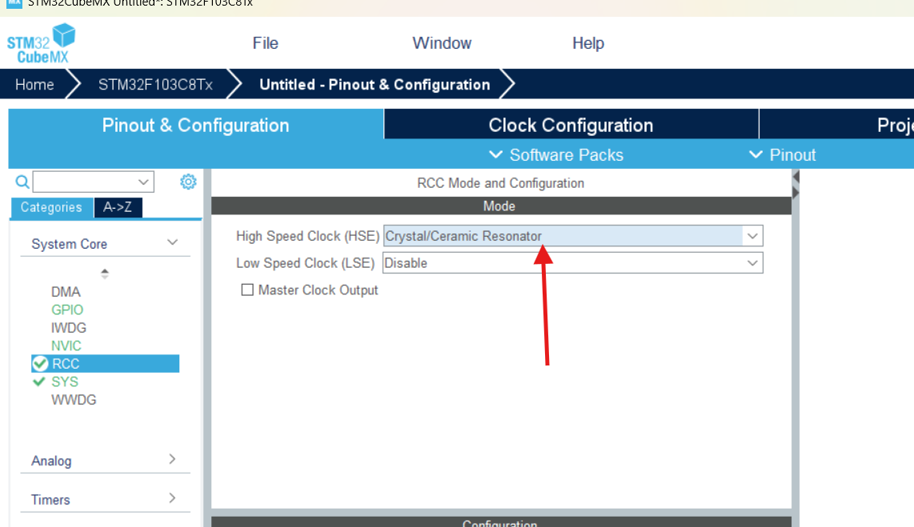
- 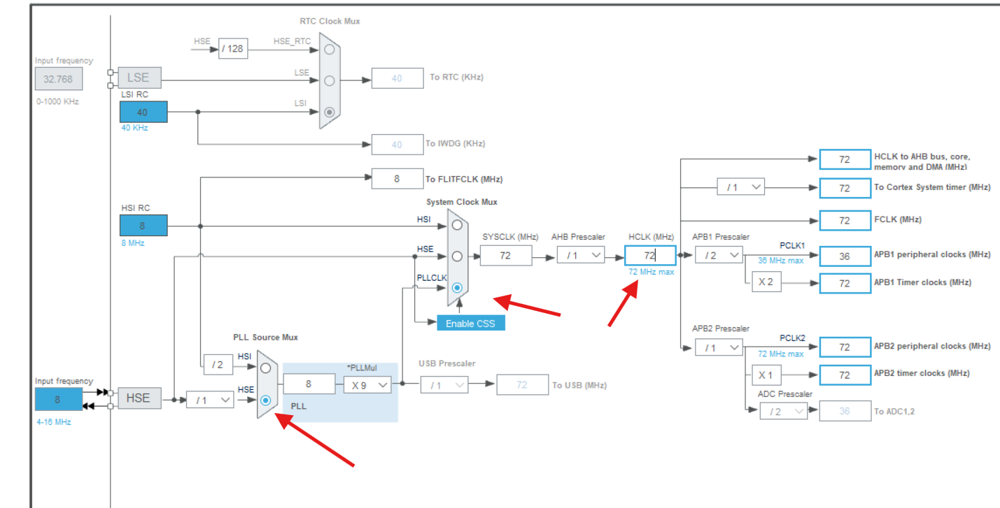
- 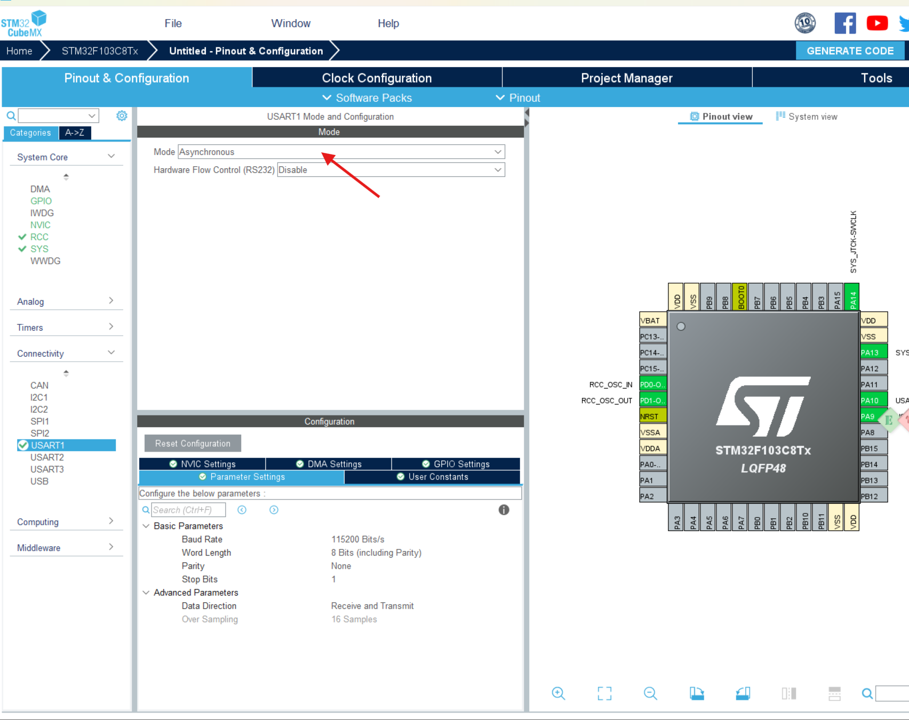 使用数据通过串口打印出来
- 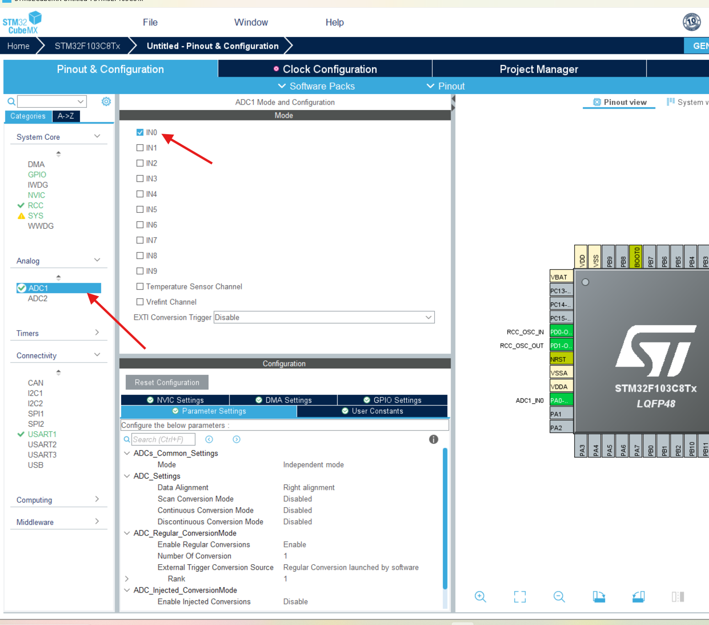 adc1 打开通道1时, sys 出现了warning -> 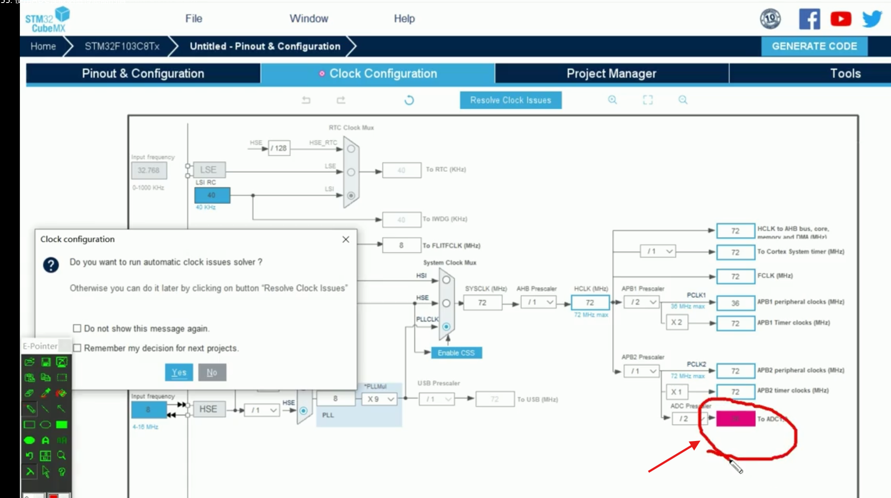
- 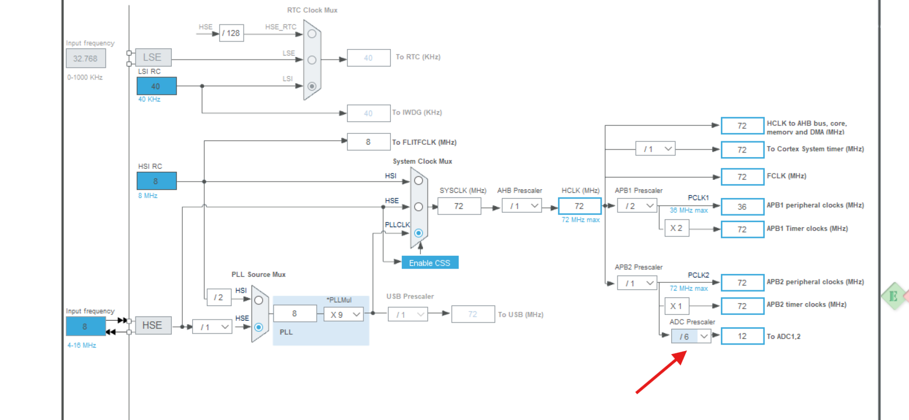
- 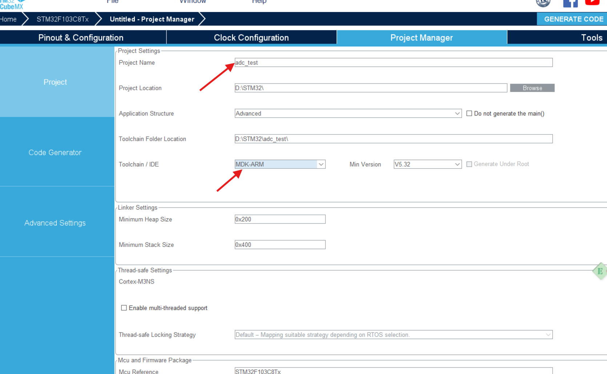
- 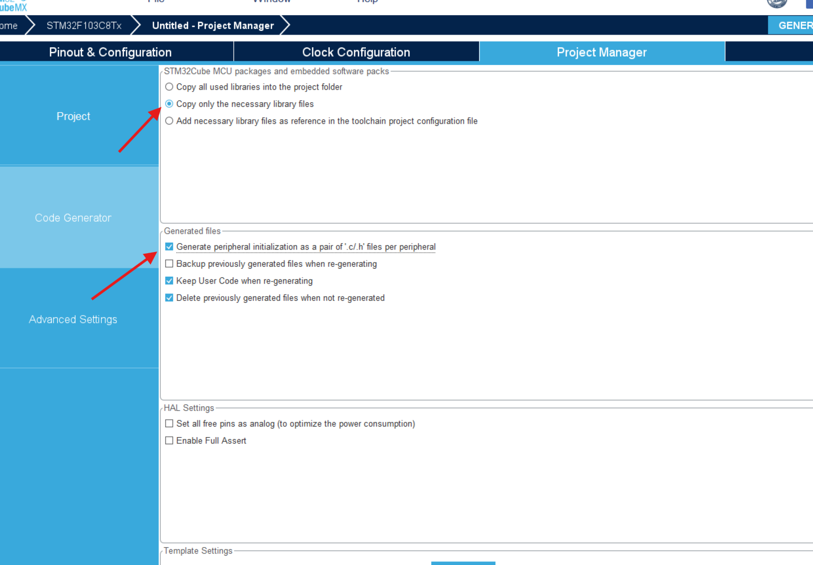
- 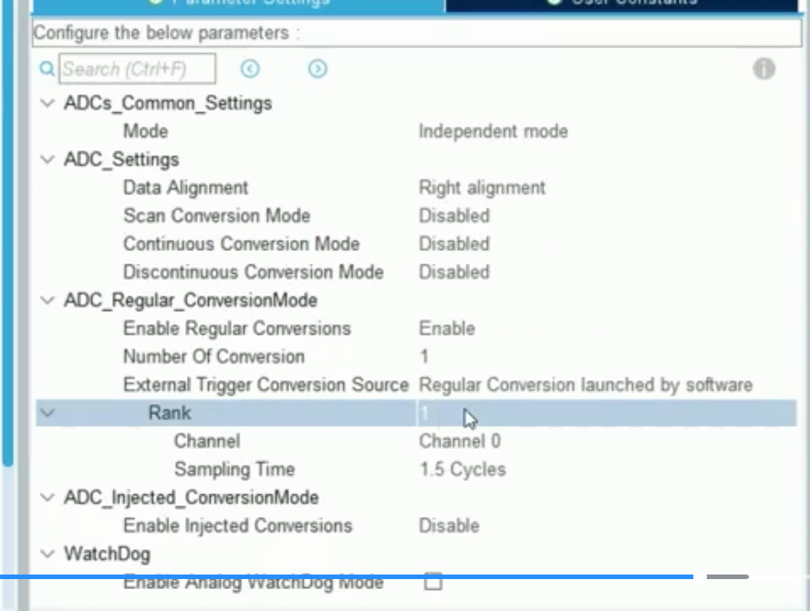
 - 参数说明:Configure the below parameters :

▾ ADCs_Common_Settings
 Mode         Independent mode // 独立模式 

▾ ADC_Settings
 Data Alignment     Right alignment // 数据对齐方式 右对齐 数据采集完放到数据寄存器(16位寄存器),采样回来的数据12位
 Scan Conversion Mode Disabled   // 扫描转换模式 禁用 
 Continuous Conversion Mode Disabled // 连续转换模式 禁用
 Discontinuous Conversion Mode Disabled // 非连续转换模式 禁用

▾ ADC_Regular_ConversionMode
 Enable Regular Conversions Enable // 规则通道 
 Number Of Conversion  1    // 规则通道 转换次数 1次
 External Trigger Conversion Source Regular Conversion launched by software // 通过软件触发
 Rank         1   // 第一个转化
 Channel       Channel 0  // 通道0 
 Sampling Time     1.5 Cycles  // 采样时间 1.5个周期 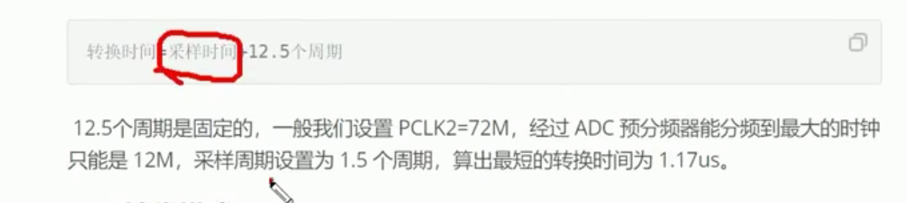

▾ ADC_Injected_ConversionMode
 Enable Injected Conversions Disable  // 注入通道 禁用

▾ WatchDog
 Enable Analog WatchDog Mode ☐ // 使能模拟看门狗模式 设定的电压超过一个值,触发复位
- 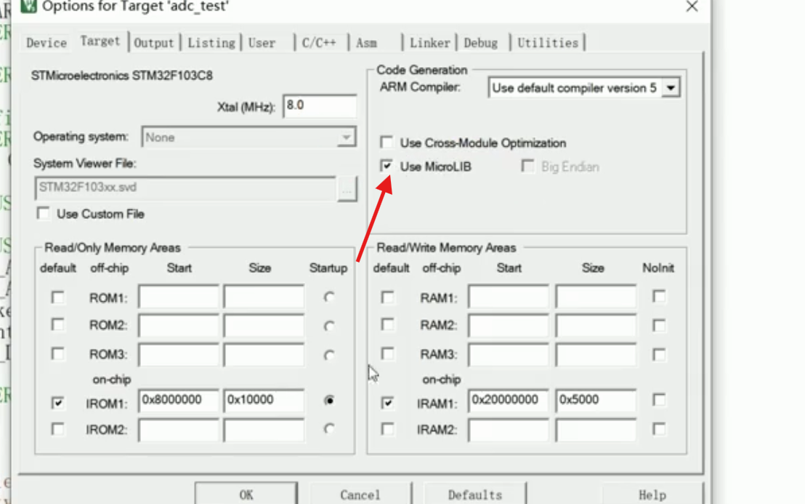 重写printf 需要打钩
- 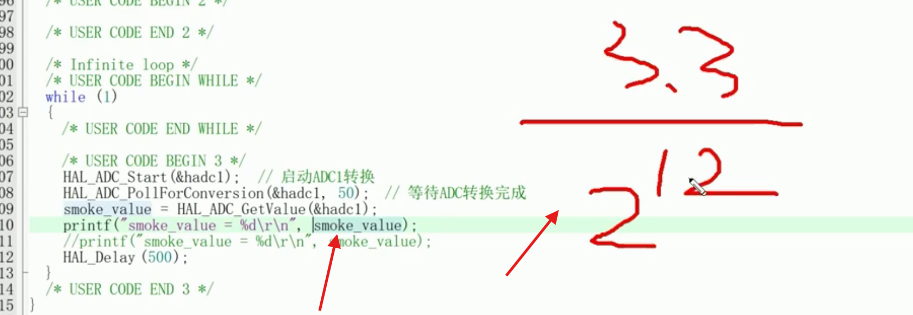 烟雾传感器的电压
- 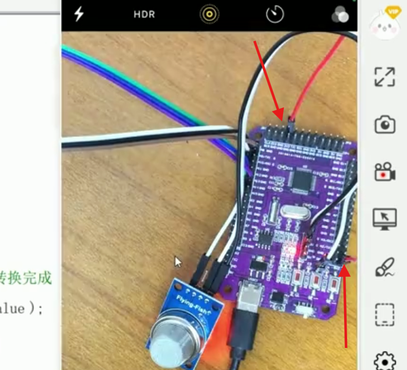 A0接到3.3v电压测试