## SPI 介绍
- 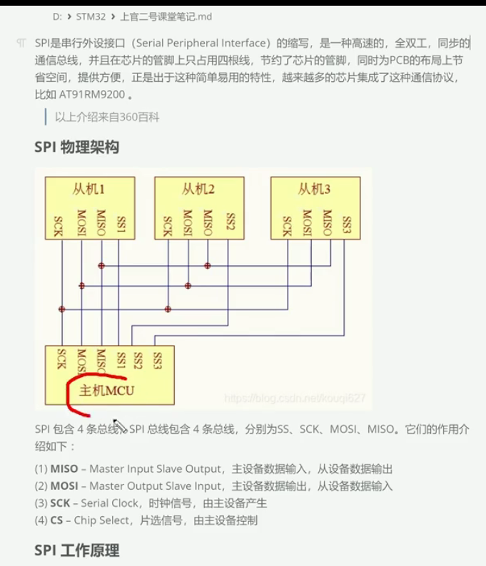 
 - 当ss1 需要主机与从机进行通信时，ss1 引脚为低电平，当ss1 不需要主机与从机进行通信时，ss1 引脚为高电平。
- 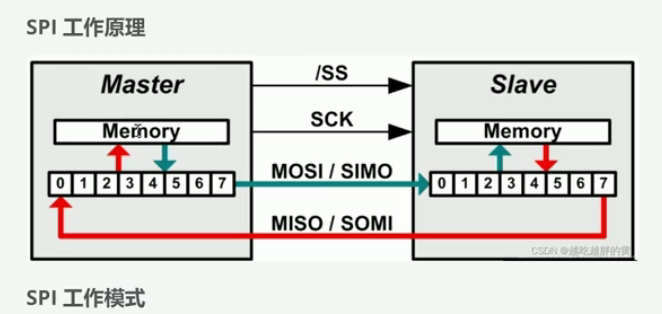
- 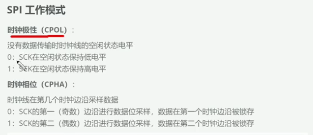
- 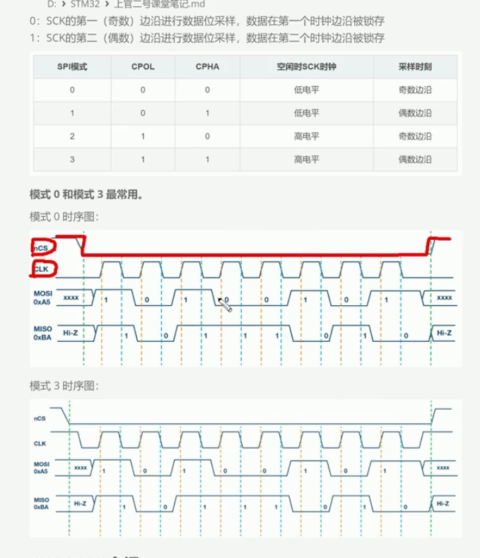
- 1. cs 低电平, 主机可以与从机进行通信 
- 2. clk 时钟是用来采样的,固定好了再某个时刻同时采样(是在第一个上升沿采样,还是下降沿采样,做一些规定)
- 3. clk 一开始是高电平还是低电平
- 4. 0 和 3 应用最多
- 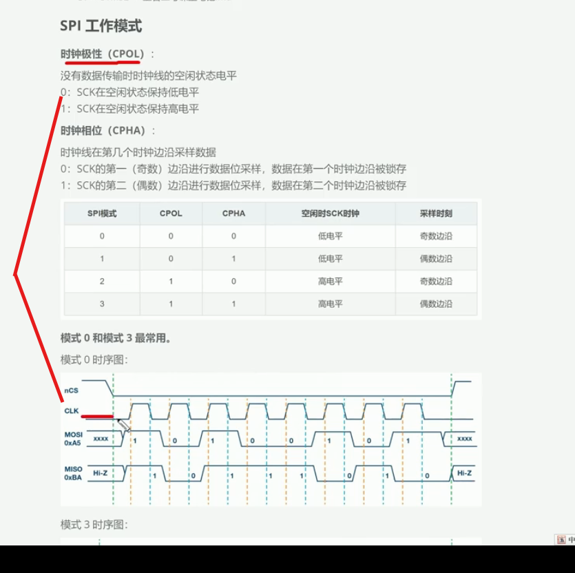
- 黄色的线就是在采样
## W25Q128介绍
- 8bits = 1 byte  8个比特是1个字节
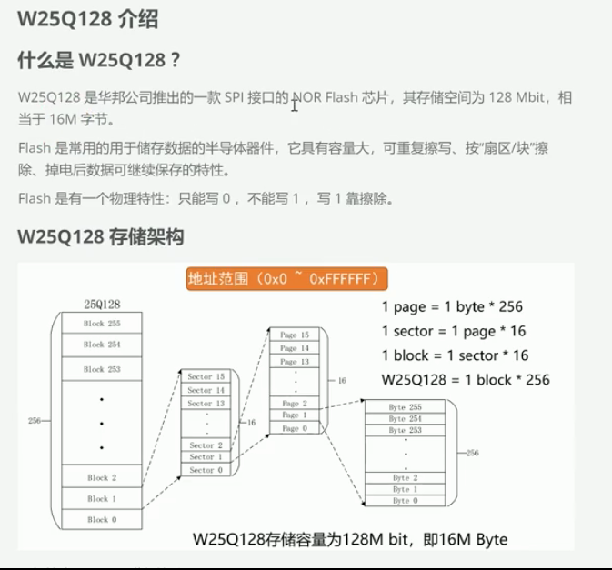
- 1. flash 物理特性: 只能写0, 不能写1, 写1靠擦除; 擦除之前要备份; 然后把新的数据加到备份里面, 然后把所有的数据写入到擦除到flash里面
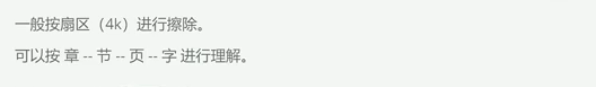
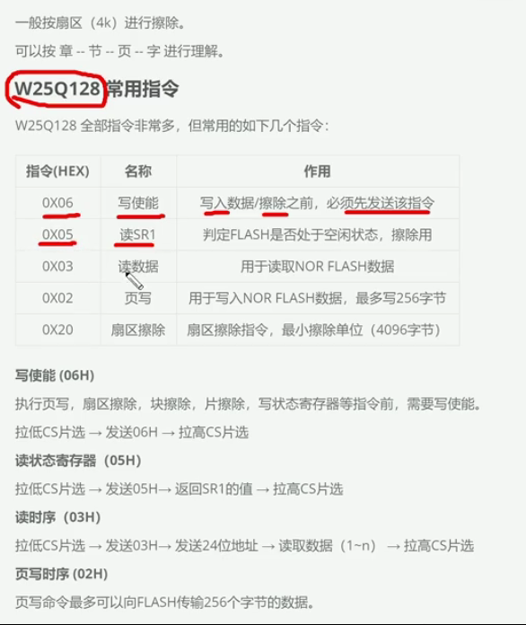
- SR1: 状态寄存器1
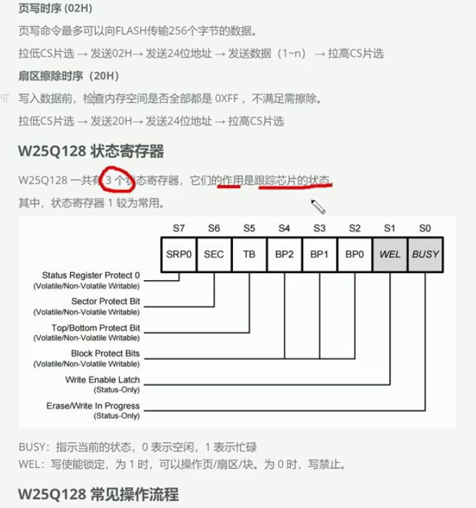
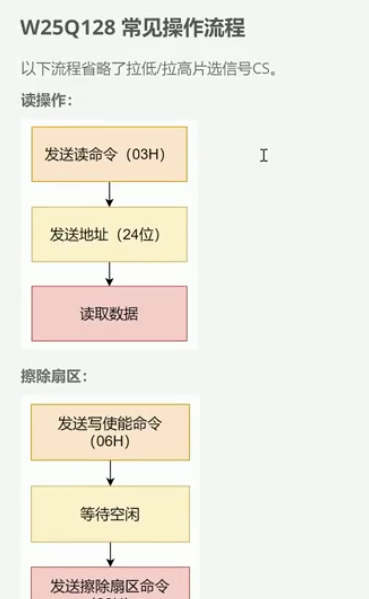
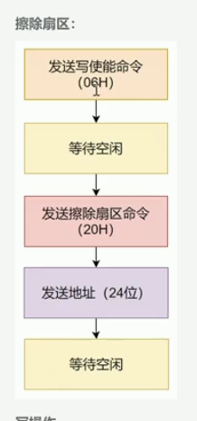
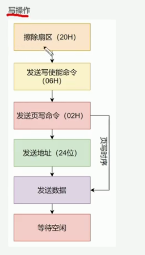
 