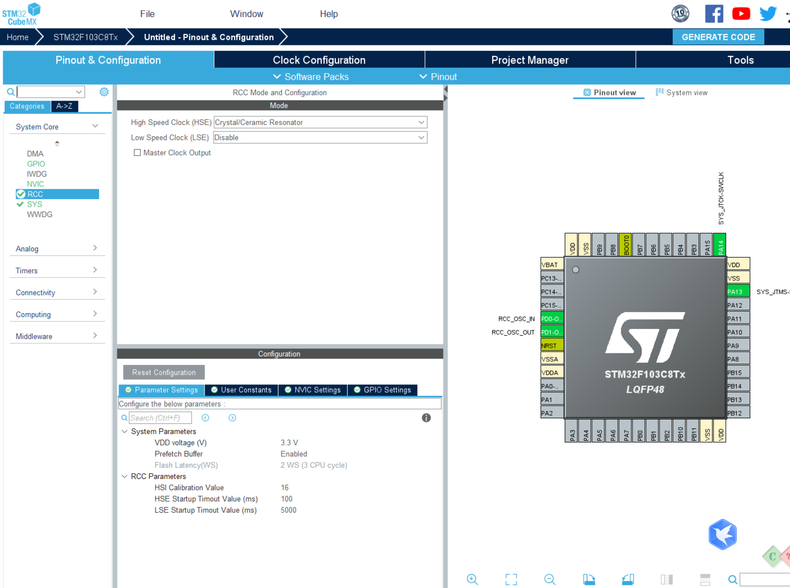
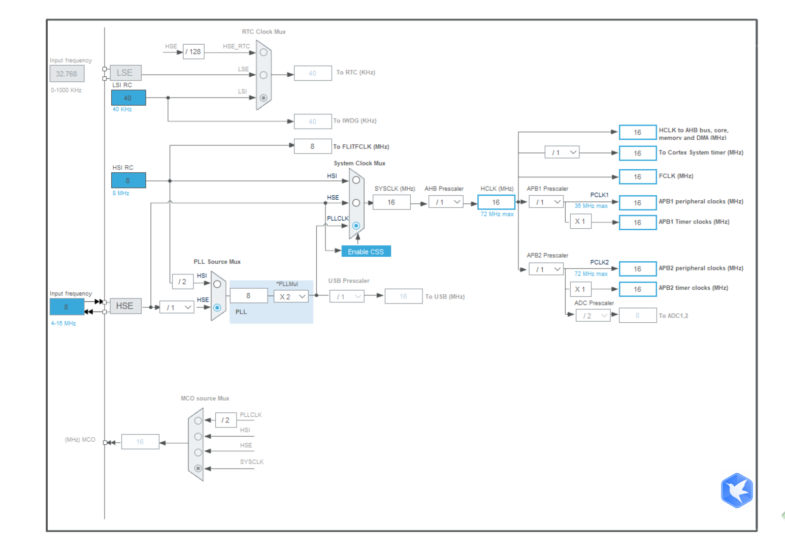

# 复位和时钟控制(rcc)

## 复位

1.  系统复位
2.  电源复位
3.  备份域复位

## 时钟

GPIO打开是由时钟控制的,时钟打开,对应设备才能工作,包括其他的外设

### 时钟来源

```
1. HSI 振荡器时钟 高速内部时钟  : 这里设置了crystal/ceramic resonator
2. HSE 振荡器时钟 高速外部时钟
3. PLL 时钟 锁相环倍频时钟
```

#### 使用cubx控制时钟

  
  
时钟相关的代码

```c
/**
 * @brief System Clock Configuration
 * @retval None
 */
void SystemClock_Config(void)
{
 RCC_OscInitTypeDef RCC_OscInitStruct = {0};
 RCC_ClkInitTypeDef RCC_ClkInitStruct = {0};

 /** Initializes the RCC Oscillators according to the specified parameters
 * in the RCC_OscInitTypeDef structure.
 */
 RCC_OscInitStruct.OscillatorType = RCC_OSCILLATORTYPE_HSE;
 RCC_OscInitStruct.HSEState = RCC_HSE_ON;
 RCC_OscInitStruct.HSEPredivValue = RCC_HSE_PREDIV_DIV1;
 RCC_OscInitStruct.HSIState = RCC_HSI_ON;
 RCC_OscInitStruct.PLL.PLLState = RCC_PLL_ON;
 RCC_OscInitStruct.PLL.PLLSource = RCC_PLLSOURCE_HSE;
 RCC_OscInitStruct.PLL.PLLMUL = RCC_PLL_MUL9;
 if (HAL_RCC_OscConfig(&RCC_OscInitStruct) != HAL_OK)
 {
   Error_Handler();
 }

 /** Initializes the CPU, AHB and APB buses clocks
 */
 RCC_ClkInitStruct.ClockType = RCC_CLOCKTYPE_HCLK|RCC_CLOCKTYPE_SYSCLK
                             |RCC_CLOCKTYPE_PCLK1|RCC_CLOCKTYPE_PCLK2;
 RCC_ClkInitStruct.SYSCLKSource = RCC_SYSCLKSOURCE_PLLCLK;
 RCC_ClkInitStruct.AHBCLKDivider = RCC_SYSCLK_DIV1;
 RCC_ClkInitStruct.APB1CLKDivider = RCC_HCLK_DIV2;
 RCC_ClkInitStruct.APB2CLKDivider = RCC_HCLK_DIV1;

 if (HAL_RCC_ClockConfig(&RCC_ClkInitStruct, FLASH_LATENCY_2) != HAL_OK)
 {
   Error_Handler();
 }
}
```