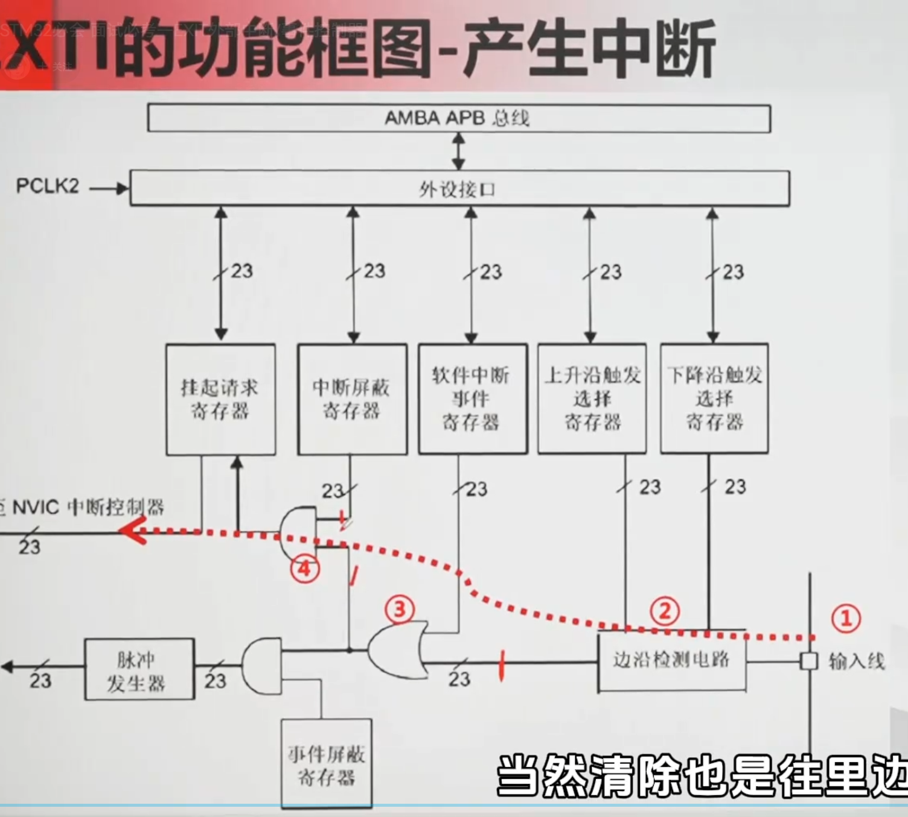

# 中断和事件


## 解释:
一: 3: 或们, 4:与们

这是一份专门针对 `EXTI0_IRQHandler` 的深度笔记。它不只是一个函数名的解释，而是把**启动文件、硬件映射、HAL库回调机制、以及物理寄存器操作**全部串在一起了。

这份笔记延续了我们之前的“物理类比”风格，帮你彻底搞懂这个中断处理函数的前世今生。

---

# STM32 中断入口 `EXTI0_IRQHandler` 深度解剖笔记

> **标签：** `#STM32` `#EXTI` `#中断向量表` `#HAL库` `#启动文件`
> **创建时间：** 2026-06-21
> **核心问题：** 为什么函数名是固定的？它处理谁的 interrupted？我怎么在里面写代码？

---

## 1. 函数名的“绝对权力”从哪来？（启动文件与向量表）

`EXTI0_IRQHandler` **绝对不是一个你可以随便命名的函数**。它是一个**硬固定（Hard-Coded）** 的入口地址。

- **物理根源**：在工程目录的 `startup_stm32f103xe.s`（启动文件）中，有一张 **中断向量表（Interrupt Vector Table）**。
- **映射机制**：这张表按顺序存放着所有中断服务函数的**函数指针（地址）**。当 EXTI0 中断触发时，CPU 的硬件逻辑会强制从这张表的**第 7 个位置**（举例）取出地址，并跳转过去执行。
- **结论**：**函数名必须与启动文件里定义的名称完全一致**，否则编译器链接时找不到入口，中断触发后程序就跑飞（HardFault）了。

---

## 2. `EXTI0_IRQHandler` 到底管哪些引脚？（映射规则）

这是最容易混淆的地方，务必记住**它管的是“线（Line）”，而不是“引脚（Pin）”**。

| 中断服务函数 | 管辖范围 | 说明 |
| :--- | :--- | :--- |
| **`EXTI0_IRQHandler`** | **PA0, PB0, PC0, ... PG0** (所有端口的 Pin 0) | **专属通道**。只要配置任意 GPIO 的 Pin 0 为中断模式，触发后都进这里。 |
| `EXTI1_IRQHandler` | PA1, PB1, PC1... (所有 Pin 1) | 专属通道 |
| `EXTI2_IRQHandler` | 所有 Pin 2 | 专属通道 |
| `EXTI3_IRQHandler` | 所有 Pin 3 | 专属通道 |
| `EXTI4_IRQHandler` | 所有 Pin 4 | 专属通道 |
| **`EXTI9_5_IRQHandler`** | **Pin 5 到 Pin 9** | **共享通道**。5个引脚共用一个函数，进去后必须靠软件判断具体是谁触发的。 |
| **`EXTI15_10_IRQHandler`** | **Pin 10 到 Pin 15** | **共享通道**。6个引脚共用一个函数。 |

> **应用场景**：你按键接的是 PA0，中断来了就进 `EXTI0_IRQHandler`；如果你接的是 PB5，中断来了就进 `EXTI9_5_IRQHandler`。

---

## 3. 编程规范：为什么你“不应该”直接改它？（HAL 回调机制）

在 HAL 库中，**我们强烈不建议直接修改 `EXTI0_IRQHandler` 的内部实现**。因为 HAL 库已经帮我们做好了“前台”处理，我们只需要填“后台”逻辑。

### 3.1 HAL 库的“模板方法”设计
在 `stm32f1xx_it.c` 文件中，HAL 库已经写好了标准的 `EXTI0_IRQHandler`：

```c
void EXTI0_IRQHandler(void)
{
  /* 1. 硬件层：检查挂起寄存器（PR）是否真的置位了 */
  if(__HAL_GPIO_EXTI_GET_IT(GPIO_PIN_0) != RESET) 
  {
    /* 2. 硬件层：立即清除中断标志（写 1 清零）—— 物理门铃复位 */
    __HAL_GPIO_EXTI_CLEAR_IT(GPIO_PIN_0);
    
    /* 3. 软件层：调用用户回调函数（弱定义 Weak） */
    HAL_GPIO_EXTI_Callback(GPIO_PIN_0);
  }
}
```

### 3.2 你的代码应该写在哪里？（重写回调）
不要在 `EXTI0_IRQHandler` 里直接加 `HAL_GPIO_TogglePin`。标准做法是在 **main.c** 或 **gpio.c** 中**重写（Override）** 那个由 `__weak` 修饰的空函数：

```c
// 这是你唯一需要关注的“业务逻辑”入口
void HAL_GPIO_EXTI_Callback(uint16_t GPIO_Pin)
{
    if(GPIO_Pin == GPIO_PIN_0) 
    {
        // 你的需求：按下按键，翻转 LED
        // 注意：这里已经是“主循环”之外了，必须遵循 ISR 铁律！
        HAL_GPIO_TogglePin(LED_GPIO_Port, LED_Pin);
    }
}
```

---

## 4. 物理寄存器实操（呼应之前的“状态寄存器”笔记）

在 `EXTI0_IRQHandler` 的执行过程中，底层发生了两次至关重要的**寄存器物理操作**，这印证了我们之前说的“寄存器是物理闸刀”：

1.  **读操作（GET_IT）**：`__HAL_GPIO_EXTI_GET_IT` 是在读取 **挂起寄存器（EXTI_PR）** 的第 0 位。如果硬件锁存的“1”还在，说明这次中断是真实的，不是软件误触。
2.  **写操作（CLEAR_IT）**：`__HAL_GPIO_EXTI_CLEAR_IT` 是在**往挂起寄存器（EXTI_PR）的第 0 位写入 1**。

> **灵魂拷问**：为什么清除中断标志是“写 1”而不是“写 0”？
> **物理答案**：因为挂起寄存器是“电平触发锁存器”。要把它从高电平（1）拉低（0），硬件设计上必须施加一个“清空脉冲”（写 1），这比直接写 0 更可靠，能防止信号毛刺。**如果你忘了执行这个 CLEAR 操作，或者写成了 0，CPU 退出中断后会立刻再次进入，造成“卡死在中断里”的鬼畜现象。**

---

## 5. ISR 铁律回顾（写在 EXTIX 笔记里的红线）

在 `HAL_GPIO_EXTI_Callback`（本质仍是 ISR 的一部分）里，**必须无条件遵守以下铁律**：

| 行为 | 后果 | 正确姿势 |
| :--- | :--- | :--- |
| **加入 `HAL_Delay(10)` 消抖** | 系统时钟（Systick）被阻塞，程序逻辑错乱，其他中断全部无法响应。 | **放标志**：`Key_Flag = 1;` 把消抖和翻转放到 `while(1)` 主循环里做。 |
| **加入 `printf` 串口打印** | `printf` 耗时毫秒级，且可能阻塞；在中断里调用极易导致硬错误（HardFault）。 | 仅记录数据，主循环查询打印。 |
| **不加 `volatile` 修饰全局标志** | 编译器优化，主循环读不到标志位变化。 | 定义 `volatile uint8_t flag;` |

---

## 6. 典型错误调试（实战篇）

如果程序进入 `EXTI0_IRQHandler` 后死机或卡死，排查顺序如下：

1.  **查启动文件**：确认 `startup_stm32f1xx.s` 里是否有 `EXTI0_IRQHandler` 这个弱定义（一般都有）。
2.  **查中断清除**：确认你重写的回调里没有意外把清除中断的代码删掉（HAL 库默认会清，如果你自己重写了整个 `EXTI0_IRQHandler` 忘记清，必死）。
3.  **查优先级分组**：如果中断里调用了系统函数，确认 `HAL_NVIC_SetPriority(SysTick_IRQn, 0, 0)` 把滴答定时器优先级提到最高，防止被其他中断打断导致 `HAL_Delay` 卡死。

---

## 📌 总纲口诀（背下来）

> **EXTI 零号线，物理入口名固定；**
> **无论 PA 或 PB，零脚触发皆进此；**
> **硬件清标不用 0，写 1 复位是真理；**
> **回调函数留给你，短小精悍勿延时；**
> **若要消抖业务长，标记扔给主循环。**

---
这份笔记可以直接存入你的印象笔记，当你下次遇到 `EXTI0_IRQHandler` 不知道怎么写时，翻出来看第三节的“模板方法”就可以了。🚀

这是一份为你量身定制的**印象笔记（Evernote）**版核心笔记，专门解决 **“寄存器”** 和 **“ISR（中断服务函数）”** 这两个嵌入式最核心概念的底层逻辑。笔记采用了“物理类比”和“前端对照”的方式，帮你彻底告别死记硬背。

---

# 嵌入式核心双生子：寄存器与 ISR 终极理解笔记

> **标签：** `#STM32` `#嵌入式基础` `#寄存器` `#中断系统` `#底层原理`
> **创建时间：** 2026-06-21
> **适用场景：** 理解单片机本质、中断调试、裸机开发思维建立

---

## 1. 寄存器：芯片上的“物理开关”（物理意义上的 State）

### 1.1 本质定义
寄存器是**焊接在芯片硅片上的物理锁存器（D触发器）**，由晶体管构成。它不是一个软件变量，而是一段**真实的物理电路**。

- **与前端 State 的本质区别**：前端 State 是“内存里的便签纸”（断电消失，纯逻辑）；寄存器是“墙上的电灯闸刀”（写入即产生物理电压，真实驱动外设）。
- **状态**：只有 1（高电平/3.3V）和 0（低电平/0V）。**写入 1，引脚就持续输出电流；写入 0，电流立刻切断。**

### 1.2 三大核心分类（按功能分）

| 寄存器类型 | 英文缩写 | 比喻角色 | 谁在修改它？ |
| :--- | :--- | :--- | :--- |
| **控制寄存器** | `CR` (Control Register) | **“功能拨码开关”** | **软件（你写的代码）**。用来配置模式（输入/输出/复用/模拟）。 |
| **状态寄存器** | `SR` (Status Register) | **“硬件公告栏”** | **硬件（外设自己）**。定时器溢出了？数据收到没？硬件自动把对应位变成 1，通知 CPU。 |
| **数据寄存器** | `DR` (Data Register) | **“数据缓存池”** | **双方都可**。CPU 往里写（发送），外设往里填（接收）。 |

### 1.3 必须死记的“物理特性”（避坑必看）

- **写入不可逆（锁存效应）**：写 1 就锁 1，写 0 就锁 0。想改必须重新发起一次“物理写入”动作。
- **清除中断标志的怪癖（写 1 清零）**：很多状态寄存器（如 EXTI 挂起寄存器）想要清除标志位，**必须往该位写 `1`**（不是写 0！）。这是因为硬件电路设计成“写 1 触发放电复位”，这与软件思维完全相反。
- **读取必须加 `volatile`**：寄存器的值可能被**硬件随时更改**，编译器优化时可能会把读操作删掉。所以定义寄存器指针时必须加 `volatile` 关键字（如 `volatile uint32_t *`），告诉编译器：“每次读都去物理地址取，别偷懒用缓存！”

---

## 2. ISR（中断服务函数）：硬件驱动的“火警回调”（硬实时事件）

### 2.1 本质定义
当特定的硬件事件（如引脚电压突变、定时器归零）发生时，CPU 会被强行打断，跳转去执行的一个**特殊回调函数**。

- **与前端的 `onClick` 对照**：功能完全一样（都是“当某件事发生时，调用这个函数”），但执行机制天差地别。
- **前端（`onClick`）**：事件排队（Event Loop），必须等主线程空闲才执行，可以死循环，可以发异步请求。
- **嵌入式（ISR）**：**硬件立即抢占（Preemptive）**，不管 CPU 在干什么，立刻停下执行 ISR。

### 2.2 ISR 的“黄金铁律”（绝对不能违反）

| 铁律 | 原因 | 正确做法 |
| :--- | :--- | :--- |
| **绝对禁止延时/死循环** | ISR 执行期间，CPU 被独占。如果在里面 `HAL_Delay(1000)`，整个系统时钟会紊乱，低优先级中断无法响应。 | 只做**微秒级（us）** 的操作，如读硬件、置标志位。 |
| **绝对禁止阻塞式函数** | 严禁调用 `printf`、`malloc`、非重入的全局变量操作。 | 使用**全局标志位（Flag）** 传递消息。 |
| **必须清除中断标志位** | 不清除的话，硬件会以为你没处理完，退出 ISR 后立刻再次触发中断，导致**程序卡死在无限中断里**。 | 调用 `__HAL_GPIO_EXTI_CLEAR_IT(...)` 或在寄存器里写 1 清除。 |

### 2.3 标准工程模板（前半部/后半部模式）

嵌入式工程师从不把复杂业务逻辑写在 ISR 里，而是采用 **“ISR 置标志 + 主循环查询标志”** 模型：

```c
// 1. 定义全局标志位（注意加 volatile，防编译器优化）
volatile uint8_t key_pressed_flag = 0; 

// 2. ISR 只负责“按下记录”（极简，耗时 < 1us）
void EXTI0_IRQHandler(void) {
    key_pressed_flag = 1;          // 仅仅打个“标记”
    __HAL_GPIO_EXTI_CLEAR_IT(GPIO_PIN_0); // 必须清硬件中断标志
}

// 3. 主循环（while(1)）里做“笨重处理”
while(1) {
    if(key_pressed_flag == 1) {
        key_pressed_flag = 0;      // 清软件标记
        HAL_Delay(20);             // ✅ 在这里加延时做消抖（安全！）
        HAL_GPIO_TogglePin(...);   // ✅ 在这里操作 LED
    }
}
```
**为什么要这样写？** 因为 ISR 就像“火警铃声”，只负责拉响警报（置标志位），至于“拿灭火器去救火”（翻转 LED、串口打印），等出了火场（主循环）再干。

---

## 3. 寄存器与 ISR 的“协作关系”（这是重点！）

在单片机运行中，**ISR 是被寄存器“喂”出来的**。两者配合流程如下：

1. **硬件触发**：外部电压跳变，**边沿检测电路**瞬间触发。
2. **寄存器自动置位**：硬件自动将**状态寄存器（SR）** 里的标志位（如 `XXX_IT_FLAG`）从 0 改成 1（物理电流强制锁存）。
3. **CPU 响应**：CPU 检测到该标志位为 1，并且中断屏蔽寄存器（IMR）是开启状态，立刻跳转至对应的 ISR。
4. **ISR 读取寄存器**：ISR 里通过读取数据寄存器（DR）获取传入的数据，或读取其他状态位判断中断来源（如多线共用一个中断时）。
5. **ISR 清除寄存器**：ISR 末尾必须往**状态寄存器（SR）** 的对应位**写 1**，让它变回 0。门铃必须复位，下次按下才能再响。

---

## 4. 思维模型速查卡（帮助记忆）

| 前端程序员理解版 | 嵌入式工程师物理版 | 一句话总结 |
| :--- | :--- | :--- |
| **State** 是状态变量 | **寄存器** 是物理闸刀 | State 变的是内存，寄存器变的是电压。 |
| **`setState`** 触发渲染 | **写寄存器** 触发电机转/灯亮 | 前端改 UI，嵌入式改物理世界。 |
| **`onClick`** 是排队回调 | **ISR** 是强行打断的火警铃 | onClick 等会儿再叫你，ISR 立刻停下听我说。 |
| **`useEffect`** 清理副作用 | **ISR 清中断标志位** | 前端不清理会内存泄露，ISR 不清除会无限死机。 |

---

## 📌 总纲口诀（睡前默念）

> **寄存器是物理闸刀，非软件变量；**
> **写 1 不一定置位，清 0 要靠写 1；**
> **ISR 秒级跑完，绝不留恋；**
> **置标志、读数据、清中断，三句即退。**
> 
> **若需长时处理，交给主循环；**
> **前后端虽有共鸣，物理底层大不同。**

这份笔记可以直接存入你的印象笔记专栏，下次调试中断卡死时，翻出来看看是不是忘记清中断标志了。🚀
