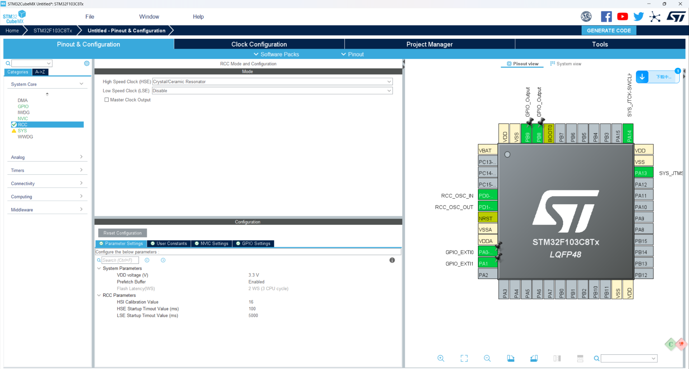
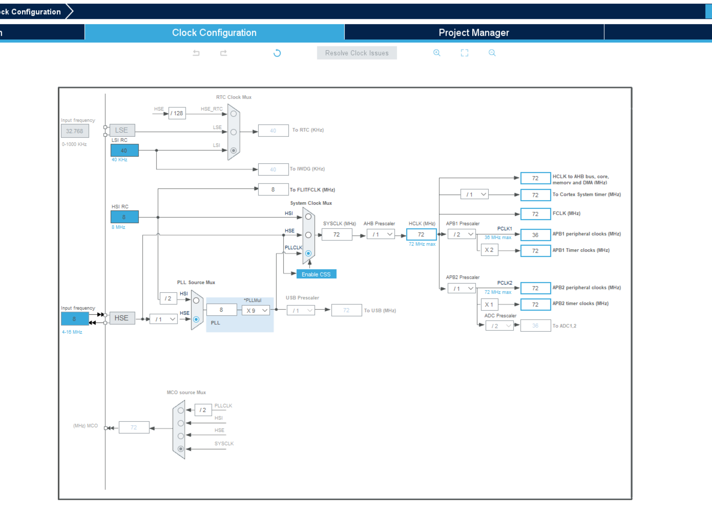
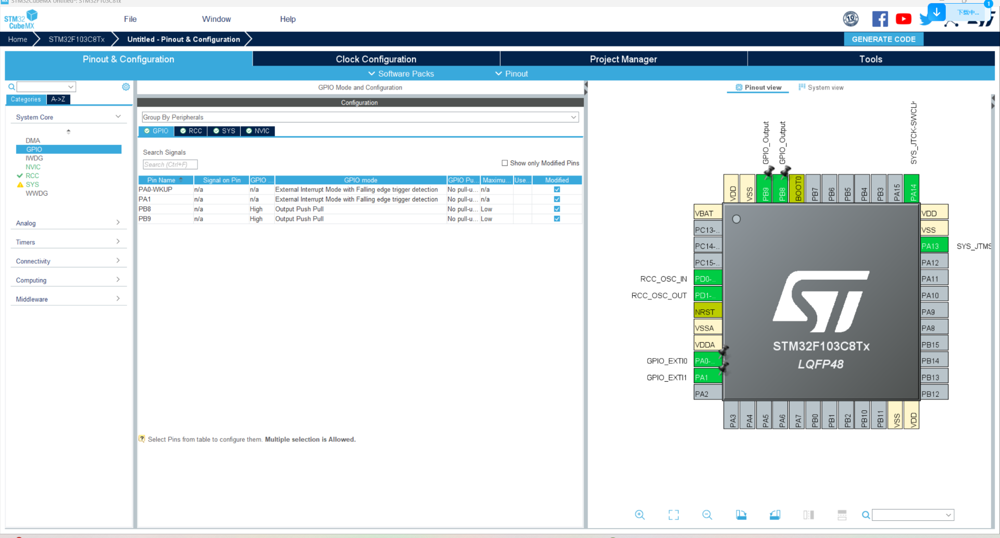
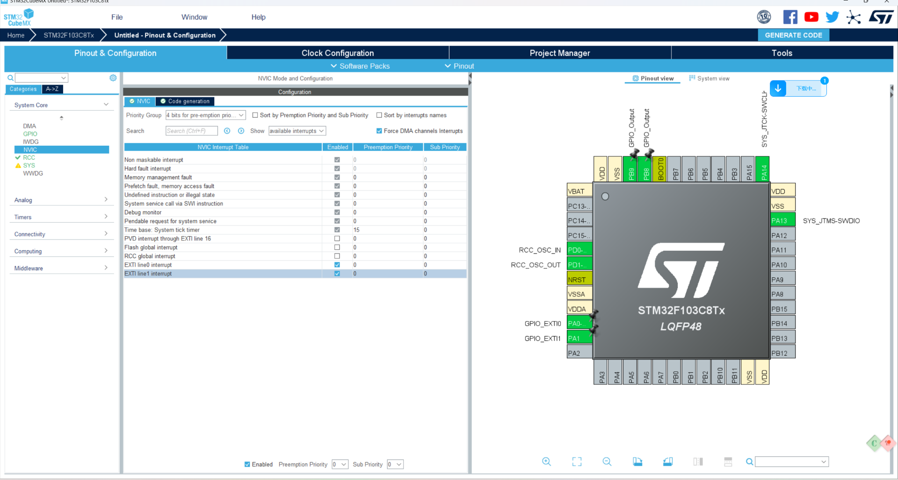
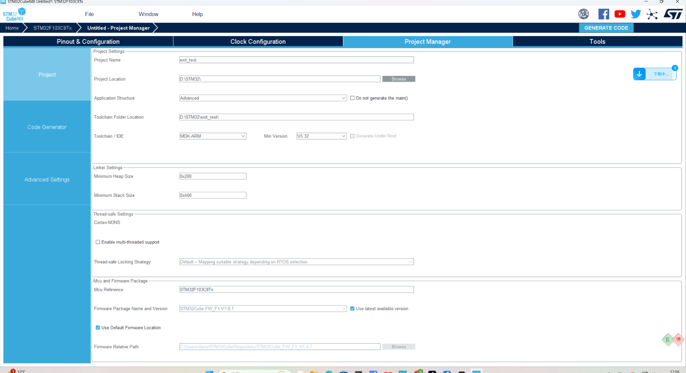
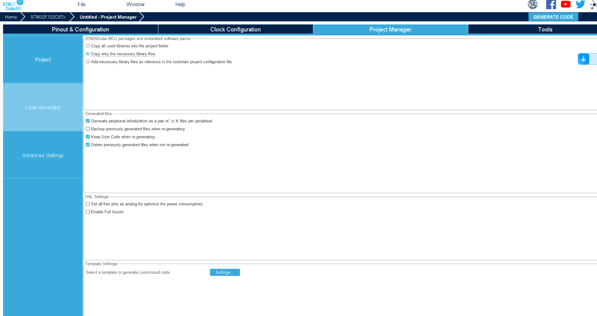
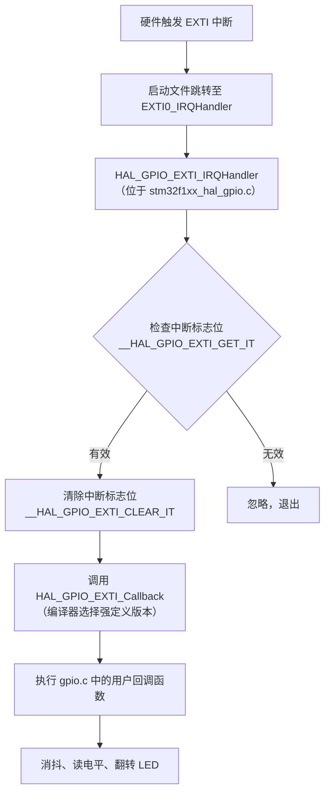

# 中断和事件点灯
1. 配置时钟: , 
2. 配置GPIO口: 
3. 使能中断:  
4. 配置工程: , 

   好的，结合你提供的**两段分别位于不同文件中的代码**，我为你整理了一份**完整的、可存档的「印象笔记」**。这份笔记将底层库函数和用户层实现串联起来，清晰展示了 STM32 HAL 库外部中断的**完整协作机制**。

---

## 📓 印象笔记 - STM32 EXTI 外部中断完整机制（底层库 + 用户实现）

### 📌 笔记标题
**STM32 HAL库外部中断（EXTI）底层机制与用户回调实现 —— 基于 `stm32f1xx_hal_gpio.c` 与 `gpio.c` 的协作分析**

### 🏷️ 标签
`#STM32` `#HAL库` `#外部中断` `#回调函数` `#弱定义` `#中断流程`

---

## 📂 文件一：`stm32f1xx_hal_gpio.c`（HAL 底层库，不建议修改）

> **文件性质**：系统级只读文件，由 ST 官方提供，通常位于固件库目录中。  
> **作用**：提供中断的统一底层处理，包括标志位检查、标志位清除，以及一个“弱定义”的空回调。

### 📝 源代码（截取自第一张图）

```c
/**
  * @brief  This function handles EXTI interrupt request.
  * @param  GPIO_Pin: Specifies the pins connected EXTI line
  * @retval None
  */
void HAL_GPIO_EXTI_IRQHandler(uint16_t GPIO_Pin)
{
  /* EXTI line interrupt detected */
  if (__HAL_GPIO_EXTI_GET_IT(GPIO_Pin) != 0x00u)
  {
    __HAL_GPIO_EXTI_CLEAR_IT(GPIO_Pin);
    HAL_GPIO_EXTI_Callback(GPIO_Pin);
  }
}

/**
  * @brief  EXTI line detection callbacks.
  * @param  GPIO_Pin: Specifies the pins connected EXTI line
  * @retval None
  */
__weak void HAL_GPIO_EXTI_Callback(uint16_t GPIO_Pin)
{
  /* Prevent unused argument(s) compilation warning */
  UNUSED(GPIO_Pin);
  /* NOTE: This function Should not be modified, when the callback is needed,
           the HAL_GPIO_EXTI_Callback could be implemented in the user file
   */
}
```

### 🔍 逐段解析

| 函数 | 关键操作 | 说明 |
| :--- | :--- | :--- |
| `HAL_GPIO_EXTI_IRQHandler` | ① `__HAL_GPIO_EXTI_GET_IT` 检查中断标志 <br> ② `__HAL_GPIO_EXTI_CLEAR_IT` **清除标志位** <br> ③ `HAL_GPIO_EXTI_Callback` 调用用户回调 | 这是中断的“总调度室”。**特别注意**：清除标志位是在调用用户回调**之前**完成的，因此用户代码中无需再手动清标志。 |
| `__weak void HAL_GPIO_EXTI_Callback` | 空函数体，仅包含 `UNUSED(GPIO_Pin)` 防止编译警告 | `__weak` 修饰符表示这是一个**弱定义**。如果没有其他强定义，则使用此空函数；如果有，则被覆盖。 |

---

## 📂 文件二：`gpio.c`（用户应用层，由 CubeMX 生成，可自由编辑）

> **文件性质**：用户级可读写文件，位于工程目录的 `Core/Src` 下。  
> **作用**：在这里**重写** `HAL_GPIO_EXTI_Callback` 函数，实现具体的业务逻辑（如按键消抖、LED 翻转）。

### 📝 源代码（截取自第二张图）

```c
/* Includes */
#include "gpio.h"

/* USER CODE BEGIN 0 */

void HAL_GPIO_EXTI_Callback(uint16_t GPIO_Pin)
{
    HAL_Delay(10);
    switch (GPIO_Pin) {
    case GPIO_PIN_0:
        if (HAL_GPIO_ReadPin(GPIOA, GPIO_PIN_0) == GPIO_PIN_RESET)
            HAL_GPIO_TogglePin(GPIOB, GPIO_PIN_8);
        break;
    case GPIO_PIN_1:
        if (HAL_GPIO_ReadPin(GPIOA, GPIO_PIN_1) == GPIO_PIN_RESET)
            HAL_GPIO_TogglePin(GPIOB, GPIO_PIN_9);
        break;
    }
}

/* USER CODE END 0 */
```

### 🔍 逐段解析

| 代码段 | 说明 |
| :--- | :--- |
| `#include "gpio.h"` | 包含 GPIO 相关的头文件和引脚定义。 |
| `/* USER CODE BEGIN 0 */` ... `/* USER CODE END 0 */` | CubeMX 生成的用户代码保护区。在此区域内编写的代码，在重新生成工程时**不会被覆盖**。 |
| `HAL_Delay(10);` | **消抖延时**。注意：当前写法放在 `switch` 外部，无论哪个引脚触发都会先执行 10ms 延时。 |
| `switch (GPIO_Pin)` | 根据触发中断的引脚，执行对应的分支逻辑。 |
| `HAL_GPIO_ReadPin(...) == GPIO_PIN_RESET` | **二次电平确认**：延时后再读取引脚状态，若确实为低电平（按键按下），则执行翻转。 |
| `HAL_GPIO_TogglePin(...)` | 翻转指定 GPIO 引脚（PB8、PB9）的输出电平，用于控制 LED 等外设。 |

---

## 🔗 两文件协作机制（完整中断执行流程）

当外部中断触发时，程序的执行路径如下：



### ✅ 关键结论

1. **清除中断标志位由底层库自动完成**，用户回调中无需（也不应）再手动清除。
2. **编译器优先级**：`gpio.c` 中的函数（强定义）会覆盖 `stm32f1xx_hal_gpio.c` 中的弱定义函数。
3. **用户只需关注 `gpio.c`**，在此文件中编写中断处理逻辑即可。

---

## ⚠️ 注意事项与优化建议

| 问题 | 当前代码表现 | 建议 |
| :--- | :--- | :--- |
| **`HAL_Delay` 放置位置** | 放在 `switch` 外部，所有引脚触发时都会执行 10ms 延时。 | 建议移入每个 `case` 内部，仅在对应引脚触发时执行消抖，逻辑更清晰。 |
| **中断内使用 `HAL_Delay` 的风险** | 如果外部中断优先级**高于** SysTick 中断，`HAL_Delay` 可能导致死等。 | 确保 EXTI 中断优先级数值 ≥ SysTick 优先级（即优先级不高于 SysTick）。 |
| **代码可扩展性** | 目前仅处理 PA0、PA1 两个引脚。 | 如需增加更多引脚，在 `switch` 中添加对应的 `case` 分支即可。 |

### 📝 优化后的回调函数推荐写法

```c
void HAL_GPIO_EXTI_Callback(uint16_t GPIO_Pin)
{
    switch (GPIO_Pin)
    {
        case GPIO_PIN_0:
            HAL_Delay(10);  // 按键消抖
            if (HAL_GPIO_ReadPin(GPIOA, GPIO_PIN_0) == GPIO_PIN_RESET)
            {
                HAL_GPIO_TogglePin(GPIOB, GPIO_PIN_8);
            }
            break;

        case GPIO_PIN_1:
            HAL_Delay(10);  // 按键消抖
            if (HAL_GPIO_ReadPin(GPIOA, GPIO_PIN_1) == GPIO_PIN_RESET)
            {
                HAL_GPIO_TogglePin(GPIOB, GPIO_PIN_9);
            }
            break;

        default:
            break;
    }
}
```

---

## 📚 知识点总结

| 知识点 | 说明 |
| :--- | :--- |
| **`__weak` 弱定义机制** | 允许用户在别的文件中重写同名函数，实现“框架提供默认实现，用户按需覆盖”的设计模式。 |
| **中断标志位清除** | HAL 库在调用回调**之前**已清除标志位，用户无需操心。 |
| **按键消抖** | 机械按键触发中断后，需延时（如 10ms）并二次读取电平，防止误触发。 |
| **文件保护区域** | `USER CODE BEGIN/END` 区域内的代码在 CubeMX 重新生成时不会被覆盖。 |
| **中断优先级与 `HAL_Delay`** | 若中断优先级高于 SysTick，`HAL_Delay` 会失效甚至卡死，需注意优先级配置。 |

---

**创建时间**：2026-06-21  
**最后更新**：2026-06-21  
**难度分级**：⭐⭐⭐⭐（深入理解 HAL 库底层机制）

---

这份笔记已将你提供的两段代码完整串联起来，你可以直接将其保存到印象笔记中。如需进一步补充其他内容（如 NVIC 配置、CubeMX 图形化设置等），随时告诉我！😊