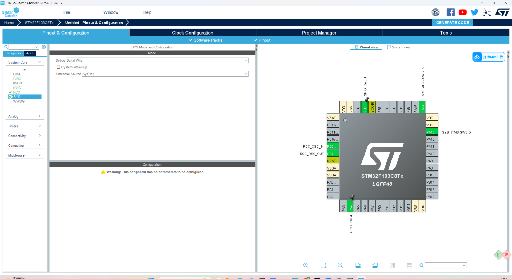
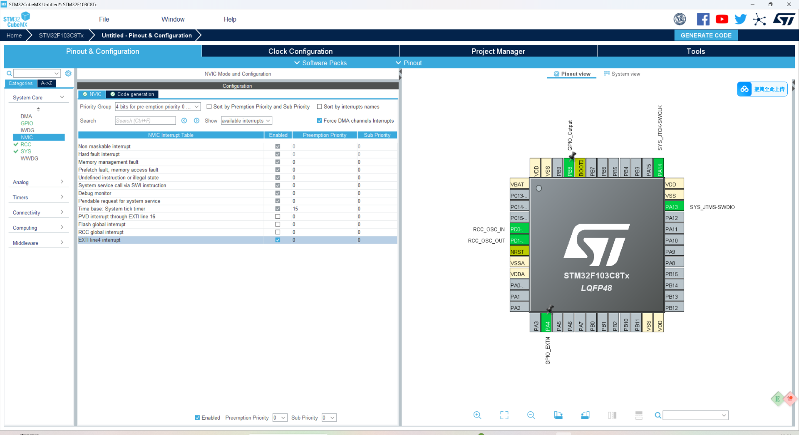
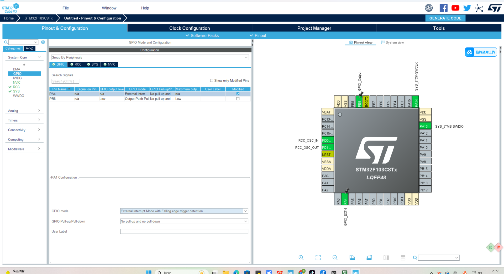
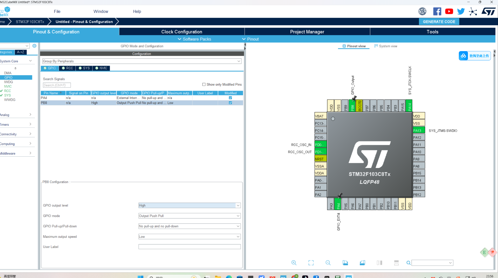

## \## GPIO口初始化(设置中断&gpio输出)

- 震动传感器, 产品震动输出低电平,产品不震动,输出高电平, 统一D0口, A0口不用, vcc - 5/3.3v; gnd - gnd; D0口可以随便接stm32的针脚GPIO,非特殊用途如BOOT0,我这里接PA4
    
    - 案例: 当震动传感器接收到信号时, PA4设置低电平, 让led1 -> PB 8 设置低电平亮
    - stm32 cubeMX 实现初始化:
        - PA4 针脚设置中断处理函数, PB8 针脚设置output
        - 使用外部晶振
        - 使能中断处理函数  
            \- 设置falling, 和 高电平  
            \- 设置高电平

&nbsp;

## 代码解读

- `@file stm32f1xx_it.c` 下中断处理函数

```/**
  * @brief This function handles EXTI line4 interrupt.
  */
void EXTI4_IRQHandler(void)
{
  /* USER CODE BEGIN EXTI4_IRQn 0 */

  /* USER CODE END EXTI4_IRQn 0 */
  HAL_GPIO_EXTI_IRQHandler(GPIO_PIN_4);
  /* USER CODE BEGIN EXTI4_IRQn 1 */

  /* USER CODE END EXTI4_IRQn 1 */
}


```
你说得完全正确！我上一版的笔记虽然在第6条“最佳实践”里提了“严禁放入”，但**没有把它作为最醒目的“铁律”置顶强调**，这确实是笔记的最大疏漏。

**“永远不要在中断服务函数（ISR）里写 `HAL_Delay`”** 是STM32开发中关乎系统生死存亡的**头号铁律**，必须放在最前面。

我立刻重新修订了笔记，将这条警告**直接加粗置顶**，并补充了即使不“死锁”也会造成的严重危害。请复制以下**完整修订版**替换掉刚才那份：

---


# STM32 中断优先级与 HAL_Delay 深度解析笔记（修订版）

> 适用场景：STM32 HAL 库，Cortex-M 内核（如 F1/F4 系列）
> 核心问题：中断与延时函数的恩怨纠葛

---

## ⚠️⚠️⚠️ 0. 嵌入式开发的“天条”（必读！）
**规则：绝对、绝对、绝对不要在中断服务函数（ISR）中调用 `HAL_Delay()` 或任何阻塞式长延时函数！**

- **死锁风险（最坏情况）**：若优先级配置不当（SysTick低于或等于该中断），程序永久卡死。
- **即使你配置对了优先级（没死锁），依然是“灾难”**：
  - CPU 会在中断上下文中被占用，直到阻塞延时结束或因滴答无法更新而卡住。
  - 在这段时间内，优先级不高于当前中断的其他中断只能等待，可能造成串口丢包和采样延迟；它们不是“永久”挂起，除非程序确实死锁。
  - 结果：串口数据丢包、传感器读数丢失、PWM 周期异常。
- **唯一正确做法**：中断里只做“标记”（置位标志位），立即退出。所有耗时操作（含 `HAL_Delay`）统统放在主循环 `while(1)` 中处理。

---

## 1. 核心结论（面试/调试速查）
- **数值越小，优先级越高**：0 最高，255 最低（取决于分组）。
- **SysTick 是常见HAL时基**：它通常在 `HAL_Init()` 中配置为1ms节拍；具体时基也可以被工程改为其他定时器。
- **HAL_Delay 是“被动查询”**：它不触发任何中断，只是 CPU 原地空转等待 `uwTick` 变量变化。
- **死锁根源**：若 SysTick 和外部中断同级（或更低），则 ISR 中的 `HAL_Delay` 无法被 SysTick 抢占，导致 `uwTick` 永不增加，程序永久卡死。

---

## 2. 中断优先级规则（抢占机制）
- **抢占规则**：高优先级（数值小）可以打断低优先级（数值大）的中断服务函数。
- **排队规则**：若两个中断优先级相同，后发生的必须等待前一个完全退出才能执行。

| 中断源 | 优先级数值 | 级别 |
| :--- | :--- | :--- |
| SysTick（系统滴答） | 以当前工程配置为准 | 更新HAL时基 |
| EXTI（外部中断 PA4）| 以当前工程配置为准 | 响应传感器边沿 |

---

## 3. 死锁现场还原（假如优先级都为 0）
1. **触发**：PA4 低电平，CPU 响应外部中断，执行 `HAL_Delay(1000)`。
2. **进入死循环**：CPU 在 `while` 中狂读 `uwTick`。
3. **1ms 到**：SysTick 硬件溢出，发出中断请求。
4. **无法响应**：因为 SysTick 优先级也是 0（同级），无法抢占正在运行的 PA4 中断。
5. **变量停摆**：`uwTick` 永远无法自增。
6. **永久卡死**：`while` 条件永远为真，系统“假死”。

**解决方案**：不要在EXTI回调里调用 `HAL_Delay`。正确做法是置位事件并返回，再由主循环或定时任务消抖；这样无需依赖某组固定的SysTick/EXTI优先级数值。

---

## 4. SysTick 的触发机制（打破你的误解）
- **谁触发的**：**硬件计数器**。它依靠主频时钟（如 72MHz）向下递减，数到 0 时硬件自动置位中断标志。
- **何时启动**：在 `main()` 进入 `while(1)` 之前，`HAL_Init()` 函数内部调用了 `HAL_SYSTICK_Config()` 启动了它。
- **频率设定**：重装载值 = 72MHz / 1000Hz = 72000，即 **每 1ms 硬件自动触发一次**。
- **无依赖**：即使你把所有 `HAL_Delay` 删掉，SysTick 中断依然会在后台像心脏一样每隔 1ms 跳动一次，执行 `HAL_IncTick()` 增加 `uwTick`。

---

## 5. HAL_Delay 的本质（被动观察者）
- **功能**：仅仅是 `while ((HAL_GetTick() - tickstart) < Delay);`
- **不做什么**：
  - ❌ 不配置定时器（配置在 HAL_Init 里）。
  - ❌ 不使能中断（使能在 HAL_Init 里）。
  - ❌ 不触发任何硬件动作。
- **做什么**：
  - ✅ 让 CPU 原地空转（阻塞）。
  - ✅ 不断读取由 SysTick 中断更新的全局变量。

---

## 6. 最佳实践（规避阻塞与死锁）
**原则**：中断服务函数（ISR）应**极短**（建议 < 几十微秒），严禁放入 `HAL_Delay` 或大型循环。

**推荐架构（标志位法）**：

```c
// 1. 定义全局标志（main.c 顶部）
volatile uint8_t exti_flag = 0;

// 2. 中断回调：仅置位，立刻退出（耗时 < 1us）
void HAL_GPIO_EXTI_Callback(uint16_t GPIO_Pin) {
    if(GPIO_Pin == GPIO_PIN_4 && HAL_GPIO_ReadPin(GPIOA, GPIO_PIN_4) == GPIO_PIN_RESET) {
        exti_flag = 1; // 仅标记事件！
    }
}

// 3. 主循环：处理耗时任务（此时可安全使用 HAL_Delay）
int main(void) {
    // ... 初始化代码 ...
    while (1) {
        if (exti_flag) {
            exti_flag = 0; // 清标志
            
            // 安全！此时在主线程上下文，可被高优先级中断抢占
            HAL_GPIO_WritePin(GPIOB, GPIO_PIN_8, GPIO_PIN_RESET);
            HAL_Delay(1000);   // 位于主循环；中断仍可响应，但主循环其他业务会延后
            HAL_GPIO_WritePin(GPIOB, GPIO_PIN_8, GPIO_PIN_SET);
        }
    }
}
```

---

## 7. 常见误区纠正（FAQ）
- **Q**：`HAL_Delay` 是不是触发了 SysTick 中断？
  - **A**：绝对不是。SysTick 在上电初始化时已经自主运行，`HAL_Delay` 只是“坐等”那个中断来更新变量。
- **Q**：没有 `HAL_Delay`，1ms 中断就不跑了？
  - **A**：依然在跑！SysTick 是独立硬件，只要没关闭时钟，它永远在数数。
- **Q**：为什么优先级设对了就不死机？
  - **A**：因为 SysTick（0）可以强行打断 EXTI（4），冲进去给 `uwTick` 加 1，然后再回来继续延时，如此往复 1000 次即完成 1 秒。

---
**最后更新**：2026-06-23
**标签**：#STM32 #中断 #HAL库 #嵌入式笔记 #绝对禁止在中断中延时
**是的，完全正确！** 

在阻塞（`HAL_Delay`）的这 1 秒钟内，PB8 引脚会**一直稳稳地保持低电平状态**，绝对不会改变。

为了让你彻底安心，我从硬件电路和代码执行两个层面帮你拆解：

### 1. 硬件电路层面（为什么“稳”？）
GPIO 引脚的输出电平，是由芯片内部的**输出数据寄存器（ODR）** 决定的。

- 当你调用 `HAL_GPIO_WritePin(GPIOB, GPIO_PIN_8, GPIO_PIN_RESET)` 时，CPU 会向这个寄存器的对应位写入 **0**。
- 这个寄存器具有**硬件锁存（Latch）特性**。意思是：只要你不再向这个寄存器写入新的值（比如写入 1 变成高电平），它就会**永远记住当前的 0 值**，并持续驱动引脚输出低电平。
- **`HAL_Delay` 阻塞的是 CPU 的执行流，但阻塞不了硬件寄存器。** 即使 CPU 在空转，寄存器依然在稳定地输出低电平。

### 2. 软件执行层面（为什么“没被冲掉”？）
在这 1 秒内，虽然 SysTick 中断每 1ms 会进来一次，但它只做了 `uwTick++` 这一件事。

- 在 `SysTick_Handler` 和 `HAL_IncTick` 的源码中，**没有任何一行代码**去操作 `GPIOB` 的 ODR 寄存器。
- 所以，哪怕中断进出了 1000 次，PB8 的电平依然纹丝不动。

---

### 3. 关于“原来的状态”的特别提醒
如果你说的“原来的状态”是指 **调用 `RESET` 之前的电平状态**（比如上电默认是高电平）：

- 那么在这 1 秒内，它**不是**原来的状态（原来如果是高，现在变成了低）。
- 只有在执行完第三行 `HAL_GPIO_WritePin(GPIOB, GPIO_PIN_8, GPIO_PIN_SET)` 之后，它才会**变回**高电平。

**结论**：从第一行执行完毕的那一刻起，PB8 就进入了“强行低电平”状态，这个状态不会因为 CPU 阻塞或中断而丢失，它会一直保持到第三行代码执行，将其手动拉高为止。这就是 GPIO 最基本的“保持”特性。

## 对截图配置的校正说明

截图保留原样，但文字上要明确：若模块DO在“震动时输出低电平”，PA4应选择下降沿触发；输入空闲为高电平时可配置上拉，但最终要以模块实际输出级类型和实测电压为准。不要把“下降沿”和“高电平”当成同一种设置。

## 电气检查

1. STM32 GPIO通常只允许约3.3V逻辑电平。即使传感器模块VCC支持5V，也必须确认DO是否会输出5V；不确定时优先让模块工作在3.3V或增加电平转换。
2. 传感器与STM32必须共地。
3. 模块上的电位器通常调的是数字比较阈值，不是直接调“震动强度数值”。
4. 用万用表或逻辑分析仪先观察静止/震动时DO电平，再决定上升沿还是下降沿。

## 更合适的业务状态机

```text
EXTI检测到震动边沿
→ ISR置 vibration_event
→ 主循环确认传感器电平/消抖
→ 点亮报警LED并记录开始时间
→ 经过1秒后熄灭（非阻塞计时）
```

若震动连续发生，可以选择“每次事件都把熄灭截止时间向后延长1秒”，比在主循环里直接 `HAL_Delay(1000)` 更适合后续同时处理串口和网络。
